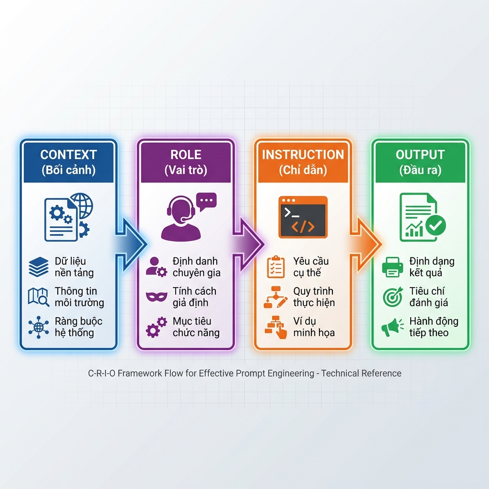
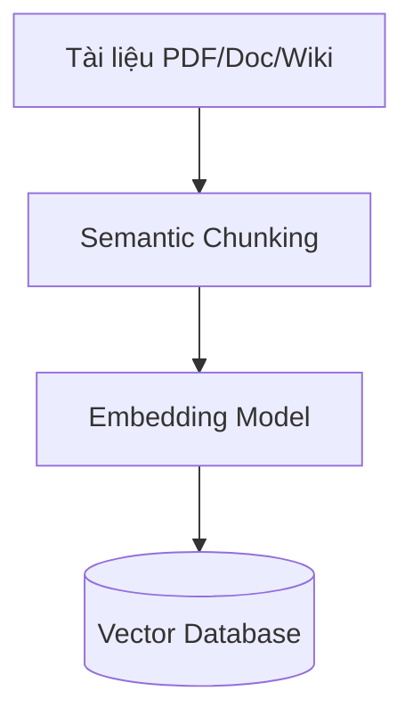
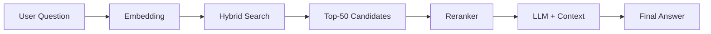
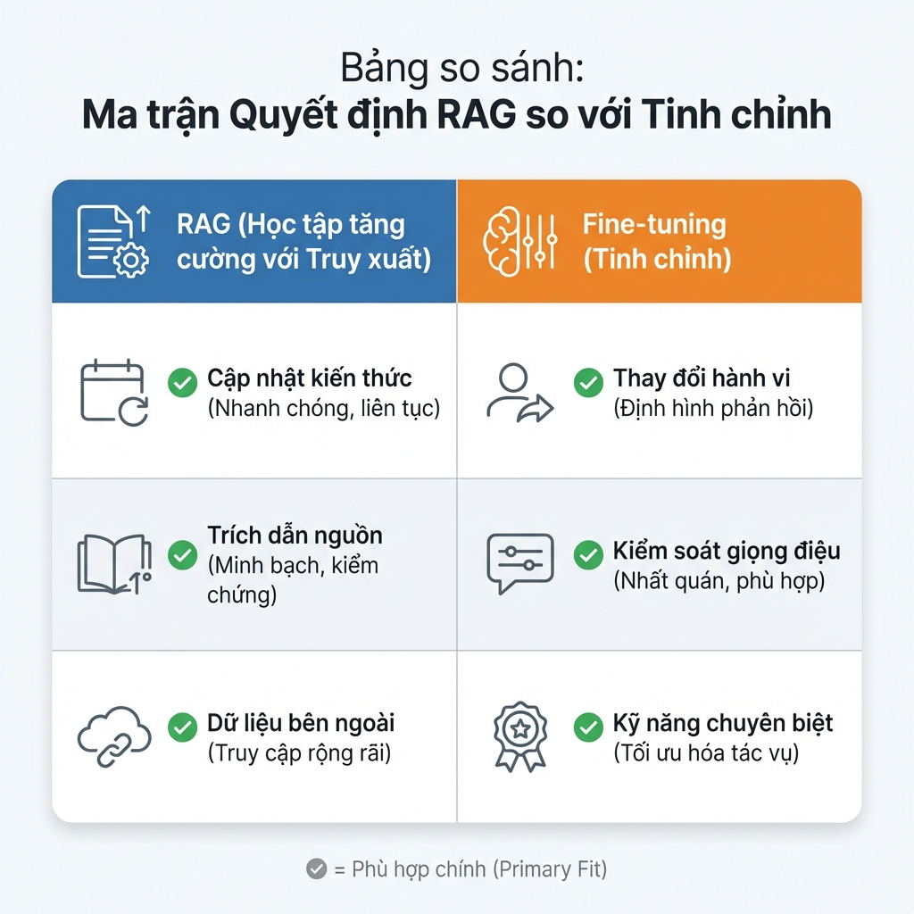
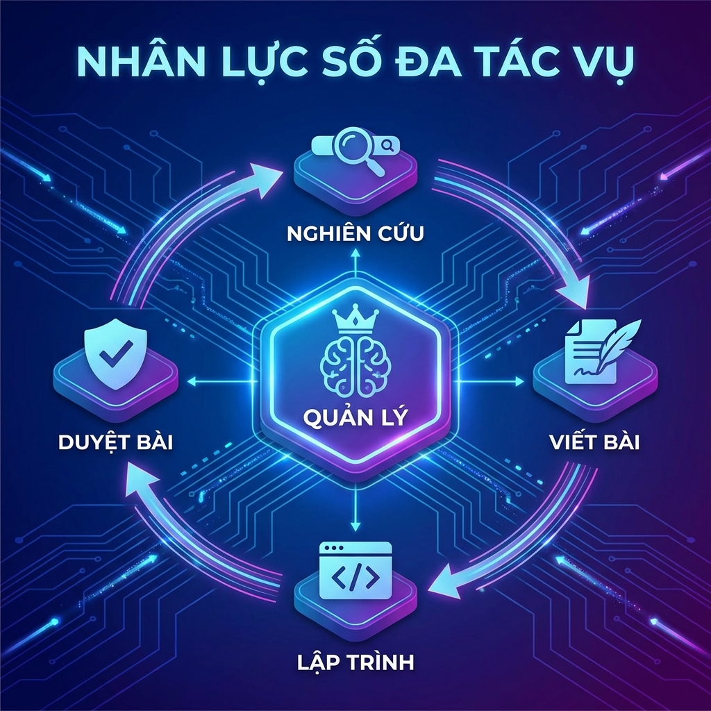
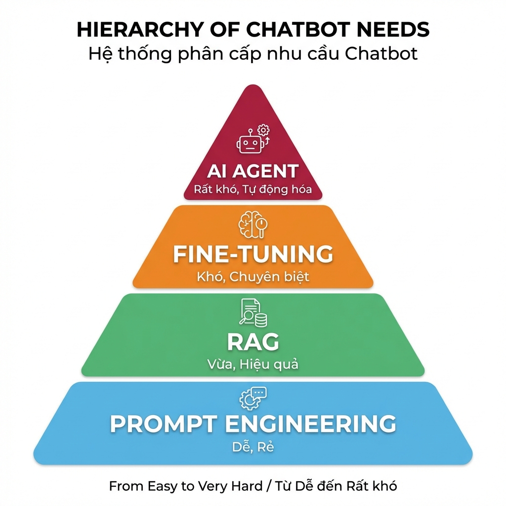

# Lộ Trình Xây Dựng Chatbot GenAI: Từ Prompt Engineering Đến AI Agent Toàn Năng
 
## Lời mở đầu: Vượt ra khỏi giao diện ChatGPT

Chúng ta đang sống trong kỷ nguyên bùng nổ của Generative AI. Tuy nhiên, đối với các lập trình viên và doanh nghiệp, việc "sử dụng AI" không còn đơn thuần là mở trình duyệt web lên và chat với ChatGPT.

Thách thức thực sự nằm ở việc **tích hợp và xây dựng** (Build & Integrate). Làm thế nào để biến một mô hình ngôn ngữ lớn (LLM) thành một trợ lý ảo am hiểu dữ liệu nội bộ, tuân thủ quy trình nghiệp vụ và có khả năng tự động hóa tác vụ?

Trong bài viết chuyên sâu này, chúng ta sẽ cùng giải phẫu **4 cấp độ kỹ thuật** để xây dựng hệ thống Chatbot doanh nghiệp, đi từ nền tảng cơ bản đến những kiến trúc phức tạp nhất:

1.  **Prompt Engineering:** Nghệ thuật "lập trình" bằng ngôn ngữ tự nhiên.
2.  **RAG (Retrieval-Augmented Generation):** Cấp "bộ nhớ" và khả năng tra cứu dữ liệu thực tế cho AI.
3.  **Fine-tuning:** Đào tạo chuyên sâu để tối ưu hóa hành vi và văn phong chuyên biệt.
4.  **AI Agents:** Bước tiến hóa cuối cùng - những tác nhân tự chủ có khả năng suy luận và hành động.


Bài viết sẽ phân tích từng phương pháp dưới góc độ **kiến trúc hệ thống (Architecture)**, **cơ chế hoạt động (Mechanism)** và **ứng dụng thực tiễn (Use Cases)** để giúp bạn chọn được chiến lược phù hợp nhất cho dự án của mình.

Hãy cùng bắt đầu hành trình từ những dòng Prompt đầu tiên!

---
## 1. Prompt Engineering: Lập Trình Bằng Ngôn Ngữ Tự Nhiên

Nếu bạn nghĩ Prompt Engineering chỉ đơn giản là "biết cách search Google" hay "chat cho vui", hãy nghĩ lại. Trong kiến trúc Generative AI, đây chính là lớp **Lập trình mềm (Soft Programming)**.

### 1.1. Bản chất: Giao thức điều khiển Model

Prompt Engineering thực chất là **Natural Language Programming**. Thay vì viết code bằng Python hay Java để máy tính hiểu, chúng ta dùng tiếng Anh (hoặc tiếng Việt) để lập trình tư duy của mô hình.

Về mặt kỹ thuật, khi bạn nhập một prompt, bạn không thay đổi bất kỳ tham số (weights) nào của mô hình (Model Weights vẫn đóng băng). Thay vào đó, bạn đang thao tác ở **Interface Layer** (Tầng giao tiếp). Một prompt tốt sẽ điều hướng cơ chế **Self-Attention** của Transformer, giúp kích hoạt chính xác các điểm dữ liệu trong không gian vector tiềm ẩn (**Latent Space**) khổng lồ mà mô hình đã học được.

> 💡 **Tư duy đúng:** Hãy coi LLM là một trình biên dịch (Compiler) cực mạnh, và Prompt của bạn chính là Source Code. Code lởm thì chương trình chạy sai (hoặc crash), Code xịn thì chương trình chạy mượt.

### 1.2. Khung C-R-I-O: Cấu trúc của một Prompt "Doanh nghiệp"

Để biến LLM từ một con vẹt biết nói thành một công cụ xử lý nghiệp vụ, đừng chat ngẫu hứng. Hãy tuân theo khung chuẩn **C-R-I-O**. Đây là cấu trúc giúp đảm bảo tính ổn định (Consistency) cho đầu ra.



#### 1. **C - Context (Bối cảnh/Dữ liệu nền)**
Đây là nơi bạn cung cấp "nguyên liệu" cho mô hình xử lý. Context giúp thu hẹp phạm vi tìm kiếm kiến thức, giảm thiểu ảo giác.
* *Ví dụ:* Dữ liệu báo cáo tài chính, đoạn text cần tóm tắt hoặc schema của Database.

#### 2. **R - Role (Vai trò)**
Gán một "Persona" cụ thể. Việc này giúp điều chỉnh phân phối xác suất từ vựng, buộc mô hình dùng ngôn ngữ chuyên ngành thay vì ngôn ngữ phổ thông.
* *Kém:* "Viết code Python cho tôi..."
* *Tốt:* "Bạn là **Senior Backend Engineer** có 10 năm kinh nghiệm về Python và High-performance Computing..."

#### 3. **I - Instruction (Chỉ dẫn logic)**
Đây là phần quan trọng nhất: Các quy tắc nghiệp vụ mà mô hình phải tuân theo.
> [!IMPORTANT]
> Đừng quên **Negative Constraints** (Ràng buộc phủ định): Hãy nói rõ những gì mô hình **KHÔNG** được làm. Ví dụ: *"Không được giải thích dông dài, chỉ trả về code."*

#### 4. **O - Output (Định dạng đầu ra)**
Để tích hợp vào phần mềm, output bắt buộc phải chuẩn hóa (Machine-readable).
* *Yêu cầu:* "Trả về kết quả dưới dạng JSON object với các trường `id`, `summary`, `sentiment`."

#### ⚔️ Ví dụ thực chiến: Xử lý khiếu nại khách hàng

Giả sử bạn cần xây dựng tính năng tự động đọc email và phân loại khiếu nại để đổ vào hệ thống CRM.

**❌ Cách làm sai (Prompt ngẫu hứng):**
> "Đọc cái email này xem khách hàng đang bực mình chuyện gì và họ tên là gì. Email: [Nội dung email...]"

* **Kết quả:** Chatbot trả lời lan man: *"Dựa trên email, tôi thấy anh Trần Văn B đang rất buồn vì hàng giao chậm..."*
* **Hậu quả:** Dev Backend **bó tay**, không thể code để bắt lấy thông tin này tự động được.

**✅ Cách làm đúng (Áp dụng C-R-I-O):**

```text
# ROLE
Bạn là AI Customer Support Analyst, chuyên phân tích cảm xúc và trích xuất dữ liệu khách hàng.

# CONTEXT
Email phản hồi: """
Chào shop, tôi là Trần Văn B (đơn hàng #DH123). Tôi đặt cái áo màu đỏ mà shop giao màu xanh. Làm ăn chán quá!
"""

# INSTRUCTION
1. Xác định tên khách hàng và mã đơn hàng.
2. Phân loại vấn đề (Giao sai hàng/Hàng hỏng/Giao chậm).
3. Đánh giá cảm xúc (Negative/Neutral/Positive).
4. TUYỆT ĐỐI KHÔNG đưa ra lời khuyên, giải thích hay xin lỗi.

# OUTPUT
Trả về kết quả dưới dạng JSON object duy nhất theo mẫu:
{
  "customer_name": "string",
  "order_id": "string",
  "issue_type": "string",
  "sentiment": "string"
}
```

---

### 1.3. Bí quyết nâng cao độ chính xác 

Khi bạn đã nắm vững cấu trúc C-R-I-O, hãy áp dụng thêm 2 chiến thuật sau để xử lý những yêu cầu "khó nhằn" mà prompt thường bó tay.

#### A. Chain-of-Thought (CoT): "Hãy nháp trước khi trả lời"

Bạn có để ý rằng nếu bắt một học sinh giải toán và yêu cầu "đọc ngay đáp án", em ấy rất dễ tính nhầm không? AI cũng vậy. Nếu ép nó trả lời ngay lập tức, nó thường đoán mò (Hallucination).

**Chain-of-Thought** đơn giản là kỹ thuật buộc AI phải **"tư duy từng bước"** (giống như làm nháp) trước khi đưa ra kết quả cuối cùng.

* **Cách dùng đơn giản nhất (Zero-shot):** Thêm câu thần chú *"Let's think step by step"* (Hãy suy nghĩ từng bước một) vào cuối prompt.
* **Hiệu quả:** Việc AI viết ra các bước suy luận giúp nó có thêm "thời gian" để tự kiểm tra logic của chính mình, từ đó giảm tỉ lệ sai sót trong các bài toán tính toán hoặc suy luận logic.

**Ví dụ so sánh:**

| Cách hỏi | Prompt | Kết quả thực tế |
| :--- | :--- | :--- |
| **Hỏi ép (Sai)** | "A có 5 táo, cho B 2, mua thêm 3. A còn mấy? Trả lời số ngay." | ❌ Rất dễ trả lời sai (VD: 5) vì tính ẩu. |
| **Hỏi CoT (Đúng)** | "Hãy liệt kê quá trình thay đổi số táo, sau đó mới chốt kết quả." | ✅ **Chính xác:** 5 - 2 = 3; 3 + 3 = 6. <br> **Đáp án: 6** |

---

#### B. Few-Shot Prompting: "Đừng giải thích, hãy làm mẫu"

Đôi khi, việc viết một đoạn văn dài để mô tả quy tắc (Zero-shot) rất khó hiểu và tốn thời gian. Thay vào đó, hãy tận dụng khả năng **bắt chước** siêu đẳng của AI bằng kỹ thuật **Few-Shot Prompting** (Cung cấp vài ví dụ mẫu).

Hãy tưởng tượng bạn đang hướng dẫn nhân viên mới. Thay vì đưa cuốn quy trình dày cộp, bạn chỉ cần đưa cho họ 2-3 hồ sơ mẫu đã làm tốt và bảo: *"Làm y hệt thế này nhé"*.

**Kỹ thuật này cực mạnh khi:**
1.  Bạn cần AI trả về định dạng lạ (JSON phức tạp, XML đặc thù).
2.  Bạn muốn AI bắt chước giọng văn (Tone of voice) cụ thể.

**Cấu trúc Prompt mẫu:**

```text
[Nhiệm vụ]: Phân loại cảm xúc khách hàng (Chỉ trả về Positive/Negative/Neutral)

[Ví dụ 1 - Để AI học]
Khách: "Hàng giao chậm nhưng chất lượng tốt."
AI: Neutral

[Ví dụ 2 - Để AI học]
Khách: "Đóng gói quá tệ, vỡ hết."
AI: Negative

[Câu hỏi thực tế cần xử lý]
Khách: "Tuyệt vời, sẽ mua lại lần nữa."
AI: [Mô hình sẽ tự động điền: Positive]
```

---
## 2. RAG (Retrieval‑Augmented Generation): Chatbot "Mở Sách"

### 2.1 Định nghĩa

RAG không chỉ là một thuật ngữ mà là **công cụ biến LLM thành trợ lý có "bộ nhớ mở rộng".**

- **LLM truyền thống**: Giống sinh viên thi cử chỉ dựa vào trí nhớ nội sinh – mọi kiến thức đã "đóng băng" tại thời điểm huấn luyện.
- **RAG**: Cho phép sinh viên mang **sách giáo khoa** (External Knowledge Base) vào phòng thi, tra cứu ngay khi cần. Nhờ vậy chatbot có thể **truy xuất** thông tin thời gian thực, giảm thiểu hiện tượng "bịa đặt" (hallucination).

### 2.2 Kiến trúc pipeline kép


RAG được chia thành **hai luồng** độc lập nhưng luôn phối hợp chặt chẽ:

#### Luồng 1 – Ingestion (Nạp dữ liệu – Offline ETL)



| Bước | Mô tả | Lưu ý |
|------|-------|-------|
| **Semantic Chunking** | Cắt tài liệu thành các *chunk* sao cho mỗi chunk chứa một ý tưởng hoàn chỉnh. | > [!IMPORTANT] "Garbage In, Garbage Out" – chất lượng câu trả lời phụ thuộc ~80 % vào bước này. |
| **Naïve Chunking** | Cắt cố định mỗi 500 từ. | Rủi ro: cắt đôi câu quan trọng, mất ngữ cảnh. |
| **Semantic Chunking (đề xuất)** | Dùng mô hình ngôn ngữ để phát hiện điểm kết thúc ý tưởng, giữ nguyên ngữ cảnh. | Hiện là chuẩn công nghiệp. |
| **Embedding** | Biến mỗi chunk thành **vector** (dãy số) để máy tính "hiểu" ý nghĩa. | Ví dụ: vector của "Vua" gần vector của "Hoàng hậu". |
| **Vector Database** | Lưu trữ các vector để **tìm kiếm nhanh** (milisecond). | Các giải pháp phổ biến: ChromaDB, Qdrant, Weaviate, Pinecone. |

#### Luồng 2 – Inference (Suy luận – Runtime)



1. **Embedding** – Câu hỏi của người dùng được mã hoá thành vector.  
2. **Hybrid Search** – Kết hợp **Vector Search** (tìm ngữ nghĩa) + **Sparse Search (BM25)** (khớp từ khóa) để giảm "blind spot".  
3. **Top‑50 Candidates** – Lấy 50 chunk có điểm tương đồng cao nhất.  
4. **Reranker (Cross‑Encoder)** – Đánh giá lại từng *cặp câu hỏi‑đoạn*, chỉ giữ **Top‑3‑5** chất lượng nhất.  
5. **LLM + Context** – Kết hợp các chunk đã chọn vào prompt, LLM sinh ra câu trả lời cuối cùng.

### 2.3 Hybrid Search – Kết hợp Dense & Sparse

- **Vector Search** (Dense) mạnh trong việc **tìm ý nghĩa** (semantic similarity).  
- **Sparse Search** (BM25) mạnh trong việc **khớp từ khóa** chính xác, đặc biệt với các chuỗi không ngữ nghĩa như mã SKU, số điện thoại.

**Chiến lược:** Thực hiện **Hybrid Search**, hợp nhất điểm số, sau đó đưa vào **Reranker**. Cách này giảm đáng kể các "false negatives" khi chỉ dùng một trong hai phương pháp.

### 2.4 Re‑ranking – "Bộ lọc tinh túy"

> [!NOTE]
> Re‑ranking là ranh giới giữa một **RAG "đồ chơi"** và một **RAG doanh nghiệp** thực thụ.

- **Vấn đề:** Retrieval gốc trả về ~50 chunk, độ chính xác chỉ 60‑70 %.  
- **Giải pháp:** Dùng **Cross‑Encoder** (được huấn luyện để đánh giá độ liên quan) để **chấm điểm lại** và chỉ giữ **Top‑3‑5** chunk.  
- **Kết quả:** Độ chính xác tăng lên **90 %+**, đồng thời giảm tải cho LLM.

### 2.5 Query Rewriting – Viết lại câu hỏi

Người dùng thường đưa ra câu hỏi ngắn gọn, thiếu ngữ cảnh (ví dụ: *"Ông ấy sinh năm bao nhiêu?"*).  

**Cách khắc phục:** Trước khi tìm kiếm, dùng **LLM** để **rewrite** câu hỏi thành dạng đầy đủ (ví dụ: *"Tim Cook sinh năm bao nhiêu?"*). Điều này giúp Retrieval tìm đúng chunk và tránh "no‑result".

### 2.6 Citations – Trích dẫn nguồn

Yêu cầu chatbot **đưa ra nguồn** cho mỗi thông tin:
> "Thông tin này lấy từ **Trang 15, Tài liệu Quy trình nhân sự**."

Việc này không chỉ tăng **độ tin cậy** (Trustworthy AI) mà còn đáp ứng các yêu cầu pháp lý (GDPR, ISO 27001, …).

### 2.7 Tech‑stack gợi ý

| Thành phần | Công cụ / Thư viện |
|------------|-------------------|
| **Framework** | LangChain, LlamaIndex |
| **Vector Database** | **ChromaDB** (đánh giá nhanh, chạy local) <br> **Qdrant / Weaviate / Pinecone** (production, scaling) |
| **Embedding Model** | OpenAI `text‑embedding‑3‑small` (chi phí thấp, chất lượng tốt) <br> HuggingFace `sentence‑transformers` (miễn phí, chạy local) |
| **Reranker** | Cross‑Encoder (BERT‑based) – có thể dùng `sentence‑transformers` hoặc `colbert` |
| **Search Engine** | BM25 (Sparse) + FAISS / HNSW (Dense) |

### 2.8 Ưu & Nhược điểm

|  | ✅ Ưu điểm | ❌ Nhược điểm |
|---|----------|------------|
| **RAG** | • Kiến thức **thời gian thực** – chỉ cần upload tài liệu mới.<br>• Giảm **hallucination** – câu trả lời dựa trên nguồn thực tế.<br>• **Trích dẫn** rõ ràng → tăng độ tin cậy. | • **Tốc độ** – cần thời gian truy xuất + rerank.<br>• **Chi phí token** – truyền nhiều chunk vào prompt.<br>• **Công sức triển khai** – ingestion, embedding, DB, search, rerank. |
 
---
 ## 3. Fine‑tuning: Đào Tạo "Chuyên Gia" Thực Thụ
 
 ### 3.1 Định nghĩa
 Fine‑tuning là quá trình **cập nhật trọng số** (weights) của một mô hình đã được huấn luyện trước (pre‑trained) bằng một tập dữ liệu **nhỏ, chuyên biệt**. Mục tiêu là thay đổi **hành vi** hoặc **cách diễn đạt** của mô hình sao cho phù hợp với ngữ cảnh, phong cách và nghiệp vụ cụ thể của doanh nghiệp.
 
 ### 3.2 RAG vs Fine‑tuning – Khi nào dùng gì?
 
 
 
 | Tiêu chí | RAG | Fine‑tuning |
 |----------|-----|-------------|
 | **Giải quyết vấn đề** | Thiếu **kiến thức** (cập nhật dữ liệu) | Thiếu **kỹ năng / hành vi** (điều chỉnh cách phản hồi) |
 | **Ví dụ** | Bot không biết giá vàng hôm nay | Bot trả lời quá máy móc, không "giọng" thương hiệu |
 | **Cập nhật dữ liệu** | **Tức thì** – chỉ cần upload file mới | **Phải train lại** – thời gian và tài nguyên cần thiết |
 | **Tốc độ phản hồi** | **Chậm** – cần thực hiện truy xuất + rerank | **Nhanh** – toàn bộ thông tin đã nằm trong mô hình |
 | **Chi phí token** | **Cao** – truyền nhiều chunk vào prompt | **Thấp** – chỉ gửi câu hỏi |
 | **Bảo mật** | Dữ liệu có thể rò rỉ (được gửi tới API) | **Tuyệt đối** – mô hình chạy offline, không gửi dữ liệu ra ngoài |
 
 > **TIP** – **Hybrid (lai ghép)**: Kết hợp RAG để lấy dữ liệu mới nhất và một mô hình **Fine‑tuned** để trả lời theo **giọng văn** và **hành vi** chuẩn của doanh nghiệp.
 
 ### 3.3 Cuộc cách mạng PEFT & LoRA
 
 
 
 #### Full Fine‑tuning (cách cũ)
 - Cập nhật **toàn bộ** hàng tỷ tham số.
 - Yêu cầu **siêu máy tính**, chi phí hàng triệu USD.
 - Rủi ro **Catastrophic Forgetting** – mô hình quên kiến thức đã học.
 
 #### LoRA (Low‑Rank Adaptation – cách hiện đại)
 - **Nguyên lý "Sơn sửa nội thất"**: mô hình gốc là tòa nhà chọc trời (đóng băng), LoRA chỉ **sơn lại tường** và **thay nội thất** bằng các ma trận trọng số nhỏ (A, B).
 - Giảm **khối lượng tính toán tới 98 %** so với full fine‑tuning.
 - Có thể **train mô hình 7B** trên một GPU 24 GB VRAM (laptop gaming).
 
 #### QLoRA (Quantized LoRA)
 - Nén mô hình gốc xuống **4‑bit** trước khi áp dụng LoRA, giảm dung lượng bộ nhớ 4‑x.
 - Cho phép **đào tạo mô hình mở nguồn** ngay trên máy cá nhân, mở ra kỷ nguyên "AI tại nhà".
 
 ### 3.4 Dữ liệu huấn luyện (Instruction Dataset)
 
 > **IMPORTANT** – **Chất lượng > Số lượng**. Một bộ **500‑1 000 mẫu "sạch"** (được kiểm duyệt kỹ) thường cho kết quả tốt hơn **100 000 mẫu rác**.
 
 #### Định dạng JSON (được mô hình hiểu ngay)
 
 ```json
 [
   {
     "instruction": "Bạn là bác sĩ AI. Hãy chẩn đoán dựa trên triệu chứng.",
     "input": "Bệnh nhân nam, 40 tuổi, đau thắt ngực trái, vã mồ hôi.",
     "output": "Dựa trên triệu chứng đau thắt ngực trái và vã mồ hôi, cần nghi ngờ Nhồi máu cơ tim cấp. Đề nghị đo điện tâm đồ (ECG) ngay lập tức."
   }
 ]
 ```
 
 - **instruction**: mô tả nhiệm vụ.
 - **input**: dữ liệu đầu vào thực tế (triệu chứng, câu hỏi).
 - **output**: câu trả lời mong muốn, tuân thủ phong cách và định dạng.
 
 ### 3.5 Quy trình triển khai (Pipeline)
 1. **Chuẩn bị dữ liệu** – Thu thập lịch sử chat, tài liệu nội bộ; **clean** (loại bỏ lỗi, chuẩn hoá); chuyển sang **JSON/JSONL**.
 2. **Chọn Base Model** – Lựa chọn mô hình phù hợp:
    - **Llama 3** (độ mạnh),
    - **Mistral** (tốc độ),
    - **Qwen** (hỗ trợ tiếng Á).
 3. **Training** – Sử dụng framework nhanh như **Unsloth**, **Axolotl**, hoặc **HuggingFace TRL**.
 4. **Theo dõi Loss** –
    - **Loss giảm đều** → ổn định,
    - **Loss tăng** → over‑fitting, cần giảm learning‑rate hoặc tăng dữ liệu.
 5. **Merge & Export** – Gộp **adapter LoRA** vào mô hình gốc, tạo **model checkpoint** sẵn sàng deploy.
 
 ### 3.6 Ưu & Nhược điểm
 
 |  | ✅ Ưu điểm | ❌ Nhược điểm |
 |---|----------|------------|
 | **Fine‑tuning** | • **Tốc độ suy luận cực nhanh** (không cần truy xuất).<br>• **Chi phí chạy thấp** (ít token).<br>• **Bảo mật tuyệt đối** – chạy offline 100 %.<br>• **Kiểm soát giọng văn** – đáp ứng phong cách thương hiệu. | • **Kiến thức "đóng băng"** tại thời điểm train – không cập nhật thông tin mới.<br>• **Ảo giác** nếu hỏi ngoài phạm vi dữ liệu huấn luyện.<br>• **Yêu cầu kỹ sư AI** có kinh nghiệm (điều chỉnh hyper‑parameters, quản lý data). |
 
 ---
 
 **Kết luận**
 Fine‑tuning là cách "đào tạo chuyên gia" cho LLM, cho phép doanh nghiệp **định hình hành vi, giọng điệu và độ chính xác** trong các tác vụ chuyên môn. Khi kết hợp với RAG (Hybrid), bạn có được **cả kiến thức thời gian thực** và **cách phản hồi chuẩn thương hiệu** – đây là cấu hình mạnh nhất hiện nay cho các chatbot doanh nghiệp.
 ---


 ## 4. AI Agent: Bước Tiến Hóa Cuối Cùng – Tự Động Hóa
 
 ### 4.1 Định nghĩa
 **AI Agent** là hệ thống sử dụng **LLM** làm "bộ não trung tâm" (Reasoning Engine) để **điều phối các hành động**. Thay vì chỉ sinh ra văn bản, Agent sinh ra **quyết định** và **gọi công cụ** (Tools) nhằm hoàn thành mục tiêu người dùng. Nhờ vậy, chatbot không còn là một công cụ trả lời câu hỏi mà trở thành một **đơn vị hành động tự động** có khả năng tương tác với môi trường thực (API, cơ sở dữ liệu, hệ thống tệp, …).
 
 ### 4.2 Giải phẫu một Agent
 Một Agent hiệu quả cần **bốn thành phần cốt lõi**:
 
 1. **Agent Core (Bộ não – LLM)**: Xử lý suy luận, tạo ra *thought* và *action*.
 2. **Memory (Bộ nhớ)**:
    - **Short‑term** – lưu trữ lịch sử hội thoại và trạng thái hiện tại.
    - **Long‑term** – lưu trữ kinh nghiệm từ các lần chạy trước (thường dưới dạng **Vector DB**).
 3. **Planning (Lập kế hoạch)**: Chia một nhiệm vụ lớn (ví dụ *phân tích đối thủ*) thành **các sub‑task** có thể thực thi tuần tự hoặc song song.
 4. **Tools (Công cụ)**: Các giao diện thực thi thực tế – Google Search, Calculator, Python interpreter, API gửi email, truy vấn SQL, v.v.
 
 ### 4.3 Vòng lặp ReAct (Reason + Act)
 
 
 
 **Quy trình ReAct** được mô tả qua năm bước:
 
 1. **Thought (Suy nghĩ)** – LLM suy nghĩ về yêu cầu, xác định cần công cụ nào. *Ví dụ*: "Người dùng hỏi thời tiết Hà Nội, mình cần dùng tool `get_weather`."
 2. **Action (Hành động)** – LLM xuất ra **JSON** mô tả lời gọi tool. 
 3. **Observation (Quan sát)** – Hệ thống thực thi tool, trả về kết quả (ví dụ `25 °C, trời nắng`).
 4. **Reflection (Phản hồi)** – LLM đánh giá xem thông tin đã đủ chưa; nếu chưa, lặp lại vòng lặp.
 5. **Final Answer** – Khi đủ dữ liệu, LLM trả lời người dùng.
 
 ### 4.4 Function Calling & Tool Use
 
 **Cơ chế**: Các mô hình hiện đại (GPT‑4o, Llama‑3‑Tool‑Use) được huấn luyện để **xuất ra JSON** mô tả lời gọi hàm. Ví dụ:
 
 ```json
 {
   "tool_name": "send_email",
   "arguments": {
     "to": "boss@company.com",
     "subject": "Báo cáo",
     "body": "Đã xong việc..."
   }
 }
 ```
 
 Hệ thống backend (Python/NodeJS) **bắt** JSON này, thực thi hàm thực tế, và **trả lại** kết quả cho LLM để tiếp tục suy luận. Điều này cho phép Agent **thực hiện hành động thực tế** (gửi email, đặt lịch, mua hàng) mà không cần người dùng can thiệp.
 
 ### 4.5 Multi‑Agent Systems (Xu hướng 2025)
 
 
 
 Một Agent duy nhất thường gặp **vấn đề quá tải** và **độ lỗi cao**. Xu hướng hiện nay là xây dựng **công ty ảo** gồm nhiều Agent chuyên biệt, phối hợp dưới sự chỉ đạo của **Manager Agent**:
 
 - 👔 **Manager Agent** – Nhận yêu cầu, phân chia công việc, giám sát tiến độ.
 - 🔍 **Researcher Agent** – Chuyên thực hiện tìm kiếm (Google, tài liệu nội bộ).
 - 💻 **Coder Agent** – Viết, chạy và kiểm thử code Python/JS.
 - ✅ **Reviewer Agent** – Kiểm tra kết quả, đưa ra phản hồi, yêu cầu sửa lỗi.
 
 Quá trình **lặp lại** cho tới khi **Reviewer** xác nhận kết quả đúng, tạo ra một **vòng phản hồi tự động** hoàn chỉnh.
 
 ### 4.6 Tech‑stack gợi ý
 
 | Thành phần | Công cụ / Thư viện |
 |------------|-------------------|
 | **Framework** | **LangGraph** – mô hình hoá luồng (graph) của Agent; **CrewAI** – hỗ trợ xây dựng đội ngũ Agent; **Microsoft AutoGen** – nền tảng đa tác nhân của Microsoft |
 | **Tool Integration** | OpenAI Function Calling, Llama‑3‑Tool‑Use, LangChain Tools, custom Python/NodeJS adapters |
 | **Memory Store** | Vector DB (Chroma, Qdrant, Weaviate) cho long‑term memory; Redis / In‑memory cho short‑term |
 | **Orchestration** | Airflow, Prefect, hoặc workflow nội bộ của LangGraph để quản lý vòng lặp ReAct |
 
 ### 4.7 Ưu & Nhược điểm
 
 |  | ✅ Ưu điểm | ❌ Nhược điểm |
 |---|----------|------------|
 | **AI Agent** | • Giải quyết **bài toán đa bước**, phức tạp.<br>• Tự động **thực thi hành động thực tế** (gửi mail, đặt lịch, mua hàng).<br>• **Self‑correction** – khả năng tự sửa lỗi qua vòng lặp ReAct.<br>• Khả năng **tích hợp đa công cụ** (API, DB, web). | • **Chi phí token cao** – mỗi vòng ReAct tiêu tốn token.<br>• **Độ trễ** – phản hồi thường mất **1‑2 phút** tùy độ phức tạp.<br>• **Rủi ro vòng lặp vô tận** nếu không có **guardrails** (timeout, max‑steps).<br>• Cần **kỹ sư AI** để thiết kế prompt, tool wrappers và giám sát. |
 
 ---
 
 ## 5. Tổng Kết: Tháp Nhu Cầu Chatbot
 
 
 
 ### Ma trận quyết định
 
 | Cấp độ | Phương pháp | Độ khó | Chi phí | Ứng dụng |
 |--------|-------------|--------|---------|----------|
 | **Tầng đáy** | Prompt Engineering | Dễ | Rẻ | Chat chit, sáng tạo nội dung cơ bản |
 | **Tầng giữa** | RAG | Trung bình | Vừa phải | Tra cứu thông tin, CSKH dựa trên dữ liệu |
 | **Tầng cao** | Fine‑tuning | Khó | Cao | Chuyên gia, độ chính xác ngôn ngữ/nghiệp vụ cao |
 | **Tầng đỉnh** | AI Agent | Rất khó | Rất cao | Thay thế con người, chuỗi tác vụ phức tạp |
 
 ### Lời khuyên triển khai
 
 > **CAUTION** – Đừng bắt đầu với AI Agent! Hãy **lên tầng** từ dưới lên:
 
 1. **Prompt Engineering** – Kiểm chứng ý tưởng nhanh.
 2. **RAG** – Khi cần truy cập dữ liệu doanh nghiệp thời gian thực.
 3. **Fine‑tuning** – Khi cần kiểm soát giọng điệu, hành vi.
 4. **AI Agent** – Khi muốn tự động hoá quy trình đa bước, giảm tải nhân lực.
  
 

---

## Tài liệu tham khảo

1. OpenAI. (2024). "GPT-4 Technical Report"
2. Lewis et al. (2020). "Retrieval-Augmented Generation for Knowledge-Intensive NLP Tasks"
3. Hu et al. (2021). "LoRA: Low-Rank Adaptation of Large Language Models"
4. Yao et al. (2023). "ReAct: Synergizing Reasoning and Acting in Language Models"
5. LangChain Documentation. (2024). "Building Production-Ready RAG Systems"

---