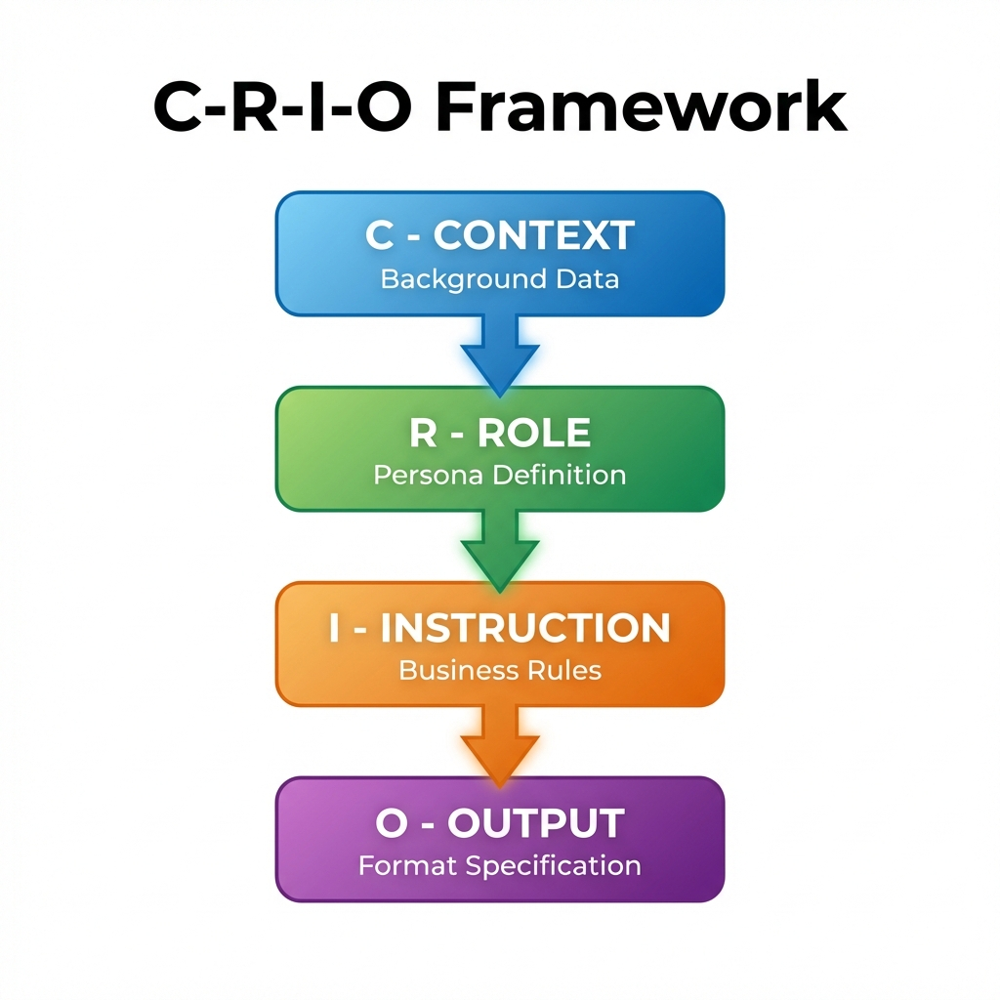
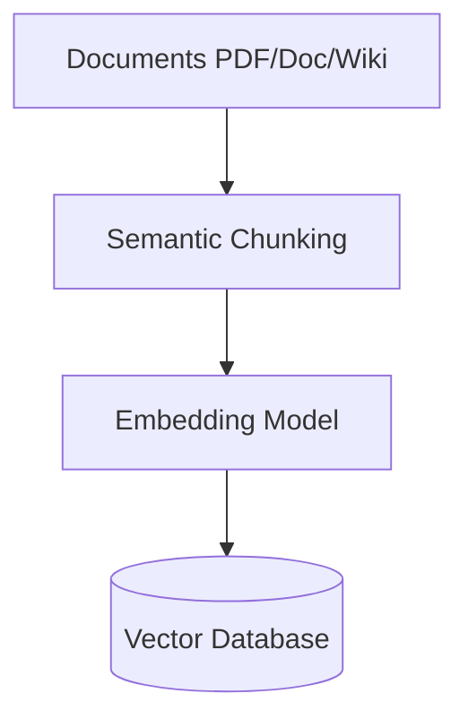
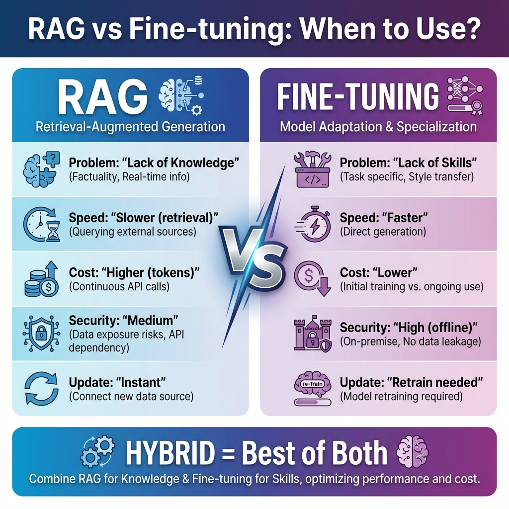
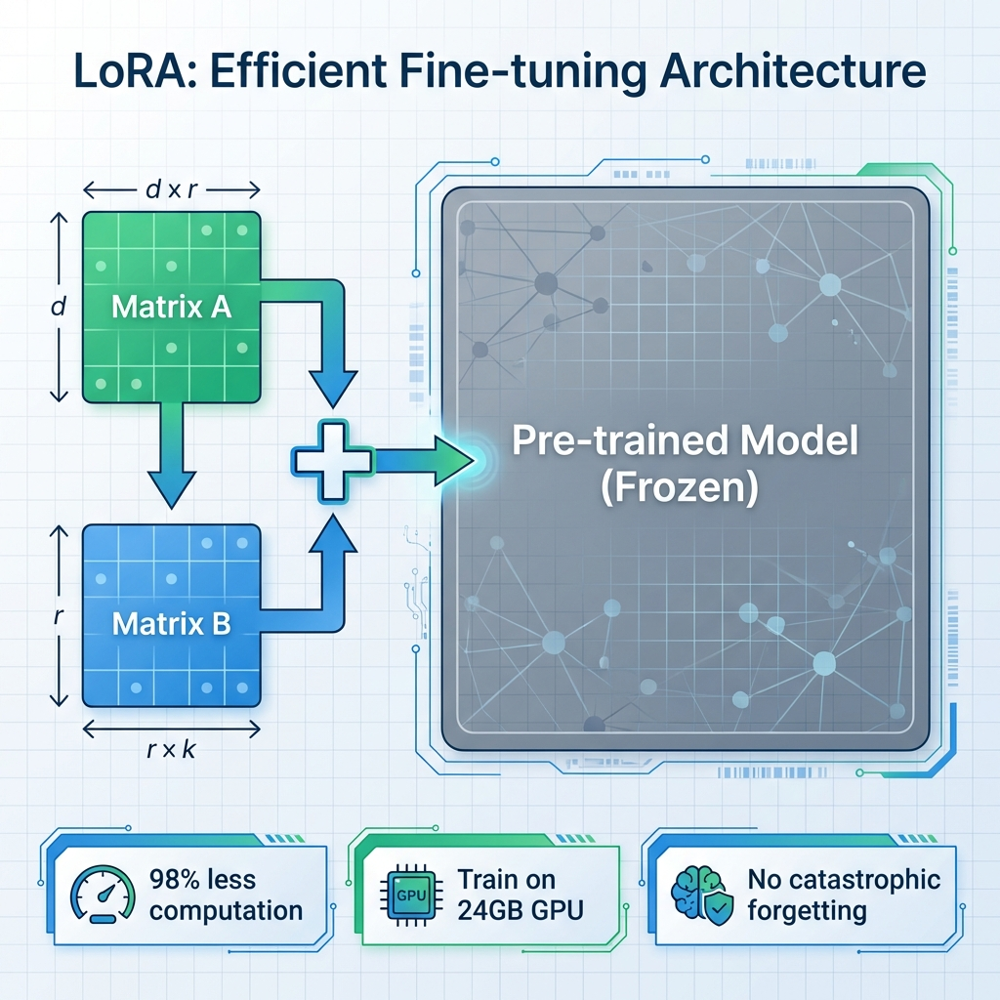
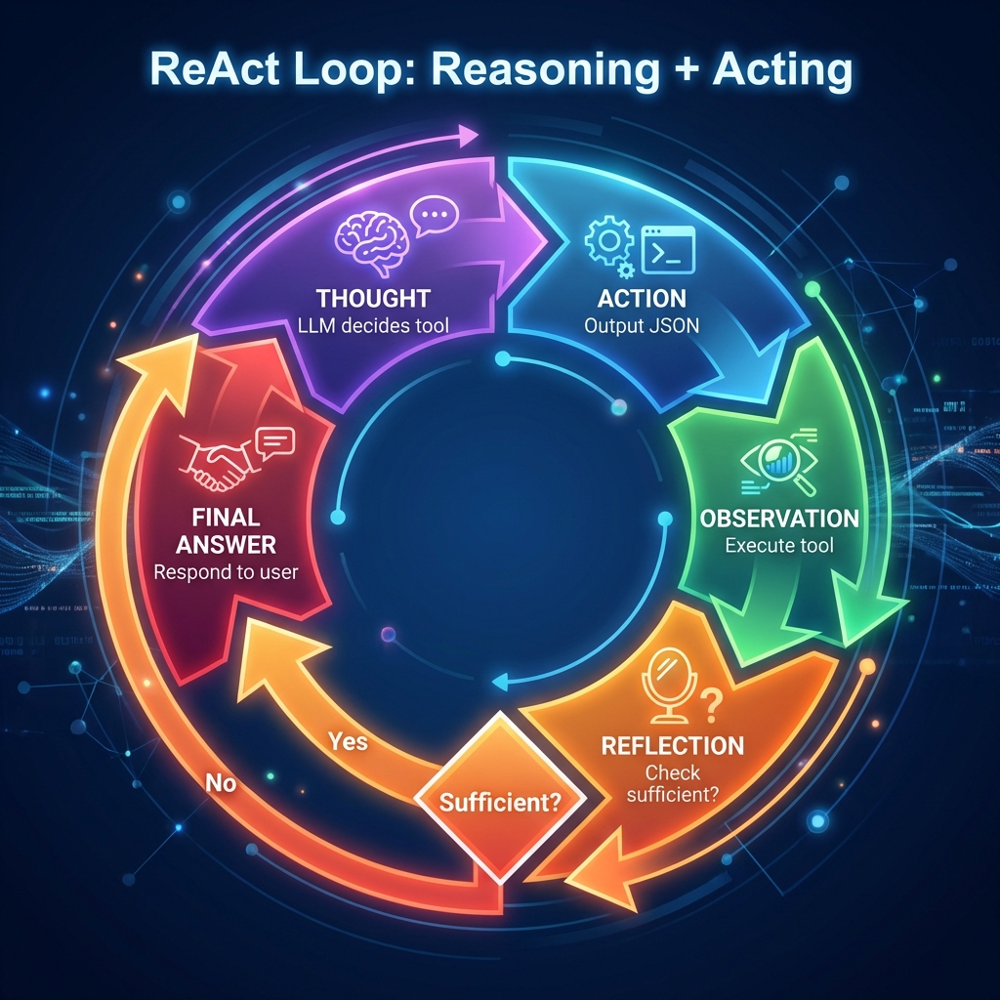
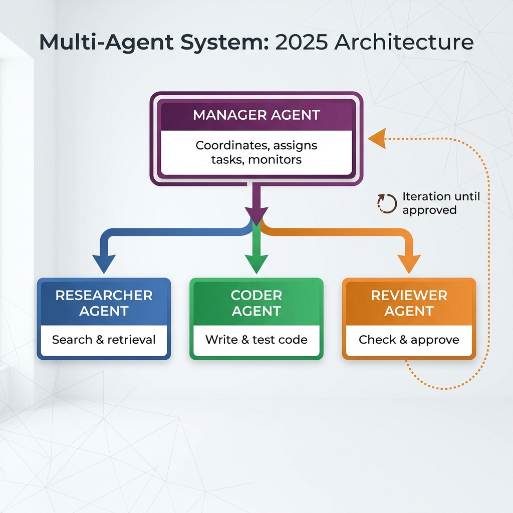
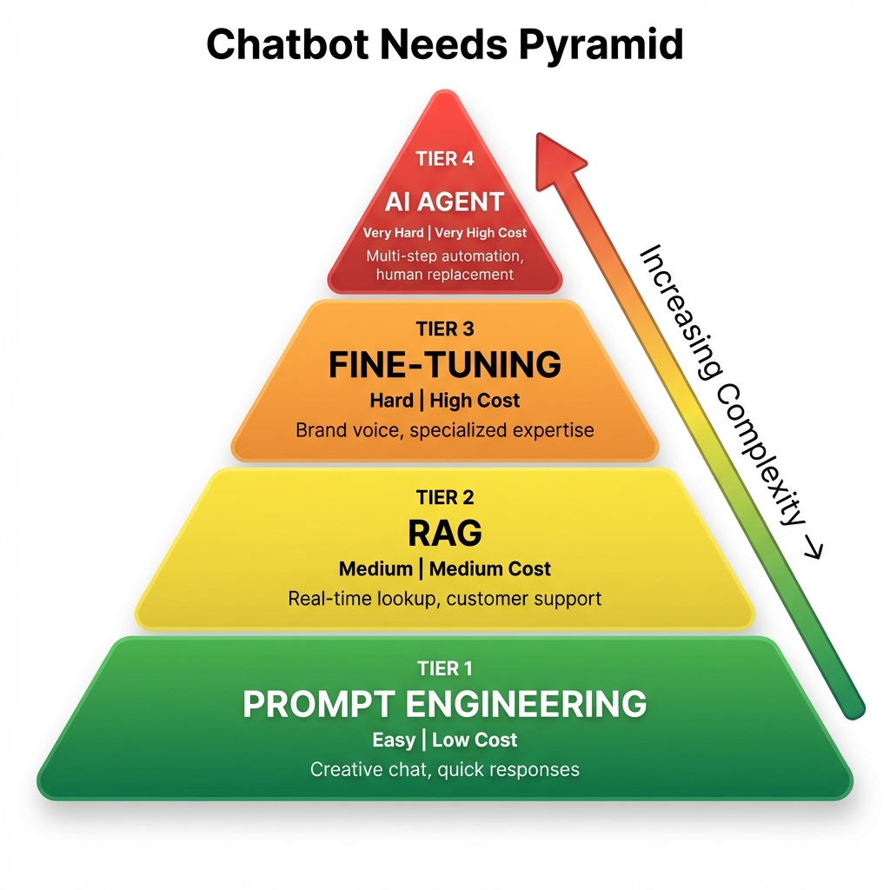

# Building GenAI Chatbots: From Prompt Engineering to Autonomous AI Agents

**Author:** AI Researcher  
**Published:** January 16, 2026

## Introduction: Beyond the ChatGPT Interface

We're living in the era of Generative AI explosion. However, for developers and enterprises, "using AI" is no longer just about opening a web browser and chatting with ChatGPT.

The real challenge lies in **Build & Integrate**. How do we transform a Large Language Model (LLM) into a virtual assistant that understands internal data, follows business processes, and automates tasks?

In this in-depth article, we'll dissect **4 technical levels** for building enterprise chatbot systems, progressing from foundational basics to the most complex architectures:

1. **Prompt Engineering:** The art of "programming" with natural language.
2. **RAG (Retrieval-Augmented Generation):** Providing "memory" and real-time data access for AI.
3. **Fine-tuning:** Deep training to optimize behavior and specialized communication style.
4. **AI Agents:** The final evolution - autonomous agents capable of reasoning and action.

This article analyzes each method from the perspectives of **system architecture**, **operating mechanisms**, and **practical use cases** to help you choose the most suitable strategy for your project.

Let's begin the journey from the first Prompt!

---

## 1. Prompt Engineering: Programming with Natural Language

If you think Prompt Engineering is simply "knowing how to Google" or "casual chatting," think again. In Generative AI architecture, this is the **Soft Programming** layer.

### 1.1. Essence: Model Control Protocol

Prompt Engineering is essentially **Natural Language Programming**. Instead of writing code in Python or Java for computers to understand, we use English (or Vietnamese) to program the model's thinking.

Technically, when you input a prompt, you don't change any model parameters (weights remain frozen). Instead, you're operating at the **Interface Layer**. A good prompt guides the **Self-Attention** mechanism of Transformers, helping activate precise data points in the massive **Latent Space** the model has learned.

> 💡 **Correct Mindset:** Consider the LLM as an extremely powerful compiler, and your Prompt is the Source Code. Poor code leads to buggy execution (or crashes), excellent code runs smoothly.

### 1.2. C-R-I-O Framework: Enterprise Prompt Structure

To transform an LLM from a parrot into a business processing tool, don't chat randomly. Follow the **C-R-I-O** standard framework. This structure ensures output consistency.



#### 1. **C - Context (Background/Foundation Data)**
This is where you provide "raw materials" for the model to process. Context helps narrow the knowledge search scope, reducing hallucinations.
* *Example:* Financial report data, text to summarize, or Database schema.

#### 2. **R - Role (Persona)**
Assign a specific "Persona." This helps adjust vocabulary probability distribution, forcing the model to use specialized language instead of common language.
* *Weak:* "Write Python code for me..."
* *Strong:* "You are a **Senior Backend Engineer** with 10 years of experience in Python and High-performance Computing..."

#### 3. **I - Instruction (Logic Guidelines)**
This is the most important part: Business rules the model must follow.
> [!IMPORTANT]
> Don't forget **Negative Constraints**: Clearly state what the model **MUST NOT** do. Example: *"Do not explain verbosely, just return code."*

#### 4. **O - Output (Output Format)**
For software integration, output must be standardized (Machine-readable).
* *Requirement:* "Return results as a JSON object with fields `id`, `summary`, `sentiment`."

#### ⚔️ Real-world Example: Customer Complaint Handling

Suppose you need to build a feature that automatically reads emails and categorizes complaints for CRM systems.

**❌ Wrong Approach (Random Prompt):**
> "Read this email and tell me what the customer is upset about and their name. Email: [Email content...]"

* **Result:** Chatbot responds verbosely: *"Based on the email, I see Mr. Tran Van B is very upset because delivery was late..."*
* **Consequence:** Backend Dev is **helpless**, cannot code to automatically capture this information.

**✅ Correct Approach (Applying C-R-I-O):**

```text
# ROLE
You are an AI Customer Support Analyst, specializing in sentiment analysis and customer data extraction.

# CONTEXT
Customer email: """
Hello shop, I am Tran Van B (order #DH123). I ordered a red shirt but received a blue one. Very disappointed!
"""

# INSTRUCTION
1. Identify customer name and order ID.
2. Classify issue (Wrong item/Damaged/Late delivery).
3. Assess sentiment (Negative/Neutral/Positive).
4. ABSOLUTELY DO NOT provide advice, explanations, or apologies.

# OUTPUT
Return result as a single JSON object following this template:
{
  "customer_name": "string",
  "order_id": "string",
  "issue_type": "string",
  "sentiment": "string"
}
```

---

### 1.3. Advanced Accuracy Techniques

Once you've mastered the C-R-I-O structure, apply these 2 tactics to handle "difficult" requirements where prompts typically struggle.

#### A. Chain-of-Thought (CoT): "Draft Before Answering"

Have you noticed that if you force a student to solve math and demand "immediate answer," they easily make mistakes? AI is the same. If you force immediate responses, it often guesses (Hallucination).

**Chain-of-Thought** is simply a technique forcing AI to **"think step by step"** (like drafting) before providing final results.

* **Simplest usage (Zero-shot):** Add the magic phrase *"Let's think step by step"* at the end of the prompt.
* **Effectiveness:** Writing out reasoning steps gives AI extra "time" to self-check its logic, reducing error rates in calculation or logical reasoning tasks.

**Comparison Example:**

| Approach | Prompt | Actual Result |
| :--- | :--- | :--- |
| **Forced (Wrong)** | "A has 5 apples, gives B 2, buys 3 more. How many does A have? Answer immediately." | ❌ Easily answers wrong (e.g., 5) due to hasty calculation. |
| **CoT (Correct)** | "List the process of apple count changes, then determine the result." | ✅ **Accurate:** 5 - 2 = 3; 3 + 3 = 6. <br> **Answer: 6** |

---

#### B. Few-Shot Prompting: "Don't Explain, Show Examples"

Sometimes, writing a long paragraph to describe rules (Zero-shot) is confusing and time-consuming. Instead, leverage AI's **excellent mimicry** capability using **Few-Shot Prompting** (providing sample examples).

Imagine training a new employee. Instead of handing them a thick procedure manual, you just give them 2-3 well-done sample files and say: *"Do exactly like this."*

**This technique is extremely powerful when:**
1. You need AI to return unusual formats (complex JSON, specific XML).
2. You want AI to mimic specific Tone of voice.

**Sample Prompt Structure:**

```text
[Task]: Classify customer sentiment (Return only Positive/Negative/Neutral)

[Example 1 - For AI to learn]
Customer: "Late delivery but good quality."
AI: Neutral

[Example 2 - For AI to learn]
Customer: "Terrible packaging, everything broken."
AI: Negative

[Actual question to process]
Customer: "Excellent, will buy again."
AI: [Model will automatically fill: Positive]
```

---

## 2. RAG (Retrieval-Augmented Generation): "Open-Book" Chatbot

### 2.1 Definition

RAG is more than just a term—it's a **tool that transforms LLMs into assistants with "expanded memory."**

- **Traditional LLM**: Like students taking closed-book exams relying solely on internal memory – all knowledge "frozen" at training time.
- **RAG**: Allows students to bring **textbooks** (External Knowledge Base) into the exam, consulting as needed. This enables chatbots to **retrieve** real-time information, minimizing "fabrication" (hallucination).

### 2.2 Dual Pipeline Architecture


RAG is divided into **two independent but closely coordinated pipelines**:

#### Pipeline 1 – Ingestion (Data Loading – Offline ETL)



| Step | Description | Notes |
|------|-------------|-------|
| **Semantic Chunking** | Split documents into *chunks* where each chunk contains one complete idea. | > [!IMPORTANT] "Garbage In, Garbage Out" – answer quality depends ~80% on this step. |
| **Naïve Chunking** | Fixed split every 500 words. | Risk: cuts important sentences in half, loses context. |
| **Semantic Chunking (recommended)** | Use language models to detect idea boundaries, preserving context. | Current industry standard. |
| **Embedding** | Transform each chunk into a **vector** (number sequence) for machines to "understand" meaning. | Example: "King" vector is close to "Queen" vector. |
| **Vector Database** | Store vectors for **fast search** (milliseconds). | Popular solutions: ChromaDB, Qdrant, Weaviate, Pinecone. |

#### Pipeline 2 – Inference (Reasoning – Runtime)


1. **Embedding** – User question is encoded into a vector.
2. **Hybrid Search** – Combines **Vector Search** (semantic search) + **Sparse Search (BM25)** (keyword matching) to reduce "blind spots."
3. **Top-50 Candidates** – Retrieve 50 chunks with highest similarity scores.
4. **Reranker (Cross-Encoder)** – Re-evaluate each *question-passage pair*, keep only **Top-3-5** highest quality.
5. **LLM + Context** – Combine selected chunks into prompt, LLM generates final answer.

### 2.3 Hybrid Search – Combining Dense & Sparse

- **Vector Search** (Dense) excels at **finding meaning** (semantic similarity).
- **Sparse Search** (BM25) excels at **exact keyword matching**, especially for non-semantic strings like SKU codes, phone numbers.

**Strategy:** Perform **Hybrid Search**, merge scores, then feed into **Reranker**. This significantly reduces "false negatives" when using only one method.

### 2.4 Re-ranking – "Refinement Filter"

> [!NOTE]
> Re-ranking is the boundary between a **"toy" RAG** and a **true enterprise RAG**.

- **Problem:** Original retrieval returns ~50 chunks, accuracy only 60-70%.
- **Solution:** Use **Cross-Encoder** (trained to evaluate relevance) to **re-score** and keep only **Top-3-5** chunks.
- **Result:** Accuracy increases to **90%+**, while reducing LLM load.

### 2.5 Query Rewriting – Question Reformation

Users often pose short, context-lacking questions (e.g., *"When was he born?"*).

**Solution:** Before searching, use **LLM** to **rewrite** the question into complete form (e.g., *"When was Tim Cook born?"*). This helps Retrieval find the right chunk and avoid "no-result."

### 2.6 Citations – Source Attribution

Require chatbot to **provide sources** for each piece of information:
> "This information is from **Page 15, HR Procedures Document**."

This not only increases **trust** (Trustworthy AI) but also meets legal requirements (GDPR, ISO 27001, ...).

### 2.7 Recommended Tech-stack

| Component | Tools / Libraries |
|-----------|-------------------|
| **Framework** | LangChain, LlamaIndex |
| **Vector Database** | **ChromaDB** (quick evaluation, runs locally) <br> **Qdrant / Weaviate / Pinecone** (production, scaling) |
| **Embedding Model** | OpenAI `text-embedding-3-small` (low cost, good quality) <br> HuggingFace `sentence-transformers` (free, runs locally) |
| **Reranker** | Cross-Encoder (BERT-based) – can use `sentence-transformers` or `colbert` |
| **Search Engine** | BM25 (Sparse) + FAISS / HNSW (Dense) |

### 2.8 Pros & Cons

|  | ✅ Advantages | ❌ Disadvantages |
|---|--------------|------------------|
| **RAG** | • **Real-time knowledge** – just upload new documents.<br>• Reduces **hallucination** – answers based on actual sources.<br>• Clear **citations** → increased trust. | • **Speed** – requires retrieval + rerank time.<br>• **Token cost** – passing multiple chunks to prompt.<br>• **Implementation effort** – ingestion, embedding, DB, search, rerank. |

---

## 3. Fine-tuning: Training True "Experts"

### 3.1 Definition
Fine-tuning is the process of **updating weights** of a pre-trained model using a **small, specialized** dataset. The goal is to modify the model's **behavior** or **expression style** to fit specific business context, style, and operations.

### 3.2 RAG vs Fine-tuning – When to Use What?



| Criteria | RAG | Fine-tuning |
|----------|-----|-------------|
| **Solves Problem** | Lack of **knowledge** (data updates) | Lack of **skills/behavior** (response style adjustment) |
| **Example** | Bot doesn't know today's gold price | Bot responds too mechanically, no brand "voice" |
| **Data Updates** | **Instant** – just upload new files | **Must retrain** – time and resources required |
| **Response Speed** | **Slower** – needs retrieval + rerank | **Faster** – all information already in model |
| **Token Cost** | **High** – passing many chunks to prompt | **Low** – just sending questions |
| **Security** | Data might leak (sent to API) | **Absolute** – model runs offline, no external data transmission |

> **TIP** – **Hybrid**: Combine RAG for latest data and a **Fine-tuned** model for **brand voice** and **standard behavior** – this is the strongest configuration for enterprise chatbots.

### 3.3 PEFT & LoRA Revolution



#### Full Fine-tuning (old method)
- Updates **all** billions of parameters.
- Requires **supercomputer**, costs millions of USD.
- Risk of **Catastrophic Forgetting** – model forgets learned knowledge.

#### LoRA (Low-Rank Adaptation – modern method)
- **"Interior Renovation" principle**: base model is a skyscraper (frozen), LoRA only **repaints walls** and **changes furniture** using small weight matrices (A, B).
- Reduces **computational load by 98%** compared to full fine-tuning.
- Can **train 7B model** on a single 24 GB VRAM GPU (gaming laptop).

#### QLoRA (Quantized LoRA)
- Compresses base model to **4-bit** before applying LoRA, reducing memory 4x.
- Enables **open-source model training** right on personal machines, opening the "AI at home" era.

### 3.4 Training Data (Instruction Dataset)

> **IMPORTANT** – **Quality > Quantity**. A set of **500-1,000 "clean" samples** (thoroughly reviewed) typically yields better results than **100,000 garbage samples**.

#### JSON Format (model-ready)

```json
[
  {
    "instruction": "You are an AI doctor. Diagnose based on symptoms.",
    "input": "Male patient, 40 years old, left chest pain, sweating.",
    "output": "Based on left chest pain and sweating symptoms, suspect acute myocardial infarction. Recommend immediate ECG."
  }
]
```

- **instruction**: task description.
- **input**: actual input data (symptoms, questions).
- **output**: desired answer, following style and format.

### 3.5 Deployment Pipeline

1. **Data Preparation** – Collect chat history, internal documents; **clean** (remove errors, standardize); convert to **JSON/JSONL**.
2. **Choose Base Model** – Select appropriate model:
   - **Llama 3** (power),
   - **Mistral** (speed),
   - **Qwen** (Asian language support).
3. **Training** – Use fast frameworks like **Unsloth**, **Axolotl**, or **HuggingFace TRL**.
4. **Monitor Loss** –
   - **Loss steadily decreases** → stable,
   - **Loss increases** → over-fitting, need to reduce learning-rate or increase data.
5. **Merge & Export** – Merge **LoRA adapter** into base model, create deployment-ready **model checkpoint**.

### 3.6 Pros & Cons

|  | ✅ Advantages | ❌ Disadvantages |
|---|--------------|------------------|
| **Fine-tuning** | • **Extremely fast inference** (no retrieval needed).<br>• **Low running cost** (fewer tokens).<br>• **Absolute security** – runs 100% offline.<br>• **Voice control** – meets brand style. | • Knowledge **"frozen"** at training time – no new information updates.<br>• **Hallucination** if asked beyond training data scope.<br>• Requires **experienced AI engineers** (hyper-parameter tuning, data management). |

---

**Conclusion**
Fine-tuning is the way to "train experts" for LLMs, enabling enterprises to **shape behavior, tone, and accuracy** in specialized tasks. When combined with RAG (Hybrid), you get **both real-time knowledge** and **standard brand responses** – this is currently the strongest configuration for enterprise chatbots.

---

## 4. AI Agent: The Final Evolution – Automation

### 4.1 Definition
**AI Agent** is a system using **LLM** as the "central brain" (Reasoning Engine) to **orchestrate actions**. Instead of just generating text, Agents generate **decisions** and **call tools** to accomplish user goals. Thus, chatbots are no longer just Q&A tools but **autonomous action units** capable of interacting with real environments (APIs, databases, file systems, ...).

### 4.2 Agent Anatomy
An effective Agent needs **four core components**:

1. **Agent Core (Brain – LLM)**: Handles reasoning, generates *thoughts* and *actions*.
2. **Memory**:
   - **Short-term** – stores conversation history and current state.
   - **Long-term** – stores experience from previous runs (typically as **Vector DB**).
3. **Planning**: Breaks large tasks (e.g., *competitor analysis*) into **sub-tasks** executable sequentially or in parallel.
4. **Tools**: Actual execution interfaces – Google Search, Calculator, Python interpreter, email API, SQL queries, etc.

### 4.3 ReAct Loop (Reason + Act)



**ReAct Process** described in five steps:

1. **Thought** – LLM thinks about the request, determines which tool is needed. *Example*: "User asks about Hanoi weather, I need `get_weather` tool."
2. **Action** – LLM outputs **JSON** describing tool call.
3. **Observation** – System executes tool, returns result (e.g., `25°C, sunny`).
4. **Reflection** – LLM evaluates if information is sufficient; if not, repeats loop.
5. **Final Answer** – When sufficient data, LLM responds to user.

### 4.4 Function Calling & Tool Use

**Mechanism**: Modern models (GPT-4o, Llama-3-Tool-Use) are trained to **output JSON** describing function calls. Example:

```json
{
  "tool_name": "send_email",
  "arguments": {
    "to": "boss@company.com",
    "subject": "Report",
    "body": "Task completed..."
  }
}
```

Backend system (Python/NodeJS) **catches** this JSON, executes actual function, and **returns** result to LLM for continued reasoning. This allows Agents to **perform real actions** (send email, schedule meetings, make purchases) without user intervention.

### 4.5 Multi-Agent Systems (2025 Trend)



A single Agent often faces **overload problems** and **high error rates**. Current trend is building **virtual companies** with multiple specialized Agents, coordinated under **Manager Agent** direction:

- 👔 **Manager Agent** – Receives requests, divides work, monitors progress.
- 🔍 **Researcher Agent** – Specializes in search (Google, internal documents).
- 💻 **Coder Agent** – Writes, runs, and tests Python/JS code.
- ✅ **Reviewer Agent** – Checks results, provides feedback, requests fixes.

Process **repeats** until **Reviewer** confirms correct results, creating a complete **automated feedback loop**.

### 4.6 Recommended Tech-stack

| Component | Tools / Libraries |
|-----------|-------------------|
| **Framework** | **LangGraph** – models Agent flow (graph); **CrewAI** – supports Agent team building; **Microsoft AutoGen** – Microsoft's multi-agent platform |
| **Tool Integration** | OpenAI Function Calling, Llama-3-Tool-Use, LangChain Tools, custom Python/NodeJS adapters |
| **Memory Store** | Vector DB (Chroma, Qdrant, Weaviate) for long-term memory; Redis / In-memory for short-term |
| **Orchestration** | Airflow, Prefect, or LangGraph's internal workflow for ReAct loop management |

### 4.7 Pros & Cons

|  | ✅ Advantages | ❌ Disadvantages |
|---|--------------|------------------|
| **AI Agent** | • Solves **multi-step**, complex problems.<br>• Automatically **executes real actions** (send mail, schedule, purchase).<br>• **Self-correction** – ability to fix errors through ReAct loop.<br>• Capability for **multi-tool integration** (API, DB, web). | • **High token cost** – each ReAct round consumes tokens.<br>• **Latency** – responses typically take **1-2 minutes** depending on complexity.<br>• **Risk of infinite loops** without **guardrails** (timeout, max-steps).<br>• Requires **AI engineers** to design prompts, tool wrappers, and monitoring. |

---

## 5. Summary: Chatbot Needs Pyramid



### Decision Matrix

| Level | Method | Difficulty | Cost | Application |
|-------|--------|-----------|------|-------------|
| **Foundation** | Prompt Engineering | Easy | Low | Creative chat, basic content generation |
| **Mid-Level** | RAG | Medium | Medium | Information lookup, data-driven customer support |
| **Advanced** | Fine-tuning | Hard | High | Experts, high language/business accuracy |
| **Peak** | AI Agent | Very Hard | Very High | Human replacement, complex task chains |

### Deployment Advice

> **CAUTION** – Don't start with AI Agent! **Climb the levels** from bottom up:

1. **Prompt Engineering** – Quick idea validation.
2. **RAG** – When needing real-time enterprise data access.
3. **Fine-tuning** – When needing tone and behavior control.
4. **AI Agent** – When wanting multi-step process automation, workforce reduction.

---

## References

1. OpenAI. (2024). "GPT-4 Technical Report"
2. Lewis et al. (2020). "Retrieval-Augmented Generation for Knowledge-Intensive NLP Tasks"
3. Hu et al. (2021). "LoRA: Low-Rank Adaptation of Large Language Models"
4. Yao et al. (2023). "ReAct: Synergizing Reasoning and Acting in Language Models"
5. LangChain Documentation. (2024). "Building Production-Ready RAG Systems"

---
