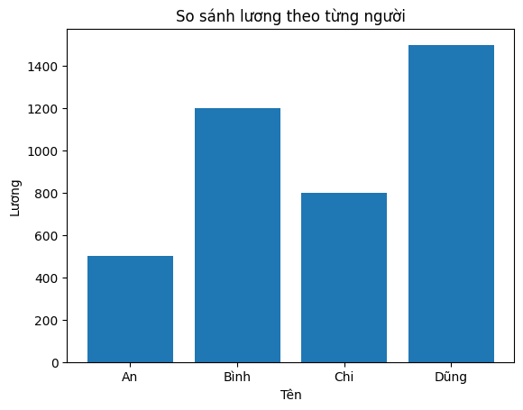

# 4. Tìm hiểu các thư viện:

Python cung cấp một hệ sinh thái các thư viện phục vụ cho việc **xử lý dữ liệu, phân tích và trực quan hóa**. Thư viện là tập hợp các hàm và đối tượng đã được xây sẵn. Bạn có thể sử dụng các thư viện này thay vì viết lại mọi thứ từ đầu.

Trong python, có 4 thư viện bắt buộc phải biết khi mới bước chân vào Machine Learning:

- NumPy
- Pandas
- Matplotlib/ Seaborn
- Scikit-learn
  Hãy hiểu **mỗi thư viện làm gì, dùng lúc nào**, không cần đào sâu lý thuyết ngay.

## 4.1. NumPy - Nền tảng xử lý số liệu:

### 4.1.1. NumPy là gì? Tại sao lại sử dụng NumPy trong Machine Learning?

NumPy giúp bạn thực hiện các **phép toán số học** trên dữ liệu. Với NumPy, bạn có thể **chuyển đổi nhiều dạng dữ liệu khác nhau về dạng số**.

Trong Machine Learning, dữ liệu đôi khi không ở dạng số, vì vậy NumPy đóng vai trò rất quan trọng trong việc xử lý và **biểu diễn toàn bộ dữ liệu nhận được dưới dạng số** để máy có thể học được.

### 4.1.2. Ví dụ minh họa với NumPy:

#### Ví dụ 1: Tạo mảng số

```python
import numpy as np

# Tạo mảng 1 chiều
arr = np.array([1, 2, 3, 4, 5])
print(arr)
```

#### Ví dụ 2: Nhân ma trận:

```python
import numpy as np

A = np.array([[1, 2],
              [3, 4]])

B = np.array([[5, 6],
              [7, 8]])

C = A @ B   # Nhân ma trận
print(C)
```

## 4.2. Pandas - Làm việc với dữ liệu dạng bảng:

### 4.2.1. Pandas và DataFrame là gì?

Trong Machine Learning, dữ liệu đầu vào thường tồn tại ở dạng **bảng** (giống Excel, CSV, SQL table).  
Pandas là một thư viện **mã nguồn mở** của Python, được sử dụng rộng rãi để **đọc, xử lý, làm sạch và phân tích dữ liệu** trước khi đưa vào mô hình học máy.

Cấu trúc dữ liệu quan trọng nhất trong Pandas là **DataFrame** – một bảng gồm:

- Các **hàng (rows)**: mỗi hàng là một bản ghi dữ liệu
- Các **cột (columns)**: mỗi cột là một đặc trưng (feature)

Ví dụ một bảng dữ liệu dạng DataFrame:

| id  | name | age | salary |
| --- | ---- | --- | ------ |
| 1   | An   | 22  | 500    |
| 2   | Bình | 35  | 1200   |
| 3   | Chi  | 28  | 800    |
| 4   | Dũng | 42  | 1500   |

DataFrame rất giống file Excel nên **dễ đọc, dễ chỉnh sửa và thuận tiện cho phân tích dữ liệu**.

Trong thực tế, dữ liệu thực tế thường **thiếu giá trị**, lẫn **dữ liệu sai**, **không đúng định dạng**. Do vậy, chung ta phải **làm sạch dữ liệu trước** khi train model.

Ví dụ một bảng dữ liệu trong thực tế:

| name | age      | salary |
| ---- | -------- | ------ |
| An   | 22       | 500    |
| Bình |          | 1200   |
| Chi  | 28       | ???    |
| Dũng | bốn mươi | 1500   |

### 4.2.2. Ví dụ minh họa với Pandas:

#### Ví dụ 1: Tạo một DataFrame giống Excel:

```python
import pandas as pd

data = {
    "name": ["An", "Bình", "Chi", "Dũng"],
    "age": [22, 35, 28, 42],
    "salary": [500, 1200, 800, 1500]
}

df = pd.DataFrame(data)
print(df)
```

Kết quả nhận được:

```
   name  age  salary
0   An   22     500
1  Bình  35    1200
2  Chi   28     800
3  Dũng  42    1500
```

#### Ví dụ 2: Thống kê nhanh trên DataFrame:

```python
df.describe()
```

Kết quả nhận được:

```t
       age    salary
mean   31.75  1000
min    22     500
max    42     1500
```

# 4.3. Matplotlib / Seaborn - Trực quan hóa dữ liệu:

### 4.3.1. Matplotlib và Seaborn là gì?

Matplotlib và Seaborn là 2 thư viện phổ biến nhất trong Python, chúng cho phép vẽ biểu đồ và đồ thị từ kết quả phân tích được. Nếu chúng ta chỉ hiểu dự liệu thông qua bảng số thì rất khó khăn, vì vậy việc trực quan hóa những bảng biểu này có thể giúp chúng ta quan sát và dễ dàng rút ra kết luận.

### 4.3.2. Ví dụ minh họa với Matplotlib/ Seaborn:

#### Ví dụ 1: Biểu đồ cột:

```python
import matplotlib.pyplot as plt

names = ["An", "Bình", "Chi", "Dũng"]
salary = [500, 1200, 800, 1500]

plt.bar(names, salary)
plt.xlabel("Tên")
plt.ylabel("Lương")
plt.title("So sánh lương theo từng người")
plt.show()
```

<figure>
  
  <figcaption><em></em></figcaption>
</figure>

#### Ví dụ 2: Biểu độ phân bố theo lương:

```python
import seaborn as sns

sns.histplot(salary, bins=10)
plt.title("Phân bố mức lương")

plt.show()
```

Kết quả nhận được:

<figure>
  
  <figcaption><em></em></figcaption>
</figure>

# 4.4. Scikit-learn – Thư viện Machine Learning cơ bản

## 4.4.1. Scikit-learn là gì? Dùng khi nào?

Scikit-learn (sklearn) là thư viện Machine Learning phổ biến nhất trong Python, cung cấp sẵn các **thuật toán ML cơ bản** và các **công cụ hỗ trợ toàn bộ quá trình huấn luyện mô hình**.

Scikit-learn thường được dùng khi:

- Dữ liệu đã được **làm sạch và chuyển về dạng số** (bằng NumPy, Pandas)
- Cần **train, đánh giá và so sánh model** nhanh chóng
- Làm các bài toán Machine Learning cổ điển:
  - Regression (hồi quy)
  - Classification (phân loại)
  - Clustering (phân cụm)

---

## 4.4.2. Quy trình Machine Learning cơ bản với Scikit-learn

Một bài toán Machine Learning cơ bản với Scikit-learn thường gồm các bước:

1. Chuẩn bị dữ liệu (X, y)
2. Chia tập train / test
3. Chọn mô hình
4. Train mô hình
5. Đánh giá kết quả

---

## 4.4.3. Ví dụ minh họa với Scikit-learn

### Ví dụ 1: Bài toán hồi quy tuyến tính (Linear Regression)

Dự đoán **lương theo tuổi** (ví dụ minh họa đơn giản).

```python
from sklearn.linear_model import LinearRegression
import numpy as np

# Dữ liệu
X = np.array([[22], [35], [28], [42]])  # tuổi
y = np.array([500, 1200, 800, 1500])    # lương

# Tạo model
model = LinearRegression()

# Train model
model.fit(X, y)

# Dự đoán
pred = model.predict([[30]])
print(pred)
```

---

### Ví dụ 2: Bài toán phân loại (Classification)

Ví dụ đơn giản: phân loại **đậu / rớt** dựa trên điểm số.

```python
from sklearn.linear_model import LogisticRegression

# Dữ liệu
X = [[5], [6], [7], [8], [9]]
y = [0, 0, 0, 1, 1]  # 0: rớt, 1: đậu

model = LogisticRegression()
model.fit(X, y)

print(model.predict([[7.5]]))
```
