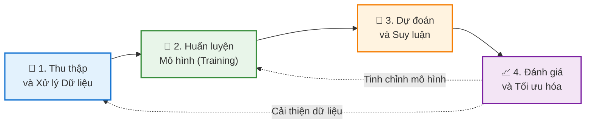

# Chào Mừng Đến Với Blog Học Machine Learning Cơ Bản  
Chào mừng bạn đến với hành trình khám phá thế giới đầy thú vị của Machine Learning! 👋🤖
## Về Blog Này
Chúng ta đang sống trong một kỷ nguyên mà **Machine Learning (Học máy)** không còn là khái niệm xa vời trong phim viễn tưởng. Nó đang âm thầm định hình lại cuộc sống hàng ngày của mỗi chúng ta. Từ gợi ý phim trên Netflix, trợ lý ảo Siri/Google Assistant, cho đến những bước tiến trong chẩn đoán y tế hay xe tự lái – Machine Learning hiện diện ở khắp mọi nơi.

Nhưng thực chất, **Machine Learning là gì?** Làm thế nào một cỗ máy có thể tự "học" từ dữ liệu mà không cần con người cầm tay chỉ việc qua từng dòng code? Và quan trọng hơn, **bạn nên bắt đầu từ đâu** giữa biển kiến thức mênh mông này?

Blog này ra đời để cùng bạn giải mã những câu hỏi đó. Tại đây, mình sẽ chia sẻ chuỗi bài viết từ cơ bản đến nâng cao, được đơn giản hóa để bất kỳ ai cũng có thể tiếp cận. Dù bạn là sinh viên, một lập trình viên muốn lấn sân sang mảng AI, hay đơn giản là một người yêu thích công nghệ, hy vọng bạn sẽ tìm thấy những hành trang giá trị tại trạm dừng chân này.

# Chương 1: Machine Learning là gì?  
## 1. Giới thiệu
Machine Learning (ML - Học máy) không chỉ là một từ khóa công nghệ, mà đã trở thành động lực cốt lõi cho cuộc cách mạng kỹ thuật số thế kỷ 21. Nó thay đổi căn bản cách con người giải quyết vấn đề: thay vì lập trình cứng nhắc, chúng ta dạy máy tính tự học.

Từ những ứng dụng gần gũi như chẩn đoán y tế, trợ lý ảo, xe tự lái, cho đến những bài toán vĩ mô như mô hình hóa khí hậu, Machine Learning đã trở thành công cụ không thể thiếu trong nền khoa học máy tính hiện đại.

## 2. Định nghĩa và khái niệm cơ bản
### 2.1 Định nghĩa

Machine Learning là một nhánh của **Trí tuệ nhân tạo (AI)**, tập trung vào việc xây dựng các thuật toán và mô hình thống kê giúp máy tính có khả năng **"học"** từ dữ liệu. Thay vì được lập trình chi tiết cho từng tình huống, hệ thống sẽ tự cải thiện hiệu suất của mình thông qua kinh nghiệm.

### 2.2 Công thức hóa (Theo Tom Mitchell)
Về mặt toán học và khoa học, một bài toán Machine Learning được định nghĩa chuẩn mực như sau:

> "Một chương trình máy tính được gọi là học từ kinh nghiệm **$E$** đối với một lớp tác vụ **$T$** và thước đo hiệu suất **$P$**, nếu hiệu suất của nó đối với tác vụ **$T$**, được đo bởi **$P$**, cải thiện theo kinh nghiệm **$E$**."

**Ví dụ dễ hiểu (Bộ lọc Spam):**
* **Tác vụ ($T$):** Phân loại email là "Spam" hay "Không phải Spam".
* **Kinh nghiệm ($E$):** Xem xét các email đã được người dùng dán nhãn trước đó.
* **Hiệu suất ($P$):** Tỷ lệ phần trăm số email được phân loại chính xác.

### 2.3 Sự chuyển dịch mô hình
Sự khác biệt lớn nhất giữa Lập trình truyền thống và Machine Learning nằm ở **luồng đi của dữ liệu và quy tắc**:

* **Lập trình Truyền thống:** Con người phải hiểu vấn đề, viết ra các quy tắc (luật/logic) để máy tính xử lý dữ liệu và đưa ra kết quả.
$$\text{Dữ liệu} + \text{Quy tắc (Code)} \rightarrow \text{Kết quả}$$

* **Machine Learning:** Máy tính nhìn vào dữ liệu và kết quả mong muốn, từ đó tự tìm ra quy tắc => mô hình.
$$\text{Dữ liệu} + \text{Kết quả (Output)} \rightarrow \text{Quy tắc (Mô hình)}$$

**Mục tiêu cốt lõi:**
Mục tiêu là tìm ra một hàm số $f: X \to Y$ sao cho nó ánh xạ đầu vào $X$ tới đầu ra $Y$ một cách chính xác nhất. Quan trọng hơn, hàm số này phải có khả năng **tổng quát hóa (generalization)** – tức là hoạt động tốt ngay cả với những dữ liệu mới mà nó chưa từng thấy trong quá trình huấn luyện.

  
## Tài liệu tham khảo

1. [How Do Chatbots Work? – BotsCrew](https://botscrew.com/blog/what-are-bots/)
2. Building Vietnamese Chatbot using LLMs and RLHF – AI Vietnam
3. [Rubric (academic) - Wikipedia](https://en.wikipedia.org/wiki/Rubric_\(academic\))
3. [ConvoMem Benchmark: Why Your First 150 Conversations Don’t Need RAG](https://arxiv.org/html/2511.10523)
4. [Introduction | Ragas](https://docs.ragas.io/en/v0.1.21/index.html)
5. [OpenAI. (2024). "GPT-4 Technical Report"](https://arxiv.org/html/2511.10523)
6. [Lewis et al. (2020). "Retrieval-Augmented Generation for Knowledge-Intensive NLP Tasks"](https://arxiv.org/html/2511.10523)
7. [Hu et al. (2021). "LoRA: Low-Rank Adaptation of Large Language Models"](https://arxiv.org/html/2511.10523)
8. [Yao et al. (2023). "ReAct: Synergizing Reasoning and Acting in Language Models"](https://arxiv.org/html/2511.10523)
9. [LangChain Documentation. (2024). "Building Production-Ready RAG Systems"](https://arxiv.org/html/2511.10523)