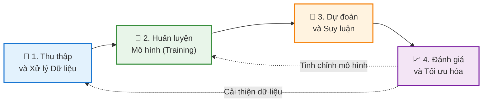

# Chào Mừng Đến Với Blog Học Machine Learning Cơ Bản  
Chào mừng bạn đến với hành trình khám phá thế giới đầy thú vị của Machine Learning! 👋🤖
## Về Blog Này
Chúng ta đang sống trong một kỷ nguyên mà **Machine Learning (Học máy)** không còn là khái niệm xa vời trong phim viễn tưởng. Nó đang âm thầm định hình lại cuộc sống hàng ngày của mỗi chúng ta. Từ gợi ý phim trên Netflix, trợ lý ảo Siri/Google Assistant, cho đến những bước tiến trong chẩn đoán y tế hay xe tự lái – Machine Learning hiện diện ở khắp mọi nơi.

Nhưng thực chất, **Machine Learning là gì?** Làm thế nào một cỗ máy có thể tự "học" từ dữ liệu mà không cần con người cầm tay chỉ việc qua từng dòng code? Và quan trọng hơn, **bạn nên bắt đầu từ đâu** giữa biển kiến thức mênh mông này?

Blog này ra đời để cùng bạn giải mã những câu hỏi đó. Tại đây, mình sẽ chia sẻ chuỗi bài viết từ cơ bản đến nâng cao, được đơn giản hóa để bất kỳ ai cũng có thể tiếp cận. Dù bạn là sinh viên, một lập trình viên muốn lấn sân sang mảng AI, hay đơn giản là một người yêu thích công nghệ, hy vọng bạn sẽ tìm thấy những hành trang giá trị tại trạm dừng chân này.

# Chương 1: Machine Learning là gì?  
## 1. Giới thiệu
Machine Learning (ML - Học máy) không chỉ là một từ khóa công nghệ, mà đã trở thành động lực cốt lõi cho cuộc cách mạng kỹ thuật số thế kỷ 21. Nó thay đổi căn bản cách con người giải quyết vấn đề: thay vì lập trình cứng nhắc, chúng ta dạy máy tính tự học.

Từ những ứng dụng gần gũi như chẩn đoán y tế, trợ lý ảo, xe tự lái, cho đến những bài toán vĩ mô như mô hình hóa khí hậu, Machine Learning đã trở thành công cụ không thể thiếu trong nền khoa học máy tính hiện đại.

## 2. Định nghĩa và khái niệm cơ bản
### 2.1 Định nghĩa

Machine Learning là một nhánh của **Trí tuệ nhân tạo (AI)**, tập trung vào việc xây dựng các thuật toán và mô hình thống kê giúp máy tính có khả năng **"học"** từ dữ liệu. Thay vì được lập trình chi tiết cho từng tình huống, hệ thống sẽ tự cải thiện hiệu suất của mình thông qua kinh nghiệm.

### 2.2 Công thức hóa (Theo Tom Mitchell)
Về mặt toán học và khoa học, một bài toán Machine Learning được định nghĩa chuẩn mực như sau:

> "Một chương trình máy tính được gọi là học từ kinh nghiệm **$E$** đối với một lớp tác vụ **$T$** và thước đo hiệu suất **$P$**, nếu hiệu suất của nó đối với tác vụ **$T$**, được đo bởi **$P$**, cải thiện theo kinh nghiệm **$E$**."

**Ví dụ dễ hiểu (Bộ lọc Spam):**
* **Tác vụ ($T$):** Phân loại email là "Spam" hay "Không phải Spam".
* **Kinh nghiệm ($E$):** Xem xét các email đã được người dùng dán nhãn trước đó.
* **Hiệu suất ($P$):** Tỷ lệ phần trăm số email được phân loại chính xác.

### 2.3 Sự chuyển dịch mô hình
Sự khác biệt lớn nhất giữa Lập trình truyền thống và Machine Learning nằm ở **luồng đi của dữ liệu và quy tắc**:

* **Lập trình Truyền thống:** Con người phải hiểu vấn đề, viết ra các quy tắc (luật/logic) để máy tính xử lý dữ liệu và đưa ra kết quả.
$$\text{Dữ liệu} + \text{Quy tắc (Code)} \rightarrow \text{Kết quả}$$

* **Machine Learning:** Máy tính nhìn vào dữ liệu và kết quả mong muốn, từ đó tự tìm ra quy tắc => mô hình.
$$\text{Dữ liệu} + \text{Kết quả (Output)} \rightarrow \text{Quy tắc (Mô hình)}$$

**Mục tiêu cốt lõi:**
Mục tiêu là tìm ra một hàm số $f: X \to Y$ sao cho nó ánh xạ đầu vào $X$ tới đầu ra $Y$ một cách chính xác nhất. Quan trọng hơn, hàm số này phải có khả năng **tổng quát hóa (generalization)** – tức là hoạt động tốt ngay cả với những dữ liệu mới mà nó chưa từng thấy trong quá trình huấn luyện.

## 2. Phân nhóm các thuật toán machine learning

### 2.1 Supervised learning (Học có giám sát)

**Supervised learning** là phương pháp học máy trong đó mô hình được huấn luyện trên tập dữ liệu **đã được gán nhãn**. Mỗi mẫu dữ liệu bao gồm **đầu vào** và **đầu ra** mong muốn. Mục tiêu của mô hình là học được mối quan hệ ánh xạ từ đầu vào sang đầu ra để có thể dự đoán chính xác nhãn của các dữ liệu mới **chưa từng quan sát**.

**Ví dụ:**  
Trong bài toán phân loại các bức ảnh chó mèo, ta có dữ liệu huấn luyện gồm hàng nghìn bức ảnh đã được gán nhãn sẵn là `"cat"` hoặc `"dog"`. Chúng ta đưa các bức ảnh này vào trong một thuật toán và chỉ cho nó biết mỗi bức ảnh tương ứng là chó hay mèo. Sau khi thuật toán tạo ra một mô hình, tức một hàm số mà đầu vào là một bức ảnh và đầu ra là một nhãn, khi nhận được một bức ảnh mới mà mô hình **chưa nhìn thấy bao giờ**, nó sẽ dự đoán bức ảnh đó là chó hay mèo.

<figure>
  
  <figcaption>
    <em>Hình 2.1: Quy trình supervised learning.</em>
  </figcaption>
</figure>

**Ứng dụng:**  
Supervised learning được sử dụng rộng rãi trong các hệ thống dự đoán và ra quyết định như phát hiện gian lận tài chính, chẩn đoán bệnh, nhận dạng hình ảnh và xử lý ngôn ngữ tự nhiên.

Thuật toán supervised learning còn được tiếp tục chia nhỏ ra thành hai loại chính:

 

#### 2.1.1 Classification (Phân loại)

**Classification** là bài toán học có giám sát trong đó đầu ra là nhãn rời rạc. Mục tiêu của mô hình là gán mỗi mẫu dữ liệu đầu vào vào một trong các lớp đã xác định trước.

**Ví dụ:**  
Gmail xác định xem một email có phải là spam hay không; các hãng tín dụng xác định xem một khách hàng có khả năng thanh toán nợ hay không. 

**Một số thuật toán tiêu biểu:**  
- Logistic Regression  
- k-Nearest Neighbors (k-NN)  
- Support Vector Machine (SVM)  
- Decision Tree  

 

#### 2.1.2 Regression (Hồi quy)

**Regression** là bài toán học có giám sát trong đó đầu ra là giá trị liên tục. Mục tiêu của mô hình là dự đoán một đại lượng số dựa trên dữ liệu đầu vào.

**Ví dụ:**  
Một căn nhà rộng x m2, có y phòng ngủ và cách trung tâm thành phố z km sẽ có giá là bao nhiêu?

**Một số thuật toán tiêu biểu:**  
- Linear Regression  
- Ridge Regression  
- Lasso Regression  
- Decision Tree Regression  

 

### 2.2 Unsupervised learning (Học không giám sát)

**Unsupervised learning** là phương pháp học máy trong đó dữ liệu huấn luyện **không có nhãn**. Thuật toán sẽ dựa vào cấu trúc của dữ liệu để thực hiện một công việc nào đó, ví dụ như phân nhóm (clustering) hoặc giảm số chiều của dữ liệu (dimension reduction) để thuận tiện trong việc lưu trữ và tính toán.

Supervised learning phù hợp khi dữ liệu đã được gán nhãn và mục tiêu là dự đoán chính xác đầu ra. Ngược lại, Unsupervised learning được sử dụng khi dữ liệu chưa có nhãn, nhằm khám phá cấu trúc hoặc mẫu hình ẩn trong dữ liệu.

**Ứng dụng:**  
Unsupervised learning thường được dùng trong phân tích dữ liệu thăm dò, phân khúc khách hàng, phát hiện bất thường và tiền xử lý dữ liệu trước khi áp dụng các mô hình có giám sát.

Các bài toán Unsupervised learning được tiếp tục chia nhỏ thành hai loại:

 

#### 2.2.1 Clustering (phân nhóm)

Là một bài toán phân nhóm toàn bộ dữ liệu X thành các nhóm nhỏ dựa trên sự liên quan giữa các dữ liệu trong mỗi nhóm.

**Ví dụ:** Phân cụm khách hàng  
Giả sử ta có dữ liệu của hàng nghìn khách hàng, bao gồm các đặc trưng như độ tuổi, thu nhập, tần suất mua sắm và giá trị hóa đơn trung bình. Tập dữ liệu này không chứa nhãn cho biết khách hàng thuộc nhóm nào. Thuật toán học không giám sát được áp dụng để tự động phân chia các khách hàng thành những cụm khác nhau dựa trên mức độ tương đồng của các đặc trưng. Kết quả phân cụm giúp doanh nghiệp nhận diện các nhóm khách hàng có hành vi tương tự mà không cần thông tin phân loại có sẵn trước đó.

<figure>
  
  <figcaption>
    <em>Figure 2.2: Phân cụm khách hàng.</em>
  </figcaption>
</figure>

**Một số thuật toán tiêu biểu:**  
- K-means  
- Hierarchical Clustering  
- DBSCAN  

 

#### 2.2.2 Association rule (Luật kết hợp)

Là một dạng học không giám sát nhằm khai phá các mối quan hệ hoặc quy luật thường xuyên giữa các đối tượng trong dữ liệu, mà không cần nhãn đầu ra.

**Ví dụ:**  
những khách hàng nam mua quần áo thường có xu hướng mua thêm đồng hồ hoặc thắt lưng; những khán giả xem phim Spider Man thường có xu hướng xem thêm phim Bat Man, dựa vào đó tạo ra một hệ thống gợi ý khách hàng (Recommendation System), thúc đẩy nhu cầu mua sắm.

**Một số thuật toán tiêu biểu:**  
- Apriori  
- FP-Growth  
- Eclat  

 

### 2.3 Semi-supervised learning (Học bán giám sát)

**Semi-supervised learning** là phương pháp học máy kết hợp giữa học có giám sát và học không giám sát, trong đó tập dữ liệu huấn luyện gồm một phần nhỏ dữ liệu có nhãn và một phần lớn dữ liệu không có nhãn. Mục tiêu là tận dụng dữ liệu không nhãn để cải thiện hiệu quả học so với việc chỉ sử dụng dữ liệu có nhãn.

**Ví dụ:**  
Trong bài toán nhận dạng chữ viết tay, giả sử ta chỉ có một số ít ảnh chữ số được gán nhãn chính xác, trong khi phần lớn ảnh còn lại không có nhãn. Thuật toán học bán giám sát sử dụng các ảnh đã gán nhãn để định hướng quá trình học, đồng thời khai thác cấu trúc của dữ liệu không nhãn nhằm nâng cao độ chính xác khi dự đoán chữ số trong các ảnh mới.

**Ứng dụng:**  
Semi-supervised learning được sử dụng rộng rãi trong các bài toán mà dữ liệu có nhãn khan hiếm hoặc tốn kém chi phí gán nhãn. Phương pháp này đặc biệt hiệu quả trong các lĩnh vực như nhận dạng hình ảnh, xử lý ngôn ngữ tự nhiên và dữ liệu y sinh, nơi việc gán nhãn thường đòi hỏi chuyên gia.

**Một số thuật toán tiêu biểu:**  
- Self-training (Pseudo-labeling)  
- Label Propagation  

 

### 2.4 Reinforcement learning (Học tăng cường)

Reinforcement learning là phương pháp học máy trong đó một **tác nhân (agent)** học cách đưa ra hành động thông qua tương tác trực tiếp với **môi trường**. Thay vì học từ dữ liệu có nhãn, tác nhân nhận được **phần thưởng (reward)** hoặc **hình phạt (penalty)** sau mỗi hành động và dần dần học được chiến lược tối ưu nhằm tối đa hóa tổng phần thưởng trong dài hạn.

**Ví dụ:** Robot học cách di chuyển  
Giả sử một robot được đặt trong một môi trường có nhiều chướng ngại vật và mục tiêu cần đạt tới. Robot không được cung cấp trước đường đi đúng mà chỉ nhận được phần thưởng khi tiến gần đến mục tiêu và hình phạt khi va chạm hoặc đi sai hướng. Thông qua quá trình tương tác liên tục với môi trường và thử–sai các hành động, robot dần học được một chiến lược tối ưu để di chuyển đến mục tiêu với hiệu quả cao nhất.

**Ứng dụng:**  
Reinforcement learning phù hợp với các bài toán ra quyết định tuần tự, trong đó mô hình cần học chiến lược tối ưu thông qua tương tác với môi trường và phản hồi từ phần thưởng. Phương pháp này được áp dụng trong các hệ thống tự động và môi trường động, nơi không tồn tại dữ liệu gán nhãn sẵn.

**Một số thuật toán tiêu biểu:**  
- Q-learning  
- SARSA  
- Deep Q-Network (DQN)


# Chương 3: Lộ trình 4 Bước Cho Người Mới Bắt Đầu

Đối với người mới, thuật ngữ "Machine Learning" thường bị bao phủ bởi lớp sương mù của những công thức toán học khô khan và thuật toán phức tạp. Điều này dễ dẫn đến tâm lý e ngại. Tuy nhiên, sự thật là bạn không cần phải là một thiên tài toán học để bắt đầu.

Nếu có một lộ trình tiếp cận đúng đắn, kết hợp cân bằng giữa lý thuyết và thực hành, bạn hoàn toàn có thể xây dựng nền tảng vững chắc chỉ trong vài tháng. Dưới đây là lộ trình 4 bước tiêu chuẩn được tổng hợp từ các chương trình đào tạo khoa học dữ liệu hàng đầu.

## 3.1. Bước 1: Chuẩn bị "Vũ Khí" – Toán học và Lập trình

Machine Learning là sự giao thoa giữa Khoa học máy tính và Thống kê. Bạn cần hiểu bản chất của các công cụ mình sử dụng thay vì học vẹt.

### 📐 Toán học: Nền móng tư duy
Bạn không cần học lại toàn bộ chương trình đại học, hãy tập trung vào 3 trụ cột chính ứng dụng trực tiếp trong ML:

* **Đại số tuyến tính (Linear Algebra):** Đây là ngôn ngữ của dữ liệu.
    * *Tại sao cần?* Máy tính không hiểu hình ảnh hay văn bản, nó chỉ hiểu các con số được sắp xếp trong ma trận.
    * *Trọng tâm:* Vector, Ma trận, Phép nhân ma trận và các phép biến đổi. Đây là cơ sở để hiểu cách các mạng nơ-ron (Neural Networks) vận hành.
* **Giải tích (Calculus):** Động cơ của sự tối ưu hóa.
    * *Tại sao cần?* Giúp bạn hiểu cách mô hình tự điều chỉnh để giảm thiểu sai số.
    * *Trọng tâm:* Đạo hàm (Derivatives) và Quy tắc chuỗi (Chain rule). Khái niệm **Gradient Descent** (Hạ quy hoạch) – thuật toán tối ưu quan trọng nhất – được xây dựng hoàn toàn trên giải tích.
* **Xác suất & Thống kê (Probability & Statistics):** Khả năng xử lý sự không chắc chắn.
    * *Tại sao cần?* Giúp bạn hiểu dữ liệu, đánh giá độ tin cậy của dự báo và tránh bị "lừa" bởi các con số ngẫu nhiên.
    * *Trọng tâm:* Phân phối chuẩn (Gaussian distribution), Kỳ vọng, Phương sai, Định lý Bayes và Kiểm định giả thuyết.

### 💻 Lập trình: Công cụ thực thi
**Python** là lựa chọn số 1 hiện nay nhờ cú pháp đơn giản và hệ sinh thái thư viện khổng lồ.
* **Cơ bản:** Nắm vững biến, hàm, vòng lặp, và các cấu trúc dữ liệu (List, Dictionary, Tuple).
* **Bộ 3 thư viện quyền lực:**
    * **NumPy:** Xử lý tính toán mảng/ma trận hiệu năng cao.
    * **Pandas:** "Excel của lập trình viên" – dùng để đọc, làm sạch và thao tác dữ liệu dạng bảng.
    * **Matplotlib / Seaborn:** Trực quan hóa dữ liệu (vẽ biểu đồ) để tìm ra insight trước khi đưa vào mô hình.

## 3.2. Bước 2: Nắm vững Tư duy & Các thuật toán nhập môn

Trước khi nhảy vào code, hãy học cách tư duy như một kỹ sư ML. Bạn cần phân biệt rõ **Học có giám sát (Supervised)** – nơi dữ liệu đã có nhãn (đáp án), và **Học không giám sát (Unsupervised)** – nơi mô hình phải tự tìm ra cấu trúc dữ liệu.

Đồng thời, hãy làm quen với "kẻ thù" của mọi mô hình:
* **Overfitting (Học vẹt):** Mô hình nhớ máy móc dữ liệu huấn luyện nhưng thất bại khi gặp dữ liệu mới.
* **Underfitting (Học chưa tới):** Mô hình quá đơn giản để hiểu được quy luật của dữ liệu.

Sau đó, hãy bắt đầu với 4 thuật toán "kinh điển":

### 1. Linear Regression (Hồi quy tuyến tính)
* **Loại:** Học có giám sát (Hồi quy).
* **Bản chất:** Vẽ một đường thẳng sao cho đi qua gần nhất các điểm dữ liệu.
* **Ứng dụng:** Dự đoán giá nhà, doanh thu bán hàng, nhiệt độ ngày mai.
* **Bài học rút ra:** Hiểu về Hàm mất mát (Loss function) và cách giảm thiểu sai số.

### 2. Logistic Regression (Hồi quy Logistic)
* **Loại:** Học có giám sát (Phân loại).
* **Bản chất:** Dù tên là "Regression" nhưng nó dùng để phân loại. Nó sử dụng hàm Sigmoid để nén kết quả về khoảng (0, 1) – tượng trưng cho xác suất.
* **Ứng dụng:** Phân loại email Spam/Không Spam, dự đoán khách hàng rời bỏ dịch vụ hay không.
* **Bài học rút ra:** Hiểu về "Ngưỡng quyết định" (Decision Boundary).

### 3. Decision Tree (Cây quyết định)
* **Loại:** Học có giám sát (Phân loại & Hồi quy).
* **Bản chất:** Một loạt các câu hỏi Yes/No để chia nhỏ dữ liệu, giống như sơ đồ tư duy.
* **Ứng dụng:** Chẩn đoán y khoa (dựa trên triệu chứng), đánh giá rủi ro tín dụng.
* **Bài học rút ra:** Trực quan, dễ giải thích, nhưng dễ bị Overfitting. Là tiền đề cho các mô hình mạnh mẽ hơn như Random Forest.

### 4. K-Means Clustering (Phân cụm K-Means)
* **Loại:** Học không giám sát.
* **Bản chất:** Gom nhóm các điểm dữ liệu có đặc điểm giống nhau vào cùng một cụm (cluster) mà không cần biết trước nhãn.
* **Ứng dụng:** Phân khúc khách hàng (Customer Segmentation), nén ảnh.
* **Bài học rút ra:** Cách máy tính tự tìm ra cấu trúc ẩn trong dữ liệu hỗn độn.

## 3.3. Bước 3: Thực hành với Scikit-Learn (Hands-on)

Lý thuyết suông sẽ trôi tuột nếu không có thực hành. Đây là lúc bạn sử dụng thư viện **Scikit-Learn** – thư viện ML phổ biến nhất cho người mới.

* **Quy trình chuẩn:**
    1.  Tiền xử lý dữ liệu (Làm sạch, chuẩn hóa, xử lý dữ liệu thiếu).
    2.  Chia tập dữ liệu: Train set (để học) và Test set (để thi).
    3.  Huấn luyện mô hình (`model.fit()`).
    4.  Đánh giá kết quả (`model.predict()` và tính độ chính xác).
* **Dự án gợi ý:** Dự đoán người sống sót trên tàu Titanic (Kaggle), phân loại hoa Iris, dự đoán giá nhà Boston.

## 3.4. Bước 4: Mở rộng sang Deep Learning và chuyên sâu

Khi đã thành thạo các thuật toán cổ điển (Classical ML), bạn đã sẵn sàng cho bước nhảy vọt tiếp theo: **Deep Learning (Học sâu)**.

* Tìm hiểu về **Mạng nơ-ron nhân tạo (Neural Networks)**: Mô phỏng cách não bộ con người hoạt động.
* Làm quen với các thư viện nâng cao: **TensorFlow** hoặc **PyTorch**.
* Khám phá các lĩnh vực chuyên sâu:
    * *Computer Vision (Thị giác máy tính):* Xử lý hình ảnh, video.
    * *NLP (Xử lý ngôn ngữ tự nhiên):* Xử lý văn bản, giọng nói (như ChatGPT).

# Chương 4: Các khóa học Machine Learning cho người mới bắt đầu

Nhân tiện, cho những bạn đang cần một khóa học với lộ trình rõ ràng, được hướng dẫn một cách bài bản, nhưng lại không biết bắt đầu từ đâu, không muốn bản thân bị choáng ngợp với lượng lớn kiến thức.

Chúng mình sẽ giới thiệu cho bạn những khóa học **Machine Learning** phù hợp cho người mới với các tiêu chí:

- Giải thích dễ hiểu, có lộ trình rõ ràng  
- Có thực hành dễ làm để ra kết quả thật  
- Khóa học có cộng đồng đông đảo, hỗ trợ tốt  

 

## 4.1. Machine Learning Specialization – Andrew Ng  
**(DeepLearning.AI / Coursera)**

Đây gần như là lựa chọn an toàn nhất cho những ai vừa mới bắt đầu muốn tìm hiểu về Machine Learning. Bộ khoá học này được xây lại và mở rộng thành **3 khoá** (thay vì 1 khoá ML cổ điển trước đây), đi từ nền tảng đến các chủ đề quan trọng mà bạn sẽ gặp trong thực tế. Kèm theo đó là rất nhiều bài thực hành, theo từng phần, từng lộ trình rõ ràng, giúp bạn có thể hiểu lý thuyết ngay sau khi học.

Điểm mạnh lớn nhất của Andrew Ng là cách dạy giúp người mới **hiểu tư duy ML trước**, rồi mới tới code và chi tiết thuật toán. Cách giảng dạy dễ hiểu, dẫn dắt mạch lạc.

Khóa học này được thiết kế phù hợp cho:

- Người muốn học ML một cách chắc chắn, muốn có một lộ trình rõ ràng để bắt đầu  
- Người muốn hiểu được bản chất và có tư duy để ra quyết định  

**Lưu ý**: để học tốt khóa học này, bạn cần biết cơ bản về Python. Hoặc cần phải dành thời gian học song song để khi thực hành có thể làm bài tập tốt hơn.

 

## 4.2. Google Machine Learning Crash Course (MLCC) – *Free*

Nếu bạn đã có một chút nền tảng về Python và muốn tăng tốc nhanh, thì **MLCC** là một lựa chọn cực kì phù hợp. Đây là một khóa học nhanh, vừa học vừa kết hợp thực hành, và cũng dễ bắt nhịp khi Google thiết kế giúp bạn hiểu nhanh các khái niệm cốt lõi.

Điểm khác biệt của MLCC chính là đưa ra **đúng những thứ bạn cần để có thể làm được**:

- Bài đọc ngắn gọn, dễ hiểu cho người mới  
- Video ngắn, widget tương tác (thay vì chỉ đọc chữ)  
- Câu hỏi trắc nghiệm để tự kiểm tra  

Đặc biệt, MLCC thời gian gần đây có cập nhật lớn về nội dung, giúp cho bạn có được hướng tiếp cận hiện đại, kịp thời với sự phát triển. Khóa học phù hợp cho những bạn nên có Python cơ bản và toán phổ thông. Nếu chưa, bạn cũng đừng quá lo lắng vì khóa học không yêu cầu cao, và Google cũng có trang *“Prerequisites & prework”* hướng dẫn rất rõ cho người mới.

**Điểm mạnh:**

- Nội dung cô đọng, có bài tập tương tác  
- Rất phù hợp để lấp lỗ hổng về nền tảng  

 

## 4.3. Kaggle Learn – Intro to Machine Learning (*Free*)

Nếu bạn muốn cảm giác **học xong là làm được ngay**, Kaggle Learn sẽ là một lựa chọn đáng thử cho người mới.

Đây là dạng **micro-course**, với nội dung ngắn, dễ hiểu, và tập trung vào đúng trọng tâm và thực hành sớm. Khóa được thiết kế để giúp bạn nắm các ý tưởng cốt lõi và dựng được mô hình đầu tiên trong thời gian rất ngắn (khoá gợi ý khoảng **3 giờ**).

Kaggle cũng thiết kế sẵn lộ trình tiếp theo cho bạn:

- **Intermediate Machine Learning** – học các vấn đề hay gặp khi làm dự án thật  
- **Learn Pandas** – giúp bạn cũng cố phần thao tác dữ liệu  
- **Feature Engineering** – học cách tạo feature tốt hơn để tăng chất lượng mô hình  

Khóa học phù hợp cho:

- Người mới muốn thấy kết quả nhanh  
- Muốn học bài nhỏ và làm ngay, thay vì phải học nhiều lý thuyết  
- Muốn làm quen workflow ML *(train → validate → improve)* trước khi học sâu hơn  

Vì Kaggle ưu tiên thực hành nhanh, nên khóa học sẽ **không nói quá nhiều về kiến thức nền tảng**. Do đó, chúng mình vẫn rất khuyên các bạn nên học thêm các khóa đã giới thiệu phía trên để có được kiến thức vững chắc nhất.

 

## 4.4. Tổng kết

Tóm lại, nếu bạn đang bắt đầu Machine Learning, đừng cố học mọi thứ cùng lúc. Hãy chọn một lộ trình chính để đi cho chắc, và dùng một khoá thực hành để lên tay. Bạn có thể bắt đầu nhanh với **Kaggle Intro to ML**, tăng tốc nền tảng bằng **Google MLCC**, rồi xây nền móng bài bản với **Machine Learning Specialization (Andrew Ng)**. Quan trọng nhất chính là học tới đâu hãy cố gắng làm ra một project nhỏ tới đó, đừng quá tập trung vào lý thuyết. Đó là cách nhanh nhất để đạt được tiến bộ thực sự trong lĩnh vực học máy.
  

# Chương 5: Dự đoán khả năng sống sót trên tàu Titanic - Từ dữ liệu thô đến mô hình hoàn chỉnh

Tiếp nối chuỗi bài viết về Machine Learning, hôm nay chúng ta sẽ cùng bắt tay vào một dự án thực tế kinh điển. Bạn đã bao giờ tự hỏi làm thế nào một cỗ máy có thể dự đoán được tương lai dựa trên những dữ liệu từ quá khứ? 

Chúng ta sẽ cùng thực hiện dự án: **Phân loại hành khách sống sót trên tàu Titanic.**

Đây là một bài toán **Phân loại** điển hình: Dựa trên các đặc điểm đầu vào (features) như tuổi tác, giới tính, hạng vé... mô hình AI sẽ dự đoán hành khách đó "Sống sót" (1) hay "Không sống sót" (0).

> **🔗 Link Source Code (Google Colab):** [Dự án ML: Phân loại Titanic](https://colab.research.google.com/drive/1fchJJYixzJrIB0ngobCw6H7H4mHriOJc)

 
 

Để dự án này thành công, chúng ta sẽ đi qua 5 bước tiêu chuẩn trong quy trình Machine Learning:
1.  **Thu thập dữ liệu:** Sử dụng bộ dữ liệu Titanic Dataset nổi tiếng.
2.  **Làm sạch dữ liệu:** Xử lý các ô trống và chuẩn hóa dữ liệu.
3.  **Chia dữ liệu:** Tách tập Huấn luyện (Train) và Kiểm tra (Test).
4.  **Huấn luyện:** Sử dụng thuật toán mạnh mẽ **Random Forest**.
5.  **Đánh giá:** Kiểm tra hiệu suất của mô hình qua các chỉ số kỹ thuật.

 

## Bước 1: Thu thập & Khám phá dữ liệu

Đầu tiên, chúng ta nạp các thư viện cần thiết là `pandas`, `seaborn` và `matplotlib`. Chúng ta sẽ lấy dữ liệu mẫu trực tiếp từ thư viện `seaborn`.

```python
import pandas as pd
import seaborn as sns
import matplotlib.pyplot as plt

# 1. Tải bộ dữ liệu titanic
df = sns.load_dataset('titanic')

# Xem 5 dòng đầu tiên để hiểu cấu trúc dữ liệu
print("Dữ liệu thô ban đầu:")
print(df.head())

# Kiểm tra thông tin sơ bộ (số dòng, kiểu dữ liệu, dữ liệu bị thiếu)
print("\nThông tin dữ liệu:")
print(df.info())
```
## Bước 2: Làm sạch & Tiền xử lý dữ liệu

Trong Machine Learning, có một quy tắc vàng: **Garbage In, Garbage Out** (Dữ liệu rác vào, kết quả rác ra). Máy tính không hiểu chữ "male/female" và không thể tính toán trên các ô trống (NaN).
<figure>
  
  <figcaption>
    <em>Hình 5.1: Data Cleaning.</em>
  </figcaption>
</figure>
**Các vấn đề cần xử lý:**
* **Missing Values (Dữ liệu thiếu):** Điền tuổi thiếu bằng **Median** (Trung vị) để tránh sai lệch bởi các giá trị ngoại lai.
* **Redundant Data (Dữ liệu thừa):** Loại bỏ các cột không giúp ích nhiều như `deck`, `embark_town`, `alive`.
* **Encoding (Mã hóa):** Chuyển đổi dữ liệu dạng chữ sang dạng số.

```python
# 1. XỬ LÝ DỮ LIỆU THIẾU
df['age'] = df['age'].fillna(df['age'].median())
df['embarked'] = df['embarked'].fillna(df['embarked'].mode()[0])

# 2. LOẠI BỎ CỘT KHÔNG CẦN THIẾT
df = df.drop(columns=['deck', 'embark_town', 'alive', 'class', 'who', 'adult_male'])

# 3. MÃ HÓA DỮ LIỆU (ENCODING)
df['sex'] = df['sex'].map({'male': 0, 'female': 1})
df = pd.get_dummies(df, columns=['embarked'], drop_first=True)

print("\nDữ liệu sau khi làm sạch:")
print(df.head())
```

## Bước 3: Chia tập dữ liệu (Train/Test Split)

Chúng ta tách dữ liệu theo tỉ lệ **80:20** để đảm bảo mô hình không bị "học vẹt":
* **Tập Train (80%):** Dùng để huấn luyện mô hình.
* **Tập Test (20%):** Dùng để đánh giá khách quan sức mạnh dự báo.

```python
from sklearn.model_selection import train_test_split

X = df.drop('survived', axis=1) 
y = df['survived']              

X_train, X_test, y_train, y_test = train_test_split(X, y, test_size=0.2, random_state=42)
```


## Bước 4: Huấn luyện mô hình (Training)

Chúng ta sẽ sử dụng mô hình **Random Forest Classifier**. Đây là một thuật toán cực kỳ mạnh mẽ và phổ biến trong Machine Learning.
Đọc thêm về Random Forest Classifier: https://catalyst.earth/catalyst-system-files/professional-help/concepts/focus_c/oa_classif_intro_rt.html

<figure>
  
  <figcaption>
    <em>Hình 5.2: Mô hình **Random Forest Classifier.</em>
  </figcaption>
</figure>

> **Ý tưởng:** Hãy tưởng tượng thay vì hỏi ý kiến của duy nhất một chuyên gia, bạn hỏi ý kiến của 100 người khác nhau (đại diện cho 100 cây quyết định - Decision Trees). Mỗi người sẽ đưa ra một dự đoán, và kết quả cuối cùng sẽ dựa trên ý kiến của đa số. Cách làm này giúp mô hình giảm thiểu sai sót và hoạt động ổn định hơn.

```python
from sklearn.ensemble import RandomForestClassifier

# Khởi tạo mô hình với 100 cây quyết định
model = RandomForestClassifier(n_estimators=100, random_state=42)

# Bắt đầu quá trình huấn luyện (máy học từ dữ liệu Train)
print("Đang huấn luyện mô hình...")
model.fit(X_train, y_train)
print("Huấn luyện hoàn tất!")
```
## Bước 5: Đánh giá mô hình (Evaluation)

Sau khi máy đã "học" xong, chúng ta sẽ cho mô hình làm bài kiểm tra trên tập dữ liệu `X_test` (dữ liệu máy chưa từng thấy) và so sánh kết quả dự đoán với đáp án thật `y_test`.

**Các chỉ số đánh giá quan trọng:**
1. **Accuracy (Độ chính xác):** Tỉ lệ dự đoán đúng trên tổng số hành khách.
2. **Precision:** Trong số những người máy dự đoán là "Sống", có bao nhiêu % thực sự sống?
3. **Recall (Độ phủ):** Trong số những người thực tế đã sống, máy tìm ra được bao nhiêu %?

```python
from sklearn.metrics import accuracy_score, classification_report, confusion_matrix

# Cho mô hình dự đoán thử trên tập test
y_pred = model.predict(X_test)

# 1. Tính Accuracy
acc = accuracy_score(y_test, y_pred)
print(f"\nĐộ chính xác tổng quát (Accuracy): {acc*100:.2f}%")

# 2. Báo cáo chi tiết (Precision, Recall, F1-score)
print("\nBáo cáo chi tiết:")
print(classification_report(y_test, y_pred))

# 3. Ma trận nhầm lẫn (Confusion Matrix)
print("\nMa trận nhầm lẫn:")
cm = confusion_matrix(y_test, y_pred)
sns.heatmap(cm, annot=True, fmt='d', cmap='Greens')
plt.xlabel('Dự đoán của máy')
plt.ylabel('Thực tế')
plt.show()
```
<figure>
  
  <figcaption>
    <em>Hình 5.3: Ma trận nhầm lẫn, biểu đồ phân bố.</em>
  </figcaption>
</figure>
Bog 2/image/Titanic.png
Dự án Titanic không chỉ là một bài toán dự đoán đơn thuần, mà còn là bài học vỡ lòng tuyệt vời về quy trình xử lý dữ liệu trong AI. Chúng ta thấy rằng: **Dữ liệu sạch + Thuật toán phù hợp = Kết quả tin cậy.**

Hy vọng bài viết này đã giúp bạn hình dung rõ hơn về cách xây dựng một dự án Machine Learning từ những bước đầu tiên.

 

**Cảm ơn các bạn đã dành thời gian đọc bài blog!** Nếu có bất kỳ câu hỏi nào về code hay quy trình thực hiện, hãy để lại bình luận phía dưới nhé. 

Chúc các bạn học tốt! 🚀

  
## Tài liệu tham khảo

1. [How Do Chatbots Work? – BotsCrew](https://botscrew.com/blog/what-are-bots/)
2. Building Vietnamese Chatbot using LLMs and RLHF – AI Vietnam
3. [Rubric (academic) - Wikipedia](https://en.wikipedia.org/wiki/Rubric_\(academic\))
3. [ConvoMem Benchmark: Why Your First 150 Conversations Don’t Need RAG](https://arxiv.org/html/2511.10523)
4. [Introduction | Ragas](https://docs.ragas.io/en/v0.1.21/index.html)
5. [OpenAI. (2024). "GPT-4 Technical Report"](https://arxiv.org/html/2511.10523)
6. [Lewis et al. (2020). "Retrieval-Augmented Generation for Knowledge-Intensive NLP Tasks"](https://arxiv.org/html/2511.10523)
7. [Hu et al. (2021). "LoRA: Low-Rank Adaptation of Large Language Models"](https://arxiv.org/html/2511.10523)
8. [Yao et al. (2023). "ReAct: Synergizing Reasoning and Acting in Language Models"](https://arxiv.org/html/2511.10523)
9. [LangChain Documentation. (2024). "Building Production-Ready RAG Systems"](https://arxiv.org/html/2511.10523)
