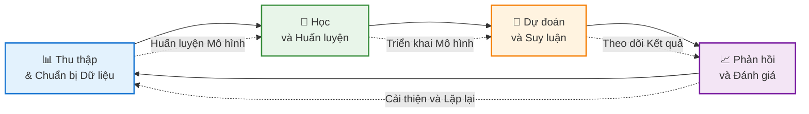

# Chào Mừng Đến Với Blog Học Machine Learning Cơ Bản
Chào mừng bạn đến với hành trình khám phá thế giới đầy thú vị của Machine Learning! 👋🤖
## Về Blog Này
Trong kỷ nguyên số hiện nay, **Machine Learning** đã trở thành một trong những công nghệ có sức ảnh hưởng lớn nhất định hình tương lai của chúng ta. Từ gợi ý phim trên Netflix đến trợ lý giọng nói như Siri và Google Assistant, từ chẩn đoán y tế đến xe tự lái – Machine Learning có mặt khắp nơi, âm thầm cách mạng hóa cách chúng ta tương tác với công nghệ.
Nhưng **Machine Learning thực sự là gì?** Làm thế nào máy tính có thể học từ dữ liệu mà không cần được lập trình chi tiết? Và quan trọng nhất, **làm sao để bắt đầu** với lĩnh vực thú vị này?
Blog này được tạo ra để trả lời những câu hỏi đó thông qua một chuỗi bài viết toàn diện nhưng dễ tiếp cận, được thiết kế cho người mới bắt đầu cũng như những người đam mê công nghệ. Dù bạn là sinh viên, chuyên gia muốn chuyển sang AI, hay đơn giản là tò mò về công nghệ đằng sau những đổi mới hiện đại, bạn sẽ tìm thấy những kiến thức giá trị tại đây.

# Machine Learning là gì? Tổng quan Khoa học Toàn diện
## Giới thiệu
Machine Learning (ML - Học máy) đã nổi lên như một trong những công nghệ có tính chuyển đổi nhất của thế kỷ 21, thay đổi căn bản cách chúng ta tiếp cận giải quyết vấn đề trong nhiều lĩnh vực đa dạng. Từ chẩn đoán y tế đến xe tự lái, từ xử lý ngôn ngữ tự nhiên đến mô hình hóa khí hậu, machine learning đã trở thành công cụ không thể thiếu trong khoa học máy tính và kỹ thuật hiện đại.

## Định nghĩa và khái niệm cơ bản
### Định nghĩa

Machine Learning là một nhánh của trí tuệ nhân tạo (AI) tập trung vào việc phát triển các thuật toán và mô hình thống kê cho phép các hệ thống máy tính cải thiện hiệu suất của chúng trên một tác vụ cụ thể thông qua kinh nghiệm, mà không cần được lập trình rõ ràng cho mọi tình huống.
Về mặt toán học, machine learning có thể được hình thức hóa như sau:
Cho một tác vụ **T**, thước đo hiệu suất **P**, và kinh nghiệm **E**, một hệ thống machine learning cải thiện ở tác vụ **T**, được đo bằng **P**, thông qua kinh nghiệm **E**.
### Mô hình học tập
Không giống như lập trình truyền thống nơi con người mã hóa rõ ràng các quy tắc và logic, machine learning đảo ngược mô hình này:
- **Lập trình Truyền thống**: Dữ liệu + Chương trình → Kết quả
- **Machine Learning**: Dữ liệu + Kết quả → Chương trình (Mô hình)
Mục tiêu cơ bản là học một hàm `f: X → Y` ánh xạ đầu vào `X` đến đầu ra `Y` dựa trên các ví dụ huấn luyện, trong đó hàm này có thể tổng quát hóa cho dữ liệu chưa thấy.


## Các Loại Machine Learning
> [!NOTE]
> **Gợi ý hình ảnh:** Thêm infographic so sánh học có giám sát, không giám sát và học tăng cường với các ví dụ trực quan.
### 1. Học Có Giám Sát (Supervised Learning)
Học có giám sát bao gồm việc huấn luyện một mô hình trên dữ liệu được gán nhãn, trong đó mỗi ví dụ đầu vào được ghép nối với đầu ra chính xác tương ứng. Mô hình học cách ánh xạ đầu vào đến đầu ra bằng cách giảm thiểu lỗi dự đoán.
**Khung Toán học:**
- Cho dữ liệu huấn luyện: `D = {(x₁, y₁), (x₂, y₂), ..., (xₙ, yₙ)}`
- Học hàm: `f(x) ≈ y`
- Tối thiểu hóa mất mát: `L(f) = Σᵢ Loss(f(xᵢ), yᵢ)`
**Các Thuật toán Chính:**
- **Hồi quy Tuyến tính (Linear Regression)**: Mô hình hóa mối quan hệ tuyến tính giữa các biến
- **Hồi quy Logistic (Logistic Regression)**: Phân loại nhị phân và đa lớp
- **Máy Vector Hỗ trợ (SVM)**: Tìm siêu phẳng tối ưu cho phân loại
- **Cây Quyết định và Rừng Ngẫu nhiên**: Cấu trúc ra quyết định phân cấp
- **Mạng Nơ-ron (Neural Networks)**: Kiến trúc deep learning cho nhận dạng mẫu phức tạp
**Ứng dụng:**
- Phân loại hình ảnh và phát hiện đối tượng
- Lọc email spam
- Chẩn đoán y tế từ dữ liệu bệnh nhân
- Đánh giá rủi ro tín dụng
- Nhận dạng giọng nói
### 2. Học Không Giám Sát (Unsupervised Learning)
Học không giám sát làm việc với dữ liệu không được gán nhãn, khám phá các mẫu, cấu trúc hoặc mối quan hệ ẩn trong dữ liệu mà không có đầu ra được định nghĩa trước.
**Khung Toán học:**
- Cho dữ liệu: `D = {x₁, x₂, ..., xₙ}` (không có nhãn)
- Khám phá cấu trúc: `P(X)` hoặc phân nhóm cluster
**Các Thuật toán Chính:**
- **Phân cụm K-Means**: Phân chia dữ liệu thành k cụm riêng biệt
- **Phân cụm Phân cấp**: Tạo hệ thống phân cấp cụm lồng nhau
- **Phân tích Thành phần Chính (PCA)**: Giảm chiều dữ liệu
- **Autoencoder**: Học biểu diễn dựa trên mạng nơ-ron
- **Mô hình Hỗn hợp Gaussian (GMM)**: Phân cụm xác suất
**Ứng dụng:**
- Phân khúc khách hàng trong marketing
- Phát hiện bất thường trong an ninh mạng
- Nén dữ liệu và trích xuất đặc trưng
- Hệ thống gợi ý
- Phân tích dữ liệu khám phá
### 3. Học Tăng Cường (Reinforcement Learning)
Học tăng cường liên quan đến một tác nhân học cách đưa ra quyết định bằng cách tương tác với môi trường, nhận phần thưởng hoặc hình phạt dựa trên các hành động được thực hiện.
**Khung Toán học:**
- **Quá trình Quyết định Markov (MDP)**: `(S, A, P, R, γ)`
  - S: Không gian trạng thái
  - A: Không gian hành động
  - P: Xác suất chuyển trạng thái
  - R: Hàm phần thưởng
  - γ: Hệ số chiết khấu
- Mục tiêu: Tối đa hóa phần thưởng tích lũy `Σₜ γᵗ R(sₜ, aₜ)`
**Các Thuật toán Chính:**
- **Q-Learning**: Học dựa trên giá trị
- **Mạng Q Sâu (DQN)**: Xấp xỉ Q-value bằng mạng nơ-ron
- **Phương pháp Gradient Chính sách**: Tối ưu hóa chính sách trực tiếp
- **Phương pháp Actor-Critic**: Kết hợp học giá trị và chính sách
- **Tối ưu hóa Chính sách Gần (PPO)**: Tối ưu hóa chính sách hiện đại
**Ứng dụng:**
- Điều hướng xe tự lái
- Điều khiển robot
- AI chơi game (AlphaGo, OpenAI Five)
- Phân bổ tài nguyên và lập lịch
- Chiến lược giao dịch tài chính
### 4. Học Bán Giám Sát và Tự Giám Sát
**Học Bán Giám Sát (Semi-Supervised Learning)** kết hợp lượng nhỏ dữ liệu có nhãn với lượng lớn dữ liệu không nhãn, tận dụng cả hai để cải thiện hiệu suất mô hình.
**Học Tự Giám Sát (Self-Supervised Learning)** tạo tín hiệu giám sát từ chính dữ liệu thông qua các tác vụ phụ (pretext tasks), cho phép học mà không cần nhãn thủ công.
## Quy Trình Machine Learning
> [!NOTE]
> **Gợi ý hình ảnh:** Thêm sơ đồ chi tiết thể hiện từng giai đoạn của quy trình ML từ thu thập dữ liệu đến triển khai.
### 1. Thu Thập và Chuẩn Bị Dữ Liệu
**Thu Thập Dữ Liệu:**
- Thu thập dữ liệu có liên quan, đại diện
- Đảm bảo chất lượng và đa dạng dữ liệu
- Giải quyết các vấn đề về quyền riêng tư và đạo đức dữ liệu
**Tiền Xử Lý Dữ Liệu:**
- **Làm sạch**: Xử lý giá trị thiếu, ngoại lai và trùng lặp
- **Chuẩn hóa/Tiêu chuẩn hóa**: Điều chỉnh đặc trưng về phạm vi so sánh được
- **Kỹ thuật Đặc trưng**: Tạo đặc trưng có ý nghĩa từ dữ liệu thô
- **Tăng Cường Dữ Liệu**: Mở rộng dữ liệu huấn luyện một cách tổng hợp
### 2. Lựa Chọn và Kỹ Thuật Đặc Trưng
**Kỹ Thuật Lựa Chọn Đặc Trưng:**
- Phương pháp lọc: Kiểm định thống kê (tương quan, chi-square)
- Phương pháp bao: Lựa chọn tiến/lùi
- Phương pháp nhúng: LASSO, Hồi quy Ridge
**Kỹ Thuật Đặc Trưng:**
- Tích hợp kiến thức lĩnh vực
- Đặc trưng đa thức
- Các hạng tử tương tác
- Hàm biến đổi (log, căn bậc hai)
### 3. Lựa Chọn Mô Hình
**Các Yếu Tố Cân Nhắc:**
- Loại vấn đề (hồi quy, phân loại, phân cụm)
- Kích thước và chiều dữ liệu
- Yêu cầu khả năng giải thích
- Tài nguyên tính toán
- Thước đo hiệu suất
### 4. Huấn Luyện Mô Hình
**Quy Trình Huấn Luyện:**
1. Khởi tạo tham số mô hình
2. Lan truyền tiến: Đưa ra dự đoán
3. Tính toán mất mát/sai số
4. Lan truyền ngược: Tính gradient
5. Cập nhật tham số bằng thuật toán tối ưu
6. Lặp lại đến khi hội tụ
**Các Thuật Toán Tối Ưu:**
- **Gradient Descent**: `θ = θ - α∇L(θ)`
- **Stochastic Gradient Descent (SGD)**: Sử dụng mini-batch
- **Adam**: Tốc độ học thích nghi với momentum
- **RMSprop**: Phương pháp tốc độ học thích nghi
### 5. Đánh Giá Mô Hình
**Thước Đo Đánh Giá:**
**Phân Loại:**
- Độ chính xác (Accuracy): `(TP + TN) / (TP + TN + FP + FN)`
- Độ chính xác (Precision): `TP / (TP + FP)`
- Độ nhạy (Recall/Sensitivity): `TP / (TP + FN)`
- Điểm F1 (F1-Score): `2 × (Precision × Recall) / (Precision + Recall)`
- ROC-AUC: Diện tích dưới đường cong đặc tính hoạt động của bộ thu
**Hồi Quy:**
- Sai Số Bình Phương Trung Bình (MSE): `(1/n) Σᵢ (yᵢ - ŷᵢ)²`
- Căn Sai Số Bình Phương Trung Bình (RMSE): `√MSE`
- Sai Số Tuyệt Đối Trung Bình (MAE): `(1/n) Σᵢ |yᵢ - ŷᵢ|`
- Điểm R² (R² Score): Hệ số xác định
**Kiểm Chứng Chéo:**
- Kiểm chứng chéo K-Fold
- Kiểm chứng chéo K-Fold phân tầng
- Kiểm chứng chéo Để-một-ra (LOOCV)
### 6. Điều Chỉnh Siêu Tham Số
**Kỹ Thuật:**
- **Tìm Kiếm Lưới (Grid Search)**: Tìm kiếm toàn diện không gian tham số
- **Tìm Kiếm Ngẫu Nhiên (Random Search)**: Lấy mẫu ngẫu nhiên tham số
- **Tối Ưu Bayesian**: Tối ưu hóa dựa trên mô hình xác suất
- **Tối Ưu Dựa Gradient**: Cho siêu tham số khả vi
### 7. Triển Khai và Giám Sát Mô Hình
**Các Yếu Tố Triển Khai:**
- Tuần tự hóa mô hình (pickle, ONNX, TensorFlow SavedModel)
- Phát triển API (REST, gRPC)
- Yêu cầu khả năng mở rộng và độ trễ
- Tích hợp liên tục/triển khai liên tục (CI/CD)
**Giám Sát:**
- Phát hiện suy giảm hiệu suất
- Giám sát sự thay đổi dữ liệu (data drift)
- Chiến lược huấn luyện lại mô hình
## Deep Learning: Cuộc Cách Mạng Mạng Nơ-ron
> [!NOTE]
> **Gợi ý hình ảnh:** Thêm sơ đồ kiến trúc mạng nơ-ron chi tiết thể hiện lớp đầu vào, lớp ẩn và lớp đầu ra với các kết nối.
### Cơ Bản Mạng Nơ-ron
**Kiến Trúc Cơ Bản:**
- **Lớp Đầu Vào**: Nhận đặc trưng thô
- **Lớp Ẩn**: Biến đổi đầu vào thông qua các biểu diễn được học
- **Lớp Đầu Ra**: Tạo dự đoán cuối cùng
**Kích Hoạt Nơ-ron:**
```
z = Σᵢ wᵢxᵢ + b
a = σ(z)
```
trong đó `σ` là hàm kích hoạt (ReLU, Sigmoid, Tanh)
### Kiến Trúc Nâng Cao
**Mạng Nơ-ron Tích Chập (CNN):**
- Chuyên biệt cho dữ liệu dạng lưới (hình ảnh)
- Lớp tích chập: Phát hiện đặc trưng cục bộ
- Lớp gộp (pooling): Giảm chiều không gian
- Ứng dụng: Thị giác máy tính, nhận dạng hình ảnh
**Mạng Nơ-ron Hồi Tiếp (RNN):**
- Xử lý dữ liệu tuần tự
- Trạng thái ẩn duy trì thông tin thời gian
- Các biến thể: LSTM (Long Short-Term Memory), GRU (Gated Recurrent Unit)
- Ứng dụng: Xử lý ngôn ngữ tự nhiên, dự đoán chuỗi thời gian
**Transformer:**
- Cơ chế chú ý (attention): `Attention(Q, K, V) = softmax(QKᵀ/√dₖ)V`
- Tự chú ý (self-attention) để nắm bắt phụ thuộc tầm xa
- Ứng dụng: BERT, GPT, dịch máy
**Mô Hình Sinh (Generative Models):**
- **GAN (Mạng Đối Kháng Sinh)**: Generator vs. Discriminator
- **VAE (Autoencoder Biến Phân)**: Biểu diễn tiềm ẩn xác suất
- **Mô Hình Khuếch Tán (Diffusion Models)**: Quá trình khử nhiễu lặp
- Ứng dụng: Sinh hình ảnh, tổng hợp dữ liệu
## Nền Tảng Toán Học
### Lý Thuyết Xác Suất
**Các Khái Niệm Chính:**
- Phân phối xác suất: `P(X)`, `P(Y|X)`
- Định lý Bayes: `P(Y|X) = P(X|Y)P(Y) / P(X)`
- Ước Lượng Hợp Lý Cực Đại (MLE)
- Suy luận Bayesian
### Đại Số Tuyến Tính
**Các Phép Toán Cần Thiết:**
- Nhân ma trận: Tính toán mô hình
- Trị riêng và vector riêng: PCA
- Phân Tích Giá Trị Suy Biến (SVD): Giảm chiều
- Tính toán gradient: Lan truyền ngược
### Giải Tích
**Tối Ưu Hóa:**
- Đạo hàm riêng: Tính toán gradient
- Quy tắc chuỗi: Lan truyền ngược trong mạng nơ-ron
- Tối ưu lồi: Cực trị toàn cục
- Tối ưu không lồi: Thách thức cực tiểu cục bộ
### Lý Thuyết Thông Tin
**Các Khái Niệm:**
- Entropy: `H(X) = -Σᵢ P(xᵢ) log P(xᵢ)`
- Mất mát entropy chéo: Mục tiêu phân loại
- KL-Divergence: Sự tương đồng phân phối
- Thông tin tương hỗ: Mức độ liên quan của đặc trưng
## Thách Thức và Các Vấn Đề Cần Cân Nhắc
### Overfitting và Underfitting
**Overfitting (Học Quá Khớp):**
- Mô hình học nhiễu trong dữ liệu huấn luyện
- Khả năng tổng quát hóa kém cho dữ liệu mới
- **Giải pháp**: Regularization, dropout, early stopping, data augmentation
**Underfitting (Học Chưa Khớp):**
- Mô hình quá đơn giản để nắm bắt mẫu dữ liệu
- **Giải pháp**: Tăng độ phức tạp mô hình, thêm đặc trưng, giảm regularization
### Đánh Đổi Bias-Variance
- **Bias (Độ lệch)**: Lỗi từ giả định không chính xác
- **Variance (Phương sai)**: Lỗi từ độ nhạy với biến thiên dữ liệu huấn luyện
- **Mục tiêu**: Tối thiểu hóa tổng lỗi = Bias² + Variance + Lỗi Không Thể Giảm
### Kỹ Thuật Regularization
**Regularization L1 (LASSO):**
```
Loss = Original_Loss + λ Σᵢ |wᵢ|
```
Khuyến khích tính thưa thớt (lựa chọn đặc trưng)
**Regularization L2 (Ridge):**
```
Loss = Original_Loss + λ Σᵢ wᵢ²
```
Ngăn trọng số lớn, giải pháp mượt
**Dropout:**
Ngẫu nhiên vô hiệu hóa nơ-ron trong quá trình huấn luyện
**Early Stopping:**
Giám sát hiệu suất validation, dừng khi suy giảm
### Thách Thức Tính Toán
- **Khả Năng Mở Rộng**: Bộ dữ liệu và mô hình lớn
- **Tăng Tốc Phần Cứng**: GPU, TPU cho tính toán song song
- **Huấn Luyện Phân Tán**: Song song hóa mô hình và dữ liệu
- **Hiệu Quả Bộ Nhớ**: Checkpoint gradient, độ chính xác hỗn hợp
## Ứng Dụng và Tác Động
> [!NOTE]
> **Gợi ý hình ảnh:** Thêm ảnh ghép thể hiện các ứng dụng ML đa dạng trong nhiều ngành công nghiệp khác nhau.
### Y Tế
- Chẩn đoán bệnh từ hình ảnh y tế
- Phát hiện và phát triển thuốc
- Đề xuất điều trị cá nhân hóa
- Dự đoán và theo dõi dịch bệnh
### Tài Chính
- Giao dịch thuật toán
- Chấm điểm tín dụng và phát hiện gian lận
- Đánh giá rủi ro
- Tối ưu hóa danh mục đầu tư
### Xử Lý Ngôn Ngữ Tự Nhiên
- Dịch máy
- Phân tích cảm xúc
- Hệ thống trả lời câu hỏi
- Sinh và tóm tắt văn bản
### Thị Giác Máy Tính
- Nhận dạng khuôn mặt
- Lái xe tự động
- Phân tích hình ảnh y tế
- Thực tế tăng cường
### Hệ Thống Gợi Ý
- Gợi ý sản phẩm thương mại điện tử
- Nền tảng phát trực tuyến nội dung
- Quản lý nguồn cấp dữ liệu mạng xã hội
- Quảng cáo được nhắm mục tiêu
## Các Vấn Đề Đạo Đức
> [!IMPORTANT]
> Các hệ thống machine learning có thể duy trì và khuếch đại các thiên kiến xã hội có trong dữ liệu huấn luyện.
### Các Vấn Đề Đạo Đức Chính
**Thiên Kiến và Công Bằng:**
- Phân biệt đối xử thuật toán
- Xem xét thuộc tính được bảo vệ
- Thước đo công bằng và kỹ thuật khử thiên kiến
**Quyền Riêng Tư:**
- Đồng ý thu thập dữ liệu
- Quyền riêng tư khác biệt (differential privacy)
- Học liên kết (federated learning)
**Minh Bạch và Khả Năng Giải Thích:**
- Khả năng giải thích mô hình hộp đen
- LIME, SHAP cho giải thích cục bộ
- Trực quan hóa chú ý (attention)
**Trách Nhiệm:**
- Trách nhiệm ra quyết định
- Tuân thủ quy định
- Dấu vết kiểm toán
## Hướng Phát Triển Tương Lai
### Xu Hướng Mới Nổi
**Few-Shot và Zero-Shot Learning:**
Học từ ví dụ tối thiểu
**Meta-Learning:**
Học cách học qua các tác vụ
**Tính Toán Neuromorphic:**
Kiến trúc phần cứng lấy cảm hứng từ não
**Machine Learning Lượng Tử:**
Thuật toán lượng tử cho các tác vụ ML
**AutoML:**
Tìm kiếm kiến trúc mô hình tự động và tối ưu hóa siêu tham số
**Continual Learning:**
Học các tác vụ mới mà không quên những tác vụ trước
## Kết Luận
Machine Learning đại diện cho sự chuyển đổi mô hình trong giải quyết vấn đề tính toán, cho phép các hệ thống học từ dữ liệu và cải thiện thông qua kinh nghiệm. Các nền tảng toán học của nó trong thống kê, đại số tuyến tính và lý thuyết tối ưu cung cấp các khung nghiêm ngặt để phát triển các thuật toán ngày càng tinh vi.
Khi ML tiếp tục phát triển, việc tích hợp chuyên môn lĩnh vực, đổi mới thuật toán và các cân nhắc đạo đức sẽ rất quan trọng cho sự phát triển và triển khai có trách nhiệm. Quỹ đạo của lĩnh vực này hướng tới các mô hình hiệu quả hơn, có thể giải thích được và tổng quát hơn, có thể giải quyết các thách thức thực tế ngày càng phức tạp.
Hiểu machine learning đòi hỏi cả chiều sâu lý thuyết và kinh nghiệm thực tế—từ công thức toán học đến chi tiết triển khai, từ tiền xử lý dữ liệu đến triển khai mô hình. Khi bạn tiếp tục hành trình của mình trong machine learning, hãy nhớ rằng về căn bản nó là về việc tạo ra các hệ thống có thể khám phá mẫu, đưa ra dự đoán, và cuối cùng là tăng cường khả năng ra quyết định của con người.
---
## Tài Liệu Tham Khảo và Đọc Thêm
1. **Sách Nền Tảng:**
   - "Pattern Recognition and Machine Learning" của Christopher Bishop
   - "The Elements of Statistical Learning" của Hastie, Tibshirani, và Friedman
   - "Deep Learning" của Goodfellow, Bengio, và Courville
2. **Tài Nguyên Trực Tuyến:**
   - Coursera: Machine Learning của Andrew Ng
   - Fast.ai: Practical Deep Learning
   - Papers with Code: Triển khai nghiên cứu mới nhất
3. **Diễn Đàn Nghiên Cứu:**
   - NeurIPS (Conference on Neural Information Processing Systems)
   - ICML (International Conference on Machine Learning)
   - CVPR (Conference on Computer Vision and Pattern Recognition)
   - ACL (Association for Computational Linguistics)
---
*Bài viết này cung cấp giới thiệu toàn diện về machine learning. Để khám phá sâu hơn các chủ đề cụ thể, hãy tham khảo các tài liệu được trích dẫn và cập nhật với bối cảnh nghiên cứu đang phát triển nhanh chóng.*


  
## Tài liệu tham khảo

1. [How Do Chatbots Work? – BotsCrew](https://botscrew.com/blog/what-are-bots/)
2. Building Vietnamese Chatbot using LLMs and RLHF – AI Vietnam
3. [Rubric (academic) - Wikipedia](https://en.wikipedia.org/wiki/Rubric_\(academic\))
3. [ConvoMem Benchmark: Why Your First 150 Conversations Don’t Need RAG](https://arxiv.org/html/2511.10523)
4. [Introduction | Ragas](https://docs.ragas.io/en/v0.1.21/index.html)
5. [OpenAI. (2024). "GPT-4 Technical Report"](https://arxiv.org/html/2511.10523)
6. [Lewis et al. (2020). "Retrieval-Augmented Generation for Knowledge-Intensive NLP Tasks"](https://arxiv.org/html/2511.10523)
7. [Hu et al. (2021). "LoRA: Low-Rank Adaptation of Large Language Models"](https://arxiv.org/html/2511.10523)
8. [Yao et al. (2023). "ReAct: Synergizing Reasoning and Acting in Language Models"](https://arxiv.org/html/2511.10523)
9. [LangChain Documentation. (2024). "Building Production-Ready RAG Systems"](https://arxiv.org/html/2511.10523)