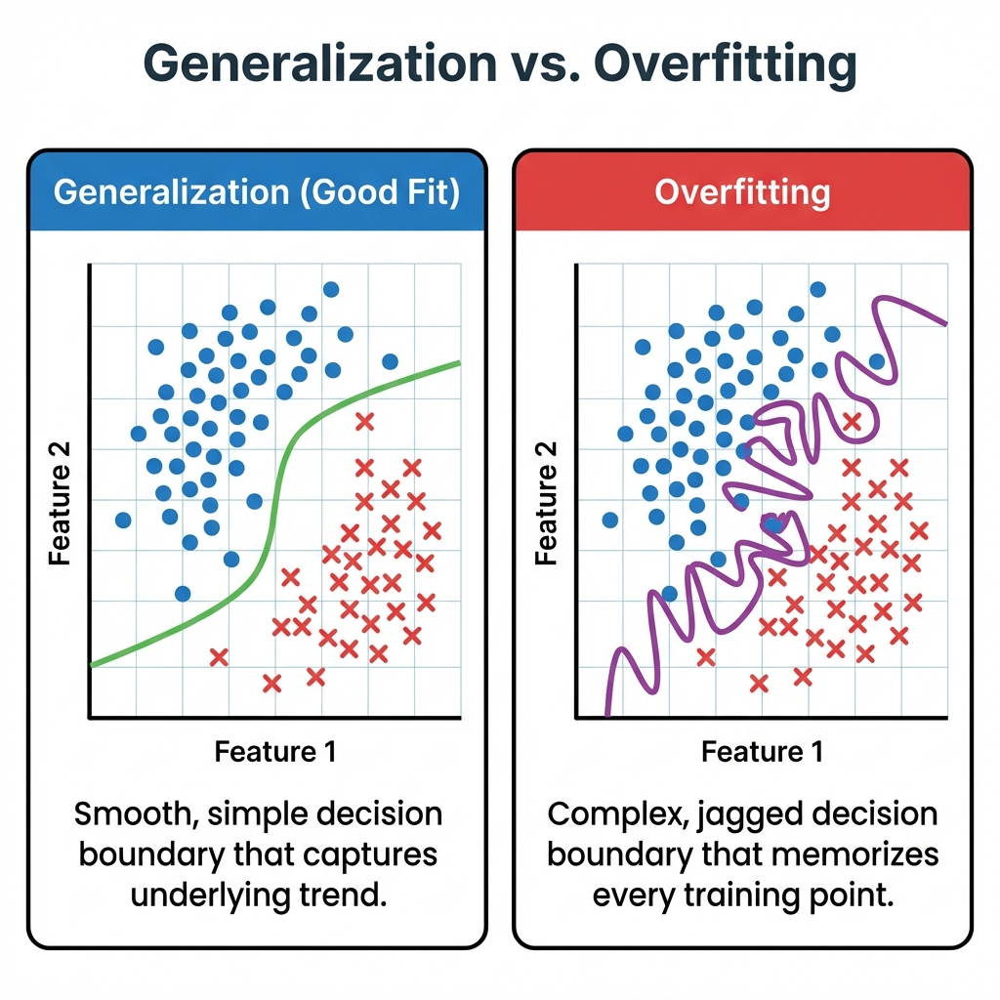
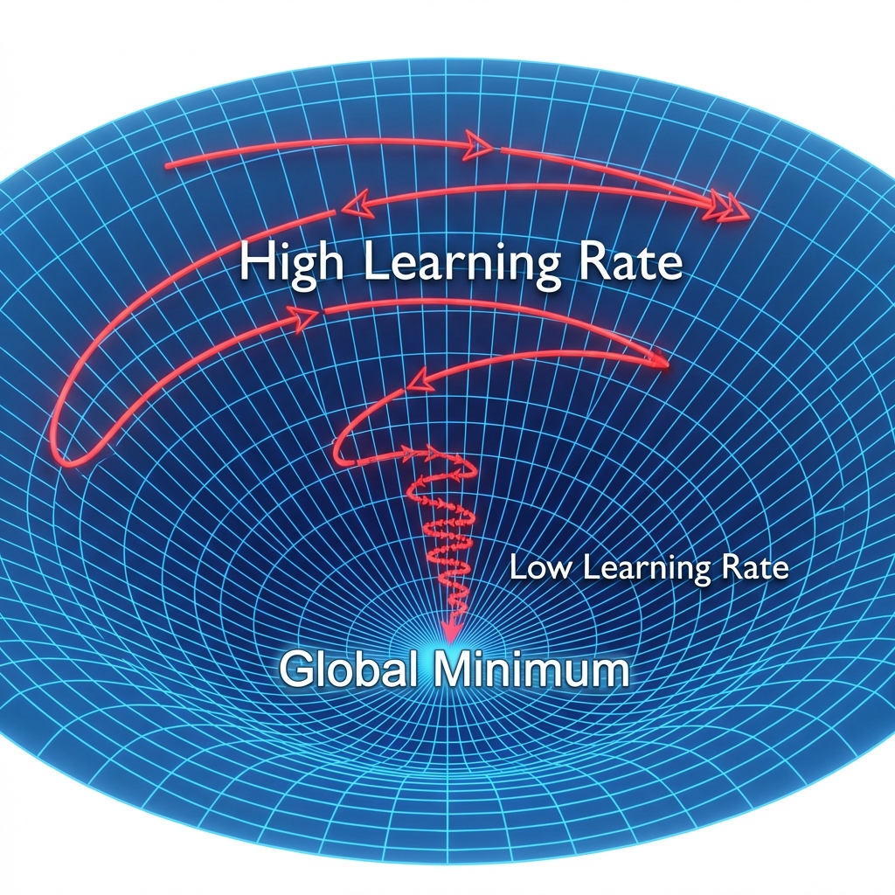
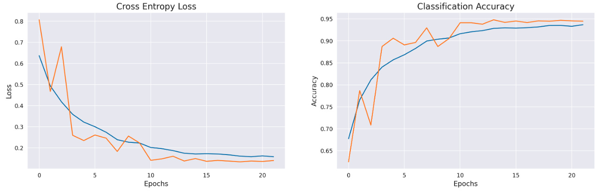
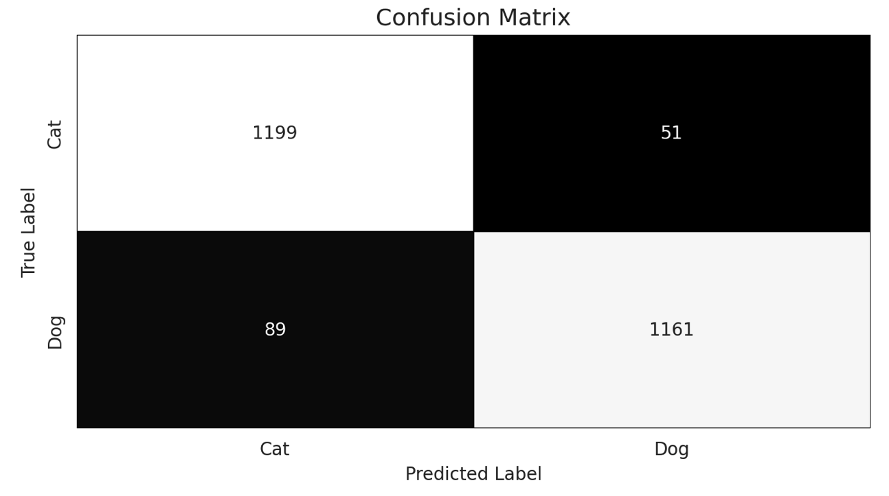
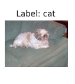

# Huấn Luyện và Đánh Giá CNN: Góc Nhìn Học Thuật và Thực Tiễn
*Bài viết này đi sâu vào quy trình huấn luyện Mạng Nơ-ron Tích chập (CNN) một cách nghiêm ngặt, không chỉ dừng lại ở các chỉ số đơn giản mà tập trung vào tính ổn định, khả năng tổng quát hóa và hiệu quả kiến trúc.*

## 1. Động Lực và Nguyên Tắc Huấn Luyện
Trong các bài toán phân loại hình ảnh—ví dụ như phân biệt giữa Chó và Mèo, chúng ta rất dễ bị đánh lừa bởi một chỉ số duy nhất: **độ chính xác trên tập huấn luyện**. Một mô hình có thể dễ dàng đạt độ chính xác 99% bằng cách đơn giản là "học vẹt" bộ dữ liệu, nhưng lại thất bại thảm hại khi gặp hình ảnh mới.
 
<figure style="text-align: center;">
  
  <figcaption>
    <em>Hình 1: So sánh giữa Tổng quát hóa (trái) và Overfitting (phải). Mô hình tốt sẽ tìm ra ranh giới mượt mà phân tách phần lớn dữ liệu, trong khi mô hình Overfitting cố gắng "học vẹt" từng điểm mút, tạo ra đường ranh giới phức tạp và không hiệu quả.</em>
  </figcaption>  
</figure>

Do đó, nguyên tắc chủ đạo trong phương pháp huấn luyện của chúng tôi rất đơn giản nhưng cực kỳ quan trọng:
 **"Một mô hình tốt là mô hình hội tụ ổn định và có khả năng tổng quát hóa đáng tin cậy trên dữ liệu chưa từng thấy."**
Nguyên tắc này chi phối mọi quyết định của người huấn luyện, từ chiến lược đánh giá đến các kỹ thuật tối ưu hóa.
 
## 2. Chiến Lược Đánh Giá
Để đảm bảo mô hình học được các mẫu có ý nghĩa thay vì học nhiễu, nhóm đã triển khai hai chiến lược động chính trong quá trình huấn luyện.

### 2.1 EarlyStopping: Ngăn Chặn Overfitting Từ Trong Thiết Kế
Nhóm không dựa hoàn toàn vào một số lượng epoch cố định. Thay vào đó, nhóm sử dụng **EarlyStopping** để giám sát hàm mất mát  trên tập validation.

*   **Cơ chế:** Nếu validation loss không cải thiện trong **10 epoch liên tiếp** (patience = 10), quá trình huấn luyện sẽ dừng lại.
*   **Khôi phục:** Trọng số (weights) từ epoch tốt nhất sẽ được tự động khôi phục.
**Tại sao điều này quan trọng:**
1.  **Tổng quát hóa:** Nó ngăn mạng nơ-ron trước khi nó bắt đầu "học thuộc lòng" dữ liệu huấn luyện.
2.  **Hiệu quả:** Tiết kiệm tài nguyên tính toán bằng cách tránh các chu kỳ huấn luyện không cần thiết.

### 2.2 ReduceLROnPlateau: Tinh Chỉnh Thích Ứng
Việc huấn luyện mô hình giống như việc đi xuống núi. Lúc đầu, bạn bước những bước dài (learning rate lớn), nhưng khi đến gần đích (điểm cực tiểu), bạn cần những bước nhỏ và cẩn thận hơn.
 
<figure style="text-align: center;">
  
  <figcaption>
    <em>Hình 2: Chiến lược "Xuống núi" với Adaptive Learning Rate. Ban đầu chúng ta đi những bước lớn (High Learning Rate) để xuống nhanh, nhưng khi gần đến đích, chúng ta cần những bước nhỏ để tinh chỉnh chính xác vào điểm cực tiểu.</em>
  </figcaption>  
</figure>

Nhóm áp dụng **ReduceLROnPlateau** để tự động giảm tốc độ học (learning rate) khi hiệu suất trên tập validation bị chững lại. Điều này cho phép bộ tối ưu hóa (optimizer):
*   Thoát khỏi các điểm cực tiểu cục bộ nông (shallow local minima).
*   Tinh chỉnh không gian tham số với độ chính xác cao.
*Về mặt thực nghiệm, đây là yếu tố then chốt để đạt được thêm 1-2% độ chính xác cuối cùng.*

## 3. Cấu Hình Huấn Luyện
Khả năng tái lập là nền tảng của tính toán khoa học. Dưới đây là cấu hình tiêu chuẩn nhưng mạnh mẽ được sử dụng để đạt được kết quả của chúng tôi:
| Thành phần | Lựa chọn | Lý do |
| :--- | :--- | :--- |
| **Optimizer** | RMSprop (hoặc Adam) | Xử lý mạnh mẽ các gradient thưa thớt (sparse gradients). |
| **Initial Learning Rate** | 0.001 | Điểm khởi đầu tiêu chuẩn cho tốc độ hội tụ. |
| **Loss Function** | Binary Crossentropy | Chuẩn mực toán học cho phân loại nhị phân. |
| **Metric** | Accuracy | Thước đo hiệu suất trực quan. |

## 4. Kết Quả Thực Nghiệm
Chiến lược đề xuất đã mang lại sự hội tụ mượt mà và ổn định. Các kết quả định lượng đã tự nói lên điều đó:
| Tập dữ liệu | Độ chính xác (Accuracy) |
| :--- | :--- |
| **Training** | **96.11%** |
| **Validation** | **95.68%** |
| **Testing** | **95.08%** |
 
<figure style="text-align: center;">
  
  <figcaption>
    <em>Hình 3: Biểu đồ <strong>Learning Curves</strong> (Training vs. Validation Loss/Accuracy theo thời gian). Hai đường nên bám sát nhau, cho thấy không có hiện tượng overfitting nghiêm trọng.</em>
  </figcaption>  
</figure>

 Khoảng cách rất nhỏ (~0.5%) giữa độ chính xác Training và Validation là dấu hiệu của sự **tổng quát hóa** hiệu quả. Mô hình không chỉ nhớ chó và mèo trông như thế nào; nó thực sự hiểu các đặc điểm của chúng.

 

## 6. Phân Tích Lỗi 

Để hiểu rõ hơn về các hạn chế của mô hình, chúng tôi đã thực hiện phân tích chi tiết các trường hợp dự đoán sai.

<figure style="text-align: center;">
  
  <figcaption>
    <em>Hình 4: Ma trận nhầm lẫn (Confusion Matrix).</em>
  </figcaption>  
</figure>

Hình 4 thể hiện ma trận nhầm lẫn của mô hình. Hiện tại vẫn còn một số trường hợp sai, chủ yếu là do:
1.  **Sự tương đồng về đặc điểm:** Một số giống chó và mèo có cùng màu sắc, kích thước và hình dáng, khiến mô hình gặp khó khăn trong việc phân biệt.
2.  **Chất lượng ảnh:** Hình ảnh bị mờ, nhiễu hoặc chủ thể bị che khuất.

Hình 5 dưới đây minh họa một trường hợp cụ thể:

<figure style="text-align: center;">
  
  <figcaption>
    <em>Hình 5: Ví dụ là Chó nhưng bị phân loại nhầm là Mèo do góc chụp hoặc đặc điểm ngoại hình không rõ ràng.</em>
  </figcaption>  
</figure>

## 7. Hướng Đi Tương Lai

Mặc dù độ chính xác ~95% là rất xuất sắc, vẫn luôn có chỗ để cải thiện. Các bước tiếp theo trong lộ trình nghiên cứu của chúng tôi bao gồm:

*   **Transfer Learning:** Khởi tạo với các trọng số được huấn luyện trước từ các mô hình khổng lồ như **VGG16** hoặc **ResNet50**. Điều này có tiềm năng đẩy độ chính xác vượt qua **98%**.
*   **Fine-Tuning:** Dần dần "mở băng" (unfreezing) các lớp cao nhất của các mô hình pre-trained đó để thích nghi tốt hơn với miền dữ liệu cụ thể của chúng ta.
*   **Chiến lược Data Augmentation Nâng cao:** Áp dụng các kỹ thuật augmentation phức tạp hơn (như Mixup, Cutout) để giúp mô hình vững vàng hơn trước các trường hợp khó (như phân tích ở mục 6).
