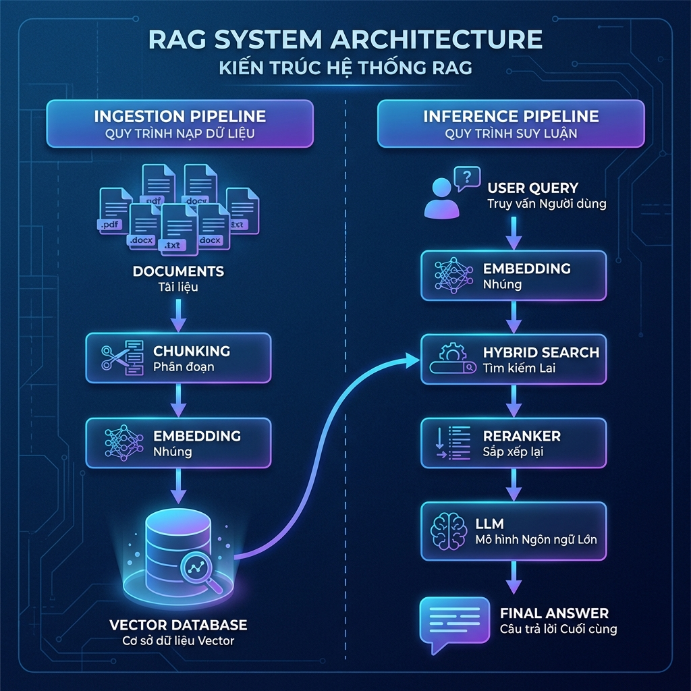
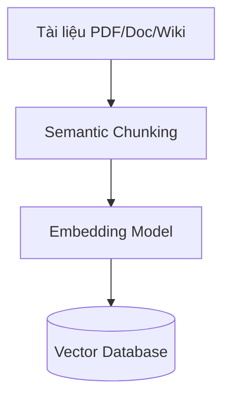
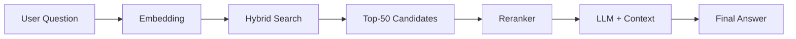
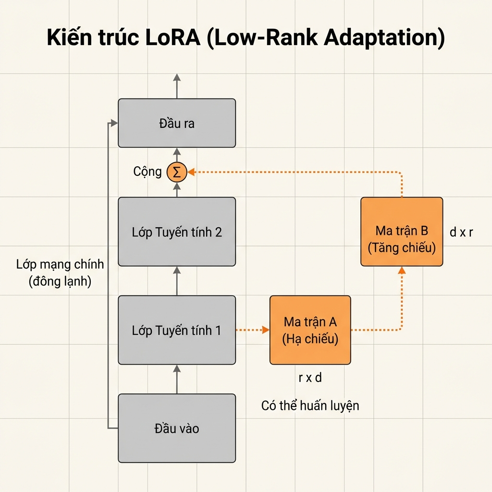
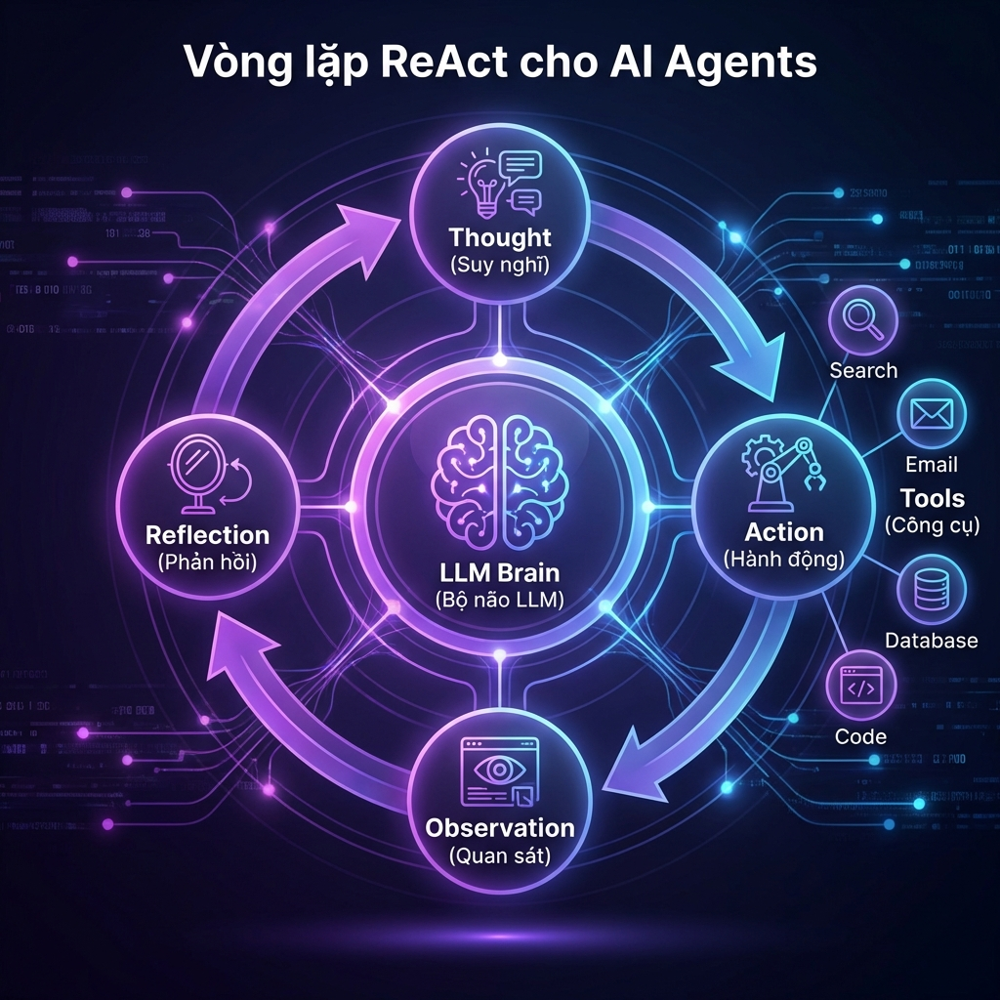

# Lộ Trình Xây Dựng Chatbot GenAI: Từ Prompt Engineering Đến AI Agent Toàn Năng

**Tác giả:** Nghiên cứu viên AI  
**Ngày xuất bản:** 16/01/2026

---

## Tóm tắt nghiên cứu

Trong kỷ nguyên Generative AI, việc xây dựng chatbot không còn dừng lại ở việc sử dụng ChatGPT qua giao diện web. Bài nghiên cứu này phân tích chuyên sâu bốn phương pháp kỹ thuật tiên tiến để phát triển hệ thống chatbot doanh nghiệp: **Prompt Engineering**, **RAG (Retrieval-Augmented Generation)**, **Fine-tuning**, và **AI Agents**. Mỗi phương pháp được giải phẫu từ góc độ kiến trúc hệ thống, cơ chế hoạt động, và ứng dụng thực tiễn.

---

## 1. Prompt Engineering: Lập Trình Bằng Ngôn Ngữ Tự Nhiên

### 1.1 Định nghĩa và Bản chất

Prompt Engineering không đơn thuần là "kỹ năng đặt câu hỏi" mà là **Natural Language Programming** - quá trình lập trình mô hình ngôn ngữ lớn (LLM) thông qua ngôn ngữ tự nhiên. Thay vì can thiệp vào hàng tỷ tham số trọng số (weights) bên trong mô hình, chúng ta thao tác ở **tầng giao tiếp** (Interface Layer) để kích hoạt các vùng kiến thức tiềm ẩn (Latent Space) trong không gian vector của mô hình.

### 1.2 Khung C-R-I-O: Cấu trúc Prompt Chuẩn

Một prompt kỹ thuật cao cần hội tụ đủ 4 thành phần:


**C - Context (Bối cảnh):** Dữ liệu nền tảng giúp thu hẹp phạm vi tìm kiếm của mô hình.

**R - Role (Vai trò):** Gán "persona" chuyên gia để điều hướng trọng số mô hình tập trung vào từ vựng và tư duy chuyên ngành.

> [!TIP]
> Thay vì "Viết code Python...", hãy dùng: "Bạn là Senior Backend Developer chuyên về Python và tối ưu hóa hiệu năng..."

**I - Instruction (Chỉ dẫn):** Ràng buộc logic nghiêm ngặt về những gì mô hình phải làm và **không được làm** (Negative constraints).

**O - Output (Đầu ra):** Định dạng chuẩn hóa (JSON, CSV, Markdown) để kết quả có thể được parse bởi hệ thống phần mềm.

### 1.3 Kỹ thuật Chain-of-Thought (CoT)

Bản chất của LLM là **Autoregressive** - dự đoán từ tiếp theo dựa trên xác suất. Với bài toán logic phức tạp, nếu ép mô hình trả lời ngay, nó thường bị "ảo giác" (hallucination).

**Cơ chế CoT:** Buộc mô hình sinh ra các bước suy luận trung gian bằng cách thêm: *"Let's think step by step"* (Hãy suy nghĩ từng bước một).

**Ví dụ so sánh:**

| Phương pháp | Prompt | Kết quả |
|-------------|--------|---------|
| **Thông thường** | "A có 5 táo, cho B 2, mua thêm 3. A còn mấy?" | Dễ sai với bài toán phức tạp |
| **Chain-of-Thought** | "Hãy liệt kê quá trình thay đổi số táo của A theo từng hành động, sau đó đưa ra kết quả." | Độ chính xác cao hơn 40-60% |

### 1.4 Kỹ thuật Few-Shot Prompting

LLM học rất nhanh qua ví dụ. Thay vì giải thích dài dòng, hãy đưa **Input mẫu** và **Output mẫu**.

```
Review: "Hàng giao chậm nhưng chất lượng tốt." → Sentiment: Neutral
Review: "Đóng gói quá tệ, vỡ hết." → Sentiment: Negative
Review: "Tuyệt vời, sẽ mua lại." → Sentiment: [AI điền: Positive]
```

### 1.5 Prompt Chaining

Thay vì nhồi nhét tất cả vào một prompt khổng lồ, hãy chia nhỏ tác vụ:

1. **Prompt A:** Tóm tắt tài liệu
2. **Prompt B:** Lấy kết quả A → Trích xuất ý chính
3. **Prompt C:** Lấy kết quả B → Dịch sang tiếng Việt

**Lợi ích:** Dễ debug, độ chính xác cao hơn 30-50%.

### 1.6 Vấn đề "Lost in the Middle"

> [!WARNING]
> Khi context quá dài (ví dụ: tài liệu 50 trang), LLM nhớ rất tốt phần **Đầu** và **Cuối**, nhưng thường quên thông tin ở **Giữa**.

**Giải pháp:** Đặt thông tin quan trọng nhất ở đầu hoặc cuối prompt.

### 1.7 Công cụ hỗ trợ

- **OpenAI Playground:** Chỉnh tham số Temperature (0 = kiên định, 1 = sáng tạo)
- **LangChain / DSPy:** Thư viện quản lý và tối ưu prompt tự động

---

## 2. RAG (Retrieval-Augmented Generation): Chatbot Được Phép "Mở Sách"

### 2.1 Định nghĩa

Nếu LLM truyền thống giống sinh viên đi thi chỉ dựa vào trí nhớ (bị "đóng băng" tại thời điểm huấn luyện), thì **RAG** cho phép sinh viên mang theo sách giáo khoa (External Knowledge Base) vào phòng thi để tra cứu.

### 2.2 Kiến trúc Pipeline Kép



Hệ thống RAG tiêu chuẩn gồm hai luồng:

#### **Luồng 1: Ingestion (Nạp dữ liệu - Offline ETL)**



**Bước 1: Semantic Chunking (Cắt nhỏ theo ngữ nghĩa)**

> [!IMPORTANT]
> "Garbage In, Garbage Out" - Chất lượng câu trả lời phụ thuộc 80% vào bước này.

- **Naive Chunking:** Cắt cứ 500 từ → Rủi ro: Cắt đôi câu quan trọng
- **Semantic Chunking:** Dùng AI phát hiện điểm kết thúc ý tưởng → Chuẩn mực hiện nay

**Bước 2: Embedding (Mã hóa Vector)**

Biến văn bản thành dãy số (vector) để máy tính hiểu "ý nghĩa".

*Ví dụ:* Vector của "Vua" nằm gần vector của "Hoàng hậu" trong không gian số, dù mặt chữ khác nhau.

#### **Luồng 2: Inference (Suy luận - Runtime)**



### 2.3 Kỹ thuật Hybrid Search

**Vector Search** (tìm ngữ nghĩa) rất mạnh, nhưng có điểm mù với từ khóa chính xác (mã sản phẩm "SKU-999").

**Giải pháp:** Kết hợp:
- **Sparse Vectors (BM25):** Tìm từ khóa chính xác
- **Dense Vectors (Embedding):** Tìm ý nghĩa tương đồng

### 2.4 Re-ranking: "Bộ lọc tinh túy"

> [!NOTE]
> Đây là kỹ thuật phân biệt RAG "đồ chơi" và RAG doanh nghiệp.

**Vấn đề:** Retrieval trả về 50 chunk, độ chính xác chỉ 60-70%.

**Giải pháp:** Dùng **Cross-Encoder** (Reranker) chấm điểm lại từng cặp "Câu hỏi - Đoạn văn", chỉ chọn Top-3 đoạn có điểm cao nhất.

**Kết quả:** Độ chính xác tăng vọt lên **90%+**.

### 2.5 Query Rewriting

**Vấn đề:** Người dùng hỏi cụt lủn:
- Câu 1: "Ai là CEO của Apple?" → Bot: "Tim Cook"
- Câu 2: "Ông ấy sinh năm bao nhiêu?" → Bot RAG chết vì không biết "Ông ấy" là ai

**Giải pháp:** Dùng LLM viết lại câu 2 thành *"Tim Cook sinh năm bao nhiêu?"* trước khi tìm kiếm.

### 2.6 Citations (Trích dẫn nguồn)

Yêu cầu Chatbot chỉ rõ: *"Thông tin này lấy từ Trang 15, Tài liệu Quy trình nhân sự"* → Tăng độ tin cậy (Trustworthy AI).

### 2.7 Tech Stack gợi ý

| Thành phần | Công cụ |
|------------|---------|
| **Framework** | LangChain, LlamaIndex |
| **Vector Database** | ChromaDB (test), Qdrant/Weaviate (production) |
| **Embedding Model** | OpenAI text-embedding-3-small, HuggingFace |

### 2.8 Ưu & Nhược điểm

**Ưu điểm:**
- ✅ Chatbot thông thái về dữ liệu riêng
- ✅ Cập nhật thông tin tức thì (chỉ cần upload file mới)
- ✅ Ít bịa đặt (có trích dẫn)

**Nhược điểm:**
- ❌ Tốc độ chậm hơn Prompt Engineering
- ❌ Chi phí token cao hơn (gửi kèm nhiều tài liệu)

---

## 3. Fine-tuning: Đào Tạo "Chuyên Gia" Thực Thụ

### 3.1 Định nghĩa

Fine-tuning là quá trình **cập nhật trọng số** (weights) của mô hình đã được huấn luyện trước bằng tập dữ liệu nhỏ, chuyên biệt để thay đổi **hành vi** hoặc **cách diễn đạt**.

### 3.2 RAG vs Fine-tuning: Khi nào dùng gì?


| Tiêu chí | RAG | Fine-tuning |
|----------|-----|-------------|
| **Giải quyết vấn đề** | Thiếu kiến thức | Thiếu kỹ năng/hành vi |
| **Ví dụ** | Bot không biết giá vàng hôm nay | Bot nói chuyện quá máy móc |
| **Cập nhật dữ liệu** | Tức thì (upload file mới) | Phải train lại |
| **Tốc độ phản hồi** | Chậm (cần tìm kiếm) | Nhanh |
| **Chi phí token** | Cao | Thấp |
| **Bảo mật** | Dữ liệu có thể rò rỉ | Tuyệt đối (chạy offline) |

> [!TIP]
> **Mô hình mạnh nhất:** Hybrid (Lai ghép) = RAG (lấy dữ liệu mới) + Fine-tuned Model (trả lời theo văn phong chuẩn).

### 3.3 Cuộc cách mạng PEFT & LoRA



**Full Fine-tuning (Cách cũ):**
- Cập nhật toàn bộ hàng tỷ tham số
- Cần siêu máy tính, tốn hàng triệu USD
- Rủi ro: **Catastrophic Forgetting** (quên kiến thức cũ)

**LoRA (Low-Rank Adaptation - Cách hiện đại):**

Nguyên lý "Sơn sửa nội thất":
- Mô hình gốc = Tòa nhà chọc trời (đóng băng - frozen)
- LoRA = Chỉ sơn lại màu tường, thay nội thất (các ma trận trọng số nhỏ)

**Hiệu quả:**
- Giảm khối lượng tính toán xuống **98%**
- Train mô hình 7B trên GPU 24GB VRAM (laptop gaming)

**QLoRA (Quantized LoRA):**
- Nén mô hình gốc xuống 4-bit trước khi train
- Giúp LLM mã nguồn mở bùng nổ (ai cũng train được tại nhà)

### 3.4 Dữ liệu huấn luyện (Instruction Dataset)

> [!IMPORTANT]
> Chất lượng > Số lượng. Chỉ cần 500-1.000 mẫu "sạch" tốt hơn 100.000 mẫu rác.

**Định dạng JSON:**

```json
[
  {
    "instruction": "Bạn là bác sĩ AI. Hãy chẩn đoán dựa trên triệu chứng.",
    "input": "Bệnh nhân nam, 40 tuổi, đau thắt ngực trái, vã mồ hôi.",
    "output": "Dựa trên triệu chứng đau thắt ngực trái và vã mồ hôi, cần nghi ngờ Nhồi máu cơ tim cấp. Đề nghị đo điện tâm đồ (ECG) ngay lập tức."
  }
]
```

### 3.5 Quy trình triển khai

1. **Chuẩn bị dữ liệu:** Thu thập lịch sử chat nhân viên xuất sắc → Clean → Chuyển JSON/JSONL
2. **Chọn Base Model:** Llama 3 (mạnh), Mistral (nhanh), Qwen (tốt cho tiếng Á)
3. **Training:** Dùng Unsloth, Axolotl, HuggingFace TRL
4. **Theo dõi Training Loss:** Loss giảm đều = tốt; Loss tăng = Overfitting
5. **Merge & Export:** Gộp lớp LoRA vào mô hình gốc

### 3.6 Ưu & Nhược điểm

**Ưu điểm:**
- ⚡ Tốc độ suy luận cực nhanh
- 💰 Chi phí chạy rẻ hơn RAG
- 🔒 Bảo mật tuyệt đối (offline 100%)
- 🎨 Kiểm soát hoàn toàn "giọng văn"

**Nhược điểm:**
- 🧊 Kiến thức "đóng băng" tại thời điểm train
- 👻 Dễ "ảo giác" nếu hỏi ngoài vùng dữ liệu
- 🛠️ Cần kỹ sư AI có kinh nghiệm

---

## 4. AI Agent: Bước Tiến Hóa Cuối Cùng - Tự Động Hóa

### 4.1 Định nghĩa

**AI Agent** là hệ thống sử dụng LLM làm "bộ não trung tâm" (Reasoning Engine) để điều phối các hành động. Thay vì chỉ sinh văn bản, Agent sinh ra **quyết định** để sử dụng công cụ (Tools) nhằm hoàn thành mục tiêu.

### 4.2 Giải phẫu một Agent

Một Agent cần 4 thành phần cốt lõi:

1. **Agent Core (Bộ não - LLM):** Chịu trách nhiệm tư duy
2. **Memory (Bộ nhớ):**
   - Short-term: Lịch sử hội thoại hiện tại
   - Long-term: Kinh nghiệm từ các lần chạy trước (Vector DB)
3. **Planning (Lập kế hoạch):** Chia nhiệm vụ lớn thành nhiệm vụ nhỏ
4. **Tools (Công cụ):** Google Search, Calculator, Python, API Email, SQL Database...

### 4.3 Vòng lặp ReAct (Reason + Act)



**Quy trình:**

1. **Thought (Suy nghĩ):** "Người dùng hỏi thời tiết Hà Nội. Mình cần dùng tool get_weather."
2. **Action (Hành động):** Gọi hàm `get_weather("Hanoi")`
3. **Observation (Quan sát):** API trả về: "25°C, trời nắng"
4. **Reflection (Phản hồi):** "Đã có đủ thông tin. Giờ mình sẽ trả lời."
5. **Final Answer:** "Thời tiết Hà Nội hiện đang 25 độ và có nắng ạ."

### 4.4 Function Calling & Tool Use

**Cơ chế:** Mô hình hiện đại (GPT-4o, Llama-3-Tool-Use) được train để xuất ra JSON:

```json
{
  "tool_name": "send_email",
  "arguments": {
    "to": "boss@company.com",
    "subject": "Báo cáo",
    "body": "Đã xong việc..."
  }
}
```

Hệ thống Python/NodeJS bắt lấy JSON này, thực thi lệnh gửi mail thật, rồi trả kết quả cho Bot.

### 4.5 Multi-Agent Systems (Xu hướng 2025)


Một Agent làm tất cả dễ bị loạn. Xu hướng hiện nay: **"Công ty ảo"** gồm nhiều Agent chuyên biệt:

- 👔 **Manager Agent:** Nhận yêu cầu, chia việc
- 🔍 **Researcher Agent:** Chuyên Google Search
- 💻 **Coder Agent:** Chuyên viết code Python
- ✅ **Reviewer Agent:** Chuyên kiểm tra lỗi

Nếu Coder viết sai, Reviewer mắng, Coder phải sửa lại → Hoàn toàn tự động đến khi đúng.

### 4.6 Tech Stack gợi ý

- **LangGraph:** Vẽ luồng đi (Flow) của Agent dưới dạng đồ thị
- **CrewAI:** Framework xây dựng Multi-Agent (Teamwork)
- **Microsoft AutoGen:** Nền tảng đa tác nhân của Microsoft

### 4.7 Ưu & Nhược điểm

**Ưu điểm:**
- 🎯 Giải quyết bài toán phức tạp, nhiều bước
- 🤖 Tự động hóa hành động thực tế (gửi mail, đặt lịch, mua hàng)
- 🔄 Khả năng tự sửa lỗi (Self-correction)

**Nhược điểm:**
- 💸 Chi phí cao (Agent suy nghĩ vòng vo, tốn nhiều Token)
- ⏱️ Độ trễ (Latency): Phản hồi chậm (1-2 phút)
- ♾️ Vòng lặp vô tận (Infinite Loop): Nếu không kiểm soát kỹ

---

## 5. Tổng Kết: Tháp Nhu Cầu Chatbot


### Ma trận quyết định

| Cấp độ | Phương pháp | Độ khó | Chi phí | Ứng dụng |
|--------|-------------|--------|---------|----------|
| **Tầng đáy** | Prompt Engineering | Dễ | Rẻ | Chat chit, sáng tạo nội dung cơ bản |
| **Tầng giữa** | RAG | Trung bình | Vừa phải | Tra cứu thông tin, CSKH dựa trên dữ liệu |
| **Tầng cao** | Fine-tuning | Khó | Cao | Chuyên gia, độ chính xác ngôn ngữ/nghiệp vụ cao |
| **Tầng đỉnh** | AI Agent | Rất khó | Rất cao | Thay thế con người, chuỗi tác vụ phức tạp |

### Lời khuyên triển khai

> [!CAUTION]
> Đừng bắt đầu với AI Agent! Hãy đi từ dưới lên:

1. **Bắt đầu:** Prompt Engineering (test ý tưởng nhanh)
2. **Mở rộng:** RAG (khi cần dữ liệu doanh nghiệp)
3. **Chuyên sâu:** Fine-tuning (khi cần kiểm soát hành vi)
4. **Tự động hóa:** AI Agent (khi cần thay thế quy trình phức tạp)

---

## 6. Kết Luận

Bốn phương pháp này không loại trừ lẫn nhau mà **bổ trợ** cho nhau:

- **Prompt Engineering** là nền tảng - bạn phải giỏi kỹ thuật này trước
- **RAG** giải quyết 80% nhu cầu doanh nghiệp hiện tại
- **Fine-tuning** dành cho các trường hợp đặc biệt cần kiểm soát tuyệt đối
- **AI Agent** là tương lai - nhưng chỉ khi bạn đã thành thạo 3 cấp độ trước

Trong thực tế, các hệ thống chatbot tiên tiến nhất hiện nay đều sử dụng **kiến trúc lai ghép** (Hybrid Architecture):

```
User Query 
  → Prompt Engineering (chuẩn hóa câu hỏi)
  → RAG (lấy dữ liệu mới nhất)
  → Fine-tuned Model (trả lời theo văn phong chuẩn)
  → AI Agent (thực thi hành động nếu cần)
```

Đây chính là con đường tiến hóa từ một chatbot đơn giản đến một **Digital Workforce** (Lực lượng lao động số) thực thụ.

---

## Tài liệu tham khảo

1. OpenAI. (2024). "GPT-4 Technical Report"
2. Lewis et al. (2020). "Retrieval-Augmented Generation for Knowledge-Intensive NLP Tasks"
3. Hu et al. (2021). "LoRA: Low-Rank Adaptation of Large Language Models"
4. Yao et al. (2023). "ReAct: Synergizing Reasoning and Acting in Language Models"
5. LangChain Documentation. (2024). "Building Production-Ready RAG Systems"

---

**Liên hệ tác giả:** research@genai-lab.com  
**Giấy phép:** CC BY-NC-SA 4.0
