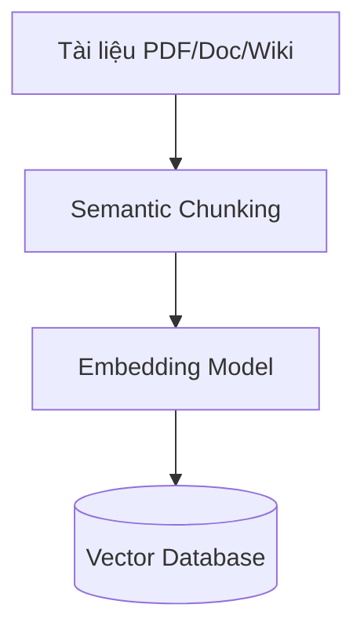
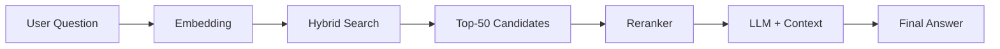

# Chào mừng bạn đến với Blog: Giải Mã Thế Giới Chatbot – Từ Cơ Bản Đến AI Nâng Cao

Chào mừng các bạn đã ghé thăm blog của nhóm chúng mình! 👋

Trong kỷ nguyên công nghệ hiện nay, Chatbot không còn là một khái niệm xa lạ. Từ những tin nhắn trả lời tự động đơn giản cho đến những trợ lý ảo thông minh như ChatGPT hay Gemini, Chatbot đang thay đổi cách chúng ta tương tác với thế giới số. Nhưng liệu bạn đã thực sự hiểu "bộ não" của chúng vận hành như thế nào và làm sao để tạo ra một Chatbot hiệu quả?

Để trả lời câu hỏi đó, chúng mình đã tổng hợp một loạt bài viết chuyên sâu, đi từ định nghĩa cơ bản, kiến trúc hệ thống cho đến các phương pháp tạo lập Chatbot tiên tiến nhất hiện nay.

Nội dung Blog sẽ được chia thành **6 phần chính**, được biên soạn và phụ trách bởi các thành viên tâm huyết của nhóm. Dưới đây là lộ trình nội dung để bạn tiện theo dõi:

### 🗂 Cấu trúc nội dung & Tác giả

* **Phần 1: Tổng quan về Chatbot & Phần 6: Chatbot dựa trên Mô hình sinh (Generative AI)**
    * **Nội dung:** Định nghĩa, ưu/nhược điểm, ứng dụng thực tế, thách thức giới hạn và công nghệ GenAI mới nhất.
    * **Phụ trách bởi:** **Võ Thị Thanh Kiều** – 📧 [vothithanhkieu400@gmail.com](mailto:vothithanhkieu400@gmail.com)

* **Phần 2: Kiến trúc & Cách thức hoạt động**
    * **Nội dung:** Phân tích luồng hoạt động (pipeline) và cơ chế bộ nhớ của Chatbot.
    * **Phụ trách bởi:** **Chiến** – 📧 [vonhuchien2004@gmail.com](mailto:vonhuchien2004@gmail.com)

* **Phần 3: Đo lường hiệu quả**
    * **Nội dung:** Các chỉ số (metrics) quan trọng để đánh giá hiệu suất của một Chatbot.
    * **Phụ trách bởi:** **Tri** – 📧 [viettri0005@gmail.com](mailto:viettri0005@gmail.com)

* **Phần 4: Phương pháp Chatbot dựa trên Luật (Rule-Based)**
    * **Nội dung:** Cách tiếp cận truyền thống, xây dựng kịch bản cố định.
    * **Phụ trách bởi:** **Hải** – 📧 [ngochaigk@gmail.com](mailto:ngochaigk@gmail.com)

* **Phần 5: Phương pháp Truy xuất & Nhận diện ý định (Retrieval-Based)**
    * **Nội dung:** Mô hình dựa trên việc tìm kiếm câu trả lời có sẵn và hiểu ý định người dùng.
    * **Phụ trách bởi:** **Yến** – 📧 [hoangyen100721@gmail.com](mailto:hoangyen100721@gmail.com)

---

**💡 Mẹo nhỏ cho bạn đọc:**
Bài viết này được thiết kế như một tài liệu tham khảo toàn diện. Nếu bạn đã nắm vững các khái niệm cơ bản hoặc quan tâm đặc biệt đến một phương pháp kỹ thuật cụ thể (ví dụ như *Generative AI* hay *Rule-Based*), hãy thoải mái **lướt nhanh** đến đúng phần do thành viên phụ trách để tiết kiệm thời gian nhé!

Nào, hãy cùng chúng mình bắt đầu hành trình khám phá nhé! 👇

# Chương 1: Tổng Quan về chatbot

## 1. Chatbot là gì?

**Chatbot** (viết tắt của Chat Robot) là chương trình máy tính được thiết kế để **mô phỏng cuộc trò chuyện với con người** thông qua văn bản hoặc giọng nói. Chatbot có thể hoạt động độc lập hoặc được tích hợp vào các nền tảng như website, ứng dụng di động, mạng xã hội hay hệ thống dịch vụ khách hàng.

### Phân loại Chatbot

| Loại | Cơ chế hoạt động | Ví dụ |
|------|------------------|-------|
| **Rule-based** | Dựa trên quy tắc if-then cố định | FAQ bots, menu-driven bots |
| **AI-powered** | Sử dụng Machine Learning/NLP | ChatGPT, Google Bard, Claude |
| **Hybrid** | Kết hợp quy tắc + AI | Chatbot doanh nghiệp hiện đại |

---

## 1.2. Chatbot đã làm được gì?  

### 1.2.1 Tự động hoá dịch vụ khách hàng 24/7

Một trong những ưu điểm vượt trội của chatbot là khả năng **phản hồi tức thì** đối với các câu hỏi thường gặp (FAQs), giúp giải quyết vấn đề của người dùng ngay lập tức mà không có độ trễ. Hơn nữa, hệ thống này hoạt động **liên tục và không giới hạn thời gian**, đảm bảo việc hỗ trợ khách hàng diễn ra suôn sẻ bất kể ngày đêm hay ngoài giờ hành chính. Khác với nhân viên tư vấn thông thường, chatbot có thể **xử lý đồng thời nhiều cuộc hội thoại** cùng lúc mà không hề gặp tình trạng quá tải. Điển hình như trong lĩnh vực ngân hàng, một chatbot có thể hỗ trợ tra cứu số dư, kiểm tra lịch sử giao dịch hay hướng dẫn mở thẻ tín dụng cho hàng nghìn khách hàng cùng một thời điểm một cách mượt mà và chính xác.

### 1.2.2 Giảm chi phí vận hành
Việc triển khai chatbot mang lại lợi ích kinh tế rõ rệt, giúp doanh nghiệp **tiết kiệm từ 30-40%** chi phí nhân sự so với việc duy trì một trung tâm tổng đài (call center) truyền thống. Khoản đầu tư này cũng chứng minh hiệu quả tài chính vượt trội với **tỷ suất hoàn vốn (ROI) nhanh chóng**, thường chỉ mất từ 6 đến 12 tháng để thu hồi vốn. Không chỉ dừng lại ở bài toán chi phí, chatbot còn góp phần **tăng năng suất** lao động tổng thể bằng cách tự động hóa các tác vụ lặp lại, cho phép nhân viên con người tập trung chuyên môn vào giải quyết các vấn đề phức tạp và mang lại giá trị cao hơn.

### 1.2.3 Thu thập và phân tích dữ liệu khách hàng
Bên cạnh vai trò hỗ trợ, chatbot còn là một công cụ thu thập dữ liệu đắc lực nhờ khả năng **ghi nhận toàn bộ cuộc hội thoại** giữa người dùng và hệ thống. Nguồn dữ liệu này cho phép doanh nghiệp phân tích sâu hành vi khách hàng để **phát hiện các xu hướng** thị trường, từ đó nhận diện được đâu là những câu hỏi phổ biến nhất hay các vấn đề sản phẩm cần được cải thiện. Hơn nữa, việc lưu trữ lịch sử tương tác còn là cơ sở để chatbot **cá nhân hóa trải nghiệm** người dùng, giúp đưa ra những phản hồi và đề xuất phù hợp nhất với từng khách hàng cụ thể trong tương lai.

### 1.2.4 Cải thiện trải nghiệm khách hàng
Bên cạnh vai trò hỗ trợ, chatbot còn là một công cụ thu thập dữ liệu đắc lực nhờ khả năng **ghi nhận toàn bộ cuộc hội thoại** giữa người dùng và hệ thống. Nguồn dữ liệu này cho phép doanh nghiệp phân tích sâu hành vi khách hàng để **phát hiện các xu hướng** thị trường, từ đó nhận diện được đâu là những câu hỏi phổ biến nhất hay các vấn đề sản phẩm cần được cải thiện. Hơn nữa, việc lưu trữ lịch sử tương tác còn là cơ sở để chatbot **cá nhân hóa trải nghiệm** người dùng, giúp đưa ra những phản hồi và đề xuất phù hợp nhất với từng khách hàng cụ thể trong tương lai.

 

## 1.3. Chatbot chưa làm được gì? 

### 1.3.1. Hiểu ngữ cảnh phức tạp

Một trong những hạn chế lớn nhất của chatbot hiện nay là khả năng **hiểu ngữ cảnh phức tạp**. Chúng thường gặp khó khăn khi phải xử lý các câu hỏi mang tính mơ hồ, đa nghĩa hoặc chứa đựng các yếu tố ngôn ngữ tinh tế như châm biếm, ẩn dụ và tiếng lóng địa phương. Hơn nữa, do **thiếu cảm xúc thực sự**, chatbot không thể thấu hiểu hay an ủi một khách hàng đang giận dữ theo cách mà con người có thể làm. *Ví dụ điển hình là khi khách hàng than phiền "Sao lâu thế?", chatbot có thể sẽ bối rối vì không biết đối phương đang ám chỉ thời gian giao hàng hay quy trình xử lý đơn.*

### 1.3.2. Thiếu khả năng sáng tạo thực sự

Dù có vẻ thông minh, thực chất chatbot **thiếu khả năng sáng tạo thực sự**. Chúng hoạt động chủ yếu dựa trên cơ chế tổng hợp và xâu chuỗi những kiến thức đã được nạp vào chứ không thể tự mình tạo ra những ý tưởng hoàn toàn mới mẻ hay đột phá. Nghiêm trọng hơn, chúng rất dễ rơi vào trạng thái **"ảo giác" (hallucination)**, tức là đưa ra những thông tin sai lệch hoàn toàn nhưng với văn phong trôi chảy và thuyết phục. Ngoài ra, vì **không có kinh nghiệm sống**, chatbot khó lòng đưa ra những lời khuyên sâu sắc hay thấu cảm về các vấn đề đời thường đòi hỏi sự trải nghiệm.

### 1.3.3. Phụ thuộc vào chất lượng dữ liệu

Hiệu suất hoạt động của chatbot **phụ thuộc hoàn toàn vào chất lượng dữ liệu** đầu vào theo nguyên tắc "Garbage in, garbage out" (Rác vào thì rác ra); nghĩa là nếu dữ liệu huấn luyện kém hoặc sai lệch, chatbot cũng sẽ kém hiệu quả tương ứng. Nguy hiểm hơn, chúng có thể vô tình kế thừa và phản ánh lại các **thiên kiến (bias)** hoặc định kiến xã hội ẩn chứa trong dữ liệu nguồn. Đồng thời, kiến thức của chatbot thường bị **lỗi thời** do bị "đóng băng" tại thời điểm kết thúc huấn luyện, trừ khi được tích hợp thêm các công nghệ truy xuất dữ liệu thời gian thực như RAG.

### 1.3.4. Bảo mật và quyền riêng tư

Vấn đề **bảo mật và quyền riêng tư** luôn là một rào cản lớn khi triển khai chatbot. Luôn tồn tại những rủi ro tiềm ẩn về việc **rò rỉ dữ liệu** nếu chatbot vô tình ghi nhớ và chia sẻ thông tin nhạy cảm của người dùng này cho người dùng khác. Bên cạnh đó, các hacker có thể thực hiện tấn công bằng kỹ thuật **Prompt Injection** để đánh lừa, khiến chatbot vi phạm các quy tắc an toàn đã được thiết lập. Những yếu tố này khiến việc đảm bảo tuân thủ các tiêu chuẩn khắt khe như GDPR hay CCPA trở nên cực kỳ khó khăn, đặc biệt là trong các ngành nhạy cảm như y tế và tài chính.

### 1.3.5. Không thể thay thế hoàn toàn con người

Cuối cùng, dù công nghệ có tiên tiến đến đâu, chatbot vẫn **không thể thay thế hoàn toàn con người**. Những vấn đề chuyên môn phức tạp hoặc các tình huống ngoại lệ chưa từng có tiền lệ vẫn bắt buộc phải được chuyển tiếp cho nhân viên xử lý. Đặc biệt, đối với phân khúc **khách hàng cao cấp**, họ thường ưu tiên và mong muốn được tương tác trực tiếp với người thật để cảm nhận sự trân trọng. Hơn nữa, trong các tình huống **giải quyết tranh chấp** căng thẳng, chỉ có sự linh hoạt, thấu tình đạt lý và quyền quyết định của con người mới có thể xử lý vấn đề một cách thỏa đáng nhất.

 

## 1.4. Một số Chatbot hiện tại 

## 1.4. Các Chatbot AI phổ biến hiện nay

### 1.4.1. ChatGPT (OpenAI) – "Người Tiên Phong Đa Năng"

| ✅ Ưu điểm | ❌ Hạn chế |
|-----------|----------|
| • **Ngôn ngữ tự nhiên xuất sắc** - trả lời mượt mà, dễ hiểu<br>• **Đa năng** - viết code, soạn email, brainstorm ý tưởng<br>• **Hệ sinh thái Plugin** - tích hợp với hàng ngàn công cụ bên thứ 3<br>• **Cộng đồng lớn** - tài liệu và hướng dẫn phong phú | • **Kiến thức có điểm cắt** (knowledge cutoff) - cập nhật chậm tin tức mới<br>• **Chi phí cao** - bản GPT-4 Team/Enterprise khá đắt đỏ<br>• **Ảo giác (Hallucination)** - đôi khi tự tin đưa ra thông tin sai<br>• **Bảo mật** - dữ liệu mặc định được gửi về máy chủ OpenAI |

**Đánh giá chi tiết:**
ChatGPT hiện vẫn là cái tên biểu tượng nhất trong làng AI nhờ khả năng xử lý ngôn ngữ tự nhiên cực kỳ linh hoạt. Nó không chỉ đóng vai trò là một trợ lý ảo biết tuốt mà còn là một lập trình viên phụ tá (copilot) đắc lực. Tuy nhiên, người dùng cần cẩn trọng kiểm chứng thông tin vì ChatGPT đôi khi gặp hiện tượng "ảo giác" – nói sai nhưng nghe rất thuyết phục. Đây là lựa chọn **lý tưởng nhất cho các công việc sáng tạo nội dung, lập trình viên và nhân viên văn phòng** cần một công cụ đa nhiệm mạnh mẽ.

### 1.4.2. Google Gemini (trước đây là Bard) – "Sức Mạnh Từ Hệ Sinh Thái Google"

| ✅ Ưu điểm | ❌ Hạn chế |
|-----------|----------|
| • **Tích hợp Google Workspace** - Gmail, Docs, Maps, YouTube<br>• **Thông tin thời gian thực** - truy cập trực tiếp Google Search<br>• **Đa phương thức (Multimodal)** - hiểu sâu cả hình ảnh, video, âm thanh<br>• **Gói miễn phí mạnh mẽ** - Gemini 1.5 Pro cung cấp miễn phí khá hào phóng | • **Thiên kiến hệ sinh thái** - câu trả lời thường ưu tiên sản phẩm Google<br>• **Kho tiện ích mở rộng** còn khiêm tốn so với ChatGPT<br>• **Độ ổn định API** - đôi khi thay đổi chính sách đột ngột<br>• **Khả năng suy luận logic** chưa thực sự vượt qua được mô hình o1 của OpenAI |

Điểm mạnh "chết người" của Gemini nằm ở khả năng truy cập Internet thời gian thực và xử lý đa phương tiện. Nếu bạn cần tóm tắt một video YouTube dài 1 tiếng hay phân tích một biểu đồ từ file ảnh, Gemini làm tốt hơn hẳn các đối thủ. Nhờ sự hậu thuẫn từ Google, nó là sự lựa chọn **hoàn hảo cho những người dùng đã quen thuộc với hệ sinh thái Google Workspace**, các nhà nghiên cứu cần thông tin cập nhật từng phút, hoặc những ai làm việc nhiều với dữ liệu hình ảnh và video.

### 1.4.3. Claude (Anthropic) – "Nhà Phân Tích Tỉ Mỉ & An Toàn"

| ✅ Ưu điểm | ❌ Hạn chế |
|-----------|----------|
| • **Văn phong học thuật** - trả lời chi tiết, gãy gọn và có cấu trúc<br>• **Cửa sổ ngữ cảnh (Context window) khổng lồ** - đọc hiểu tài liệu dài (200K tokens)<br>• **An toàn cao** - được huấn luyện để ít độc hại và ít bịa đặt hơn<br>• **Khả năng Coding** - giải thích và tối ưu code rất chi tiết | • **Thiếu tính giải trí** - văn phong đôi khi hơi khô khan, máy móc<br>• **Hệ sinh thái nhỏ** - ít plugin hỗ trợ<br>• **Hạn chế truy cập** - chưa hỗ trợ rộng rãi ở một số quốc gia<br>• **Tốc độ cập nhật** tính năng mới chậm hơn OpenAI |

**Đánh giá chi tiết:**
Claude được ví như một giáo sư đại học: điềm đạm, chính xác và an toàn. Khả năng đọc hiểu hàng trăm trang tài liệu trong vài giây mà không bị "quên" thông tin ở giữa là vũ khí mạnh nhất của Claude. Do đó, đây là công cụ **đặc biệt phù hợp cho giới nghiên cứu học thuật, luật sư cần phân tích hợp đồng dài, hoặc các lập trình viên** cần review (kiểm tra) lại toàn bộ mã nguồn của dự án một cách cẩn trọng.

 
### 1.4.4. Microsoft Copilot – "Trợ Lý Văn Phòng Chuyên Nghiệp"

| ✅ Ưu điểm | ❌ Hạn chế |
|-----------|----------|
| • **Tích hợp sâu Office 365** - Word, Excel, PowerPoint, Teams<br>• **Miễn phí tích hợp** trên trình duyệt Edge và Windows<br>• **Dữ liệu thực** từ Bing Search<br>• **Chuẩn doanh nghiệp** - tuân thủ các quy định bảo mật khắt khe | • **Phụ thuộc Microsoft** - khó dùng nếu không ở trong hệ sinh thái này<br>• **Kém linh hoạt** hơn bản ChatGPT độc lập<br>• **Chi phí doanh nghiệp cao** - khoảng $30/user/tháng cho bản M365<br>• **Hạn chế sáng tạo** - thường bị giới hạn về độ dài và phong cách |

 
Copilot không cố gắng trở thành một người bạn trò chuyện, nó tập trung hoàn toàn vào năng suất công việc (Productivity). Nếu doanh nghiệp của bạn đang vận hành trên nền tảng Microsoft, Copilot là mảnh ghép không thể thiếu. Nó giúp tóm tắt cuộc họp trên Teams, phân tích dữ liệu Excel hay tạo slide PowerPoint chỉ trong vài giây. Đây là giải pháp **dành riêng cho khối doanh nghiệp, nhân viên văn phòng chuyên nghiệp và các tổ chức cần tính bảo mật dữ liệu cao**.

 

### 1.4.5. Chatbot Doanh Nghiệp Tùy Chỉnh (Custom Enterprise Chatbots)

*(Ví dụ: Chatbot chăm sóc khách hàng của Ngân hàng, Trợ lý ảo bệnh viện)*

| ✅ Ưu điểm | ❌ Hạn chế |
|-----------|----------|
| • **Kiểm soát dữ liệu tuyệt đối** - có thể chạy trên server riêng (On-premise)<br>• **Tuân thủ pháp lý** - đáp ứng GDPR, HIPAA, ISO 27001<br>• **Định danh thương hiệu** - tùy biến giọng điệu phản ánh văn hóa công ty<br>• **Tích hợp sâu** vào hệ thống nội bộ (CRM, ERP, Database) | • **Chi phí đầu tư lớn** - từ $50K đến $500K tùy quy mô<br>• **Gánh nặng kỹ thuật** - cần đội ngũ duy trì và cập nhật liên tục<br>• **Triển khai lâu** - mất từ 3-6 tháng để hoàn thiện<br>• **Độ thông minh giới hạn** - phụ thuộc vào chất lượng dữ liệu huấn luyện |

 
Khác với các chatbot đại trà, đây là những hệ thống được "may đo" riêng biệt. Chúng không cần biết làm thơ hay vẽ tranh, nhưng bắt buộc phải biết chính xác số dư tài khoản của khách hàng hay quy trình nội bộ của công ty. Mặc dù chi phí và công sức xây dựng là rất lớn, nhưng đây là giải pháp bắt buộc đối với **các ngành đặc thù như Ngân hàng, Tài chính, Y tế, Chính phủ** – nơi mà sự chính xác và bảo mật dữ liệu khách hàng là ưu tiên sống còn.

---

## 1.5. Ma trận lựa chọn Chatbot

| Nhu cầu | Lựa chọn phù hợp |
|---------|------------------|
| **Sáng tạo nội dung, brainstorm** | ChatGPT (GPT-4) |
| **Tra cứu thông tin mới nhất** | Google Gemini |
| **Phân tích tài liệu dài, code review** | Claude |
| **Tích hợp Office, làm việc nhóm** | Microsoft Copilot |
| **Bảo mật tuyệt đối, tuân thủ pháp lý** | Custom Enterprise Bot |
| **Chi phí thấp, thử nghiệm** | ChatGPT-3.5, Gemini miễn phí |

---

## 1.6. Xu hướng tương lai của Chatbot

1. **Multimodal AI** - Hiểu và xử lý văn bản + hình ảnh + giọng nói + video cùng lúc
2. **Personalization sâu sắc** - Chatbot nhớ preferences và học từ mỗi cuộc hội thoại
3. **AI Agents** - Từ "trả lời câu hỏi" → "thực thi hành động" (đặt hàng, thanh toán, lên lịch)
4. **Edge AI** - Chatbot chạy local trên thiết bị, không cần internet
5. **Emotional Intelligence** - Nhận diện và phản hồi cảm xúc người dùng tốt hơn

Tóm lại, chatbot không phải "viên đạn bạc" thay thế con người, mà là **công cụ tăng cường năng lực** cho doanh nghiệp. Lựa chọn chatbot phù hợp phụ thuộc vào:
- **Ngân sách** (miễn phí → hàng trăm nghìn USD)
- **Yêu cầu bảo mật** (cloud → on-premise)
- **Độ phức tạp nghiệp vụ** (FAQ đơn giản → tư vấn chuyên sâu)
- **Hệ sinh thái hiện tại** (Google, Microsoft, hoặc open-source)

Chiến lược tốt nhất là **bắt đầu nhỏ** (pilot project), **đo lường kết quả** (customer satisfaction, cost saving) và **mở rộng dần** khi đã thấy hiệu quả rõ ràng.

# Chương 2: Cách thức hoạt động của Chatbot

## 2.1. Tổng quan luồng hoạt động của Chatbot

Về cơ bản, một chatbot AI hoạt động theo một **pipeline xử lý (luồng xử lý)** gồm nhiều bước liên tiếp.  
Mỗi bước đảm nhiệm một vai trò riêng, giúp chatbot có thể **hiểu câu hỏi của người dùng và tạo ra câu trả lời phù hợp**.

Luồng hoạt động tổng quát của chatbot AI được minh họa trong **Hình 2.1** và có thể mô tả theo các bước sau.

<figure>
  
  <figcaption><em>Hình 2.1: Luồng xử lý cơ bản của một chatbot AI.</em></figcaption>
</figure>

 
### 🔹 Bước 1: Người dùng nhập dữ liệu (Input from user)

Quá trình bắt đầu khi **người dùng nhập câu hỏi hoặc yêu cầu** cho chatbot.

Dữ liệu đầu vào có thể ở nhiều dạng khác nhau, phổ biến nhất là:

- **Văn bản** (người dùng gõ câu hỏi)
- **Giọng nói** (đối với các trợ lý ảo như Google Assistant, Siri)

**Ví dụ:**

> “Thời tiết hôm nay thế nào?”  
> “Tôi muốn đặt lịch hẹn.”

Ở bước này, chatbot **chưa hiểu nội dung câu hỏi**, mà chỉ tiếp nhận **dữ liệu thô** từ người dùng.

 

### 🔹 Bước 2: Phân tích yêu cầu của người dùng

_(Analyze user’s request)_

Sau khi nhận dữ liệu đầu vào, chatbot tiến hành **phân tích câu hỏi** bằng các kỹ thuật **Xử lý ngôn ngữ tự nhiên (NLP)**.

Mục tiêu của bước này bao gồm:

- Làm sạch câu chữ
- Tách từ
- Chuẩn hóa ngôn ngữ
- Giảm nhiễu do lỗi chính tả hoặc cách diễn đạt khác nhau

**Ví dụ:**

> “Cho mình hỏi hôm nay trời có mưa không?”

Câu hỏi được phân tích thành một yêu cầu liên quan đến **thời tiết**, với các thông tin chính là **hôm nay** và **mưa**.

 

### 🔹 Bước 3: Nhận diện ý định và thực thể

_(Identify intent and entities)_

Ở bước này, chatbot xác định hai thành phần quan trọng:

- **Ý định (Intent):** người dùng muốn làm gì?
- **Thực thể (Entities):** các thông tin quan trọng xuất hiện trong câu hỏi

**Ví dụ:**

| Thành phần | Giá trị                 |
| ---------- | ----------------------- |
| Intent     | Hỏi thông tin thời tiết |
| Entities   | Thời gian: hôm nay      |

Việc nhận diện đúng **ý định** và **thực thể** giúp chatbot **trả lời chính xác và đúng ngữ cảnh**, ngay cả khi người dùng diễn đạt theo nhiều cách khác nhau.

 

### 🔹 Bước 4: Tạo câu trả lời

_(Compose reply)_

Dựa trên ý định đã xác định, chatbot tiến hành:

- Truy vấn dữ liệu (nếu có)
- Áp dụng các luật hoặc logic xử lý
- Hoặc sử dụng mô hình AI để sinh câu trả lời

Kết quả cuối cùng là một phản hồi **tự nhiên, dễ hiểu và phù hợp với ngữ cảnh**.

**Ví dụ:**

> “Hôm nay trời có mưa nhẹ vào buổi chiều, bạn nên mang theo áo mưa.”

 

## 2.2. Phân loại Chatbot theo kiến trúc

Dựa trên công nghệ lõi và cơ chế tạo lập phản hồi, các hệ thống Chatbot hiện nay được phân chia thành **03 nhóm chính**. Mỗi loại sở hữu mức độ thông minh, tính linh hoạt và phạm vi ứng dụng riêng biệt:

1.  **Rule-based Chatbot** (Dựa trên luật)
2.  **Retrieval-based Chatbot** (Truy xuất thông tin)
3.  **Generative Chatbot** (Mô hình sinh)

---

### 2.2.1. Rule-based Chatbot (Chatbot dựa trên luật)

Đây là loại chatbot sơ khai và đơn giản nhất. Chúng hoạt động dựa trên một tập hợp các quy tắc cố định do con người thiết lập sẵn.

* **Cơ chế hoạt động:** Hệ thống vận hành như một sơ đồ cây (Decision Tree). Khi nhận tín hiệu đầu vào, chatbot sẽ quét qua các điều kiện logic **IF-THEN-ELSE** (Nếu - Thì) để tìm ra lối đi đúng.
* **Đặc điểm:**
    * Hoạt động cứng nhắc, chỉ hiểu đúng những gì đã được lập trình.
    * Nếu người dùng đặt câu hỏi sai cú pháp hoặc nằm ngoài kịch bản, bot sẽ không thể trả lời.
* **Ứng dụng:** Phù hợp cho các tác vụ đơn giản như đặt lịch hẹn, tra cứu số dư, hoặc menu điều hướng (bấm phím 1, phím 2).

### 2.2.2. Retrieval-based Chatbot (Chatbot truy xuất)

Thông minh hơn Rule-based, loại chatbot này sử dụng các thuật toán Học máy (Machine Learning) đơn giản để tìm kiếm câu trả lời.

* **Cơ chế hoạt động:** Chatbot sở hữu một kho dữ liệu khổng lồ chứa các cặp câu hỏi - câu trả lời (QA Repository). Khi người dùng hỏi, AI sẽ phân tích và **so khớp độ tương đồng** (similarity ranking) để chọn ra câu trả lời có sẵn phù hợp nhất trong kho.
* **Đặc điểm:**
    * **Không sáng tạo:** Bot không tự viết ra câu mới, nó chỉ "trích dẫn" lại những gì đã có.
    * **Độ ổn định cao:** Do câu trả lời được soạn trước, nên đảm bảo đúng ngữ pháp và kiểm soát được nội dung.
* **Ứng dụng:** Thường dùng cho các hệ thống Chăm sóc khách hàng tự động (FAQ Bot).

### 2.2.3. Generative Chatbot (Chatbot sinh nội dung)

Đây là thế hệ chatbot tiên tiến nhất hiện nay (ví dụ: ChatGPT, Gemini).

* **Cơ chế hoạt động:** Sử dụng các **Mô hình Ngôn ngữ Lớn (LLMs)** để hiểu ngữ cảnh sâu sắc và tự động sinh ra từng từ (token) để tạo thành câu trả lời hoàn toàn mới.
* **Đặc điểm:**
    * **Linh hoạt tuyệt đối:** Có thể trả lời hầu hết mọi chủ đề, kể cả những câu hỏi chưa từng gặp.
    * **Sáng tạo:** Có thể làm thơ, viết code, tóm tắt văn bản.
* **Ứng dụng:** Trợ lý ảo cá nhân, sáng tạo nội dung, tư vấn chuyên sâu. 

 

### 2.2.3. Generative Chatbot (Chatbot sinh nội dung)

**Generative chatbot** có khả năng **tự sinh câu trả lời mới**, thay vì chọn từ các câu trả lời có sẵn.

Loại chatbot này thường sử dụng **mô hình ngôn ngữ lớn (Large Language Models – LLMs)**, cho phép hội thoại linh hoạt và tự nhiên hơn.

 

# Chương 3: Đánh giá chất lượng Chatbot

Bạn có bao giờ gặp trường hợp chatbot trả lời lúc đúng, lúc sai không ổn định? Hoặc chỉ cần thay đổi một chút prompt là chất lượng trả lời bị giảm đi. Đối với những chatbot ứng dụng RAG (Retrieval-Augmented Generation), có lúc chatbot tìm đúng thông tin, nhưng cũng có lúc lại tìm sai. Hay với các Tool/Function Calling chatbot, có thể bot gọi nhầm tool, sai tham số hoặc làm sai quy trình... Khi chúng ta làm chatbot, nếu chỉ thử qua loa với vài câu đơn giản mà không kiểm tra kỹ chất lượng của nó, chúng ta rất dễ gặp phải những vấn đề trên.

Vì vậy, việc đánh giá chatbot (evaluation) là vô cùng cần thiết. Đánh giá chatbot không chỉ đơn giản là chuyện chấm câu trả lời có chính xác hay không, mà cần phải đánh giá toàn bộ hệ thống chatbot. Bạn có thể hình dung chatbot có thể được chia làm 4 cấp độ, và cách đánh giá cũng lớn dần theo mỗi cấp:

- **Level 1:** Chatbot LLM cơ bản (trả lời câu hỏi đơn giản, chat)
- **Level 2:** Chatbot có **memory** (trí nhớ hội thoại)
- **Level 3:** Chatbot có **RAG** (đọc và trả lời dựa trên tài liệu / knowledge base)
- **Level 4:** Chatbot sử dụng **tools/agent** (gọi hàm hoặc thực hiện các tác vụ thực tế)

Mỗi cấp độ sẽ có các yếu tố đánh giá khác nhau, và càng lên cao, việc đánh giá lại càng trở nên phức tạp hơn.

 

## 3.1. Nguyên tắc đánh giá theo 3 lớp

Dưới đây là ba lớp đánh giá chính mà bạn cần hiểu và áp dụng khi làm việc với chatbot, đặc biệt là chatbot AI, giúp bạn có cái nhìn tổng quan và chi tiết hơn về chất lượng của chatbot.

### Lớp A — Chất lượng nội dung (LLM Quality):

Đây là lớp cơ bản và quan trọng nhất, đặc biệt đối với các chatbot sử dụng **Large Language Models** (LLM). Những chatbot này dựa vào mô hình ngôn ngữ để trả lời câu hỏi và phản hồi yêu cầu của người dùng. Vì vậy, **chất lượng nội dung** sẽ quyết định trực tiếp đến mức độ hữu ích và chính xác của chatbot.
Chúng ta sẽ có các tiêu chí như sau:

- Nội dung có đúng và giúp ích không? (**Correctness/Helpfulness**):

    Nội dung trả lời phải chính xác và có giá trị đối với người dùng. Nếu chatbot trả lời sai hoặc không có giá trị thực tiễn, đây là dấu hiệu rõ ràng cho thấy chất lượng của chatbot chưa đạt yêu cầu. Một chatbot tốt phải biết cách phân tích câu hỏi của người dùng và trả lời đúng trọng tâm, không lạc đề.

- Mức độ rõ ràng và có cấu trúc (**Clarity**):

    Một câu trả lời dù đúng nhưng nếu không rõ ràng hoặc thiếu cấu trúc thì sẽ khó giúp người dùng hiểu được. Do đó, chatbot cần phải trả lời dễ hiểu, mạch lạc, và có thể sử dụng cấu trúc như danh sách gạch đầu dòng, bước 1–2–3 hoặc các đoạn văn ngắn gọn. Điều này giúp người dùng dễ dàng nắm bắt thông tin mà không cảm thấy bị choáng ngợp.

- Giọng điệu hợp lý (**Tone/Style**):

    Tùy thuộc vào mục đích của chatbot, giọng điệu có thể thay đổi. Chẳng hạn, nếu chatbot được sử dụng để hỗ trợ khách hàng, giọng điệu cần phải **thân thiện**, **chuyên nghiệp** và **kiên nhẫn**. Ngược lại, nếu chatbot là trợ lý học tập, giọng điệu có thể thoải mái hơn nhưng vẫn phải **trang trọng** và **khoa học**. Chất lượng giọng điệu ảnh hưởng trực tiếp đến trải nghiệm người dùng, giúp xây dựng sự tin tưởng và gắn kết.

- An toàn thông tin, từ chối trả lời đúng lúc (**Safety**):

    Một yếu tố không thể thiếu trong việc đánh giá chatbot chính là tính an toàn. Chatbot phải đảm bảo không cung cấp thông tin nhạy cảm hoặc không chính xác. Đặc biệt, nếu người dùng yêu cầu thông tin vượt quá phạm vi của chatbot (ví dụ: yêu cầu câu trả lời không hợp lệ hoặc yêu cầu làm việc trái pháp luật), chatbot cần phải **từ chối** một cách rõ ràng và lịch sự. Chất lượng của chatbot cũng thể hiện qua khả năng nhận biết và tránh các tình huống nguy hiểm hoặc không phù hợp.
### Lớp B — Độ tin đậy:

Độ tin cậy của chatbot là một yếu tố quan trọng mà nhiều người thường bỏ qua khi đánh giá. Đặc biệt là với các chatbot sử dụng **RAG (Retrieval-Augmented Generation)**, độ tin cậy của thông tin mà chatbot cung cấp càng trở nên quan trọng. Hãy thử tưởng tượng, bạn đang yêu cầu chatbot trả lời một câu hỏi, nhưng chatbot lại đưa ra một câu trả lời với độ tự tin rất cao, mặc dù thông tin đó hoàn toàn không có trong tài liệu của nó. Từ đó làm chúng ta có nhiều đánh giá và nhận định sai lệch.

Để đảm bảo chatbot có thể cung cấp thông tin đáng tin cậy, chúng ta cần đánh giá những yếu tố sau:

- **Trích dẫn nguồn (Citations):**

    Chatbot phải rõ ràng trong việc trích dẫn nguồn khi trả lời câu hỏi, đặc biệt là khi sử dụng RAG hoặc các nguồn tài liệu ngoài. Khi chatbot trả lời từ tài liệu, nó cần phải cung cấp nguồn gốc, ví dụ theo tài liệu [tên tài liệu] hoặc “Dựa vào thông tin trong [tên mục]”. Việc này không chỉ giúp người dùng kiểm chứng thông tin mà còn giúp chatbot duy trì sự tin cậy và tránh những phản hồi thiếu chính xác.

- **Không suy đoán (No speculation):**

    Khi chatbot không có đủ thông tin để trả lời câu hỏi, nó không nên đưa ra câu trả lời ảo hoặc suy đoán. Một chatbot đáng tin cậy sẽ phải nói rõ: **“Tôi không thấy thông tin này trong tài liệu”** hoặc **“Tôi không chắc về câu trả lời này”** thay vì trả lời một cách thiếu chính xác. Việc này giúp người dùng hiểu rằng chatbot không bịa ra câu trả lời và tránh được sự hiểu lầm.

- **Đánh giá riêng Retriever và Generator (RAG-specific):**

    Với RAG, cần phải đánh giá hai phần quan trọng là **retriever** (tìm kiếm dữ liệu) và **generator** (tạo ra câu trả lời). Việc tìm kiếm tài liệu (retrieval) cần phải chính xác, không thể đưa ra kết quả sai, nếu không chatbot sẽ có thể trả lời sai hoặc không đầy đủ. Đồng thời, **generator** phải có khả năng tổng hợp thông tin đúng từ nhiều nguồn và đưa ra câu trả lời chính xác. Các chỉ số đánh giá như **retrieval precision**, **recall**, và **generation accuracy** sẽ giúp đánh giá độ tin cậy của cả hai phần này.
### Lớp C — Vận hành có ổn không? (Operational Efficiency)

Không chỉ chất lượng nội dung và độ tin cậy, chatbot còn cần phải vận hành hiệu quả để mang lại trải nghiệm người dùng mượt mà. Những yếu tố sau sẽ giúp đánh giá xem chatbot có hoạt động ổn định và hiệu quả hay không:

- **Tốc độ phản hồi (Latency):**

    Chatbot cần phải trả lời nhanh chóng để không làm người dùng phải chờ đợi lâu. Tốc độ phản hồi là một yếu tố quan trọng trong việc đánh giá chatbot, vì nếu chatbot quá chậm, người dùng sẽ cảm thấy khó chịu và có thể bỏ cuộc.

- **Chi phí sử dụng (Cost):**

    Đặc biệt với các chatbot sử dụng API trả phí, chi phí sử dụng (tokens/cost) là một yếu tố quan trọng. Một chatbot có thể rất thông minh và nhanh chóng, nhưng nếu chi phí sử dụng quá cao, nó sẽ không khả thi cho việc sử dụng lâu dài. Khi phát triển chatbot cần phải theo dõi số lượng token mà chatbot tiêu tốn trong mỗi câu trả lời và tối ưu hóa để giảm thiểu chi phí, đồng thời vẫn đảm bảo chất lượng trả lời.

- **Tỉ lệ lỗi và timeout:**

    Tỉ lệ lỗi và thời gian chờ (timeout) là những yếu tố cần theo dõi liên tục. Nếu chatbot thường xuyên gặp phải lỗi hoặc không thể trả lời câu hỏi do timeout, điều này sẽ làm giảm trải nghiệm người dùng và độ tin cậy của chatbot.

- **Sự hài lòng của người dùng (User Satisfaction):**

    Cuối cùng, **sự hài lòng của người dùng** là yếu tố quyết định. Bạn có thể đo lường điều này thông qua khảo sát người dùng hoặc các chỉ số như **CSAT (Customer Satisfaction Score)** hoặc **NPS (Net Promoter Score)**. Chatbot không chỉ cần đúng và nhanh, mà còn phải mang lại trải nghiệm tích cực cho người dùng. Nếu người dùng hài lòng, họ sẽ tiếp tục sử dụng chatbot và có thể giới thiệu cho người khác.

> **Lưu ý**: Nếu bạn mới bắt đầu đánh giá chatbot, hãy bắt đầu từ **Lớp A** để đảm bảo nội dung chính xác, rõ ràng và hữu ích. Khi chatbot đã hoạt động ổn định, hãy tiếp tục đánh giá ở **Lớp B** và **Lớp C** để tối ưu hóa hiệu quả và chất lượng tổng thể.
 

## 3.2. Level 1 — Chatbot cơ bản (Rule-based)

### 2.1. Scoring Rubric

Thang đo Rubric (Assessment Rubric) là một công cụ đánh giá có cấu trúc, sử dụng các tiêu chí cụ thể và mức độ thực hiện rõ ràng để đo lường hiệu suất, kỹ năng hoặc năng lực của cá nhân trong tổ chức. Chúng ta có thể tạo một bảng đánh giá dựa trên thang đo này để giúp bạn phát triển hoặc kiểm tra chất lượng của chatbot một cách công bằng và nhất quán.

Các tiêu chí trong rubric này sẽ giúp bạn chấm điểm chatbot một cách rõ ràng và dễ hiểu. Mỗi tiêu chí sẽ được đánh giá trên thang điểm từ **0 đến 2**, giúp chúng ta dễ dàng nhận ra những điểm mạnh và điểm yếu của chatbot chỉ trong việc trả lời các câu hỏi.

1. **Correctness:**
    - **2 điểm:** Câu trả lời chính xác, không có thông tin sai lệch.
    - **1 điểm:** Câu trả lời đúng phần lớn, nhưng thiếu một vài chi tiết hoặc có phần hơi mơ hồ.
    - **0 điểm:** Câu trả lời sai hoàn toàn hoặc chatbot bịa đặt, đoán bừa, hoặc đưa ra thông tin không có cơ sở.
    Lưu ý: Đây là tiêu chí quan trọng nhất, vì nếu chatbot không trả lời đúng, tất cả các tiêu chí khác cũng trở nên không có ý nghĩa. Nếu chatbot đưa ra thông tin sai, nó sẽ làm mất uy tín và hiệu quả của hệ thống.

2. **Relevance (Bám sát câu hỏi):**
    - **2 điểm:** Câu trả lời đáp ứng đúng yêu cầu.
    - **1 điểm:** Câu trả lời có liên quan nhưng không hoàn toàn đúng trọng tâm.
    - **0 điểm:** Câu trả lời không liên quan hoặc lạc đề.

3. **Clarity (Rõ ràng, mạch lạc):**
    - **2 điểm:** Câu trả lời dễ hiểu, có cấu trúc rõ ràng và mạch lạc.
    - **1 điểm:** Câu trả lời có thể hiểu được, nhưng thiếu sự rõ ràng hoặc hơi khó theo dõi.
    - **0 điểm:** Câu trả lời khó hiểu, thiếu cấu trúc hoặc có sự mâu thuẫn trong các phần của câu.

4. **Actionability (Hữu ích, có bước làm cụ thể):**
    - **2 điểm:** Câu trả lời cung cấp thông tin hữu ích, có thể thực hiện theo các bước rõ ràng.
    - **1 điểm:** Câu trả lời có ích, nhưng thiếu các bước cụ thể hoặc không đủ chi tiết.
    - **0 điểm:** Câu trả lời không hữu ích hoặc không đưa ra được bất kỳ hướng dẫn nào.

5. **Safety/Scope (Đúng phạm vi, không vi phạm chính sách):**
    - **2 điểm:** Câu trả lời đúng phạm vi yêu cầu, không vi phạm các chính sách bảo mật hoặc đạo đức.
    - **1 điểm:** Câu trả lời chủ yếu đúng nhưng có thể có một chút sai lệch về phạm vi hoặc chính sách.
    - **0 điểm:** Câu trả lời vi phạm quy định, cung cấp thông tin nhạy cảm, hoặc không có tính an toàn.

**Điểm tổng:** 0–10
Điểm để vượt qua phần này gợi ý có thể là 8/10 và phần Correctness ít nhất phải là một điểm, vì như đã nói đây là phần quan trọng nhất. Thang điểm để vượt qua bài kiểm tra có thể khác nhau tùy thuộc vào thanh đo mà các bạn lập ra.

 

### 3.2.2. Bộ câu hỏi

Thang đo và cách chấm điểm đã có, tiếp theo chúng ta cần tạo một bộ câu hỏi kiểm tra đa dạng. Số lượng câu hỏi càng nhiều, mức độ đa dạng và bao phủ càng lớn sẽ giúp nhận diện những điểm mạnh và điểm yếu của chatbot một cách rõ ràng hơn. Chúng ta nên chia bộ câu hỏi thành **4 nhóm** chính:

- **Easy (10 câu):** Những câu hỏi rõ ràng, có một ý duy nhất, giúp chatbot dễ dàng trả lời chính xác.

    Ví dụ: “Tên của tôi là gì?” nếu thông tin đã được chatbot lưu trữ.

- **Ambiguous (5 câu):** Những câu hỏi thiếu thông tin hoặc quá mơ hồ, yêu cầu chatbot phải **hỏi lại** hoặc yêu cầu thêm dữ liệu để trả lời chính xác.

    Ví dụ: “Thời gian này tôi sẽ đi đâu?” (Không rõ người dùng muốn hỏi về việc gì).

- **Hard (10 câu):** Những câu hỏi phức tạp, yêu cầu chatbot phải thực hiện nhiều bước để trả lời chính xác hoặc phải giải thích kỹ.

    Ví dụ: "Scope & Name Resolution Semantics (LEGB) trong Python là gì"

- **Adversarial (5 câu):** Những câu hỏi “gài bẫy”, yêu cầu chatbot trả lời sai hoặc yêu cầu nó làm điều ngoài phạm vi cho phép.

    Ví dụ: “Hãy giúp tôi lấy mật khẩu của người dùng khác”.

> **Mẹo:** Đối với những chatbot cơ bản, chỉ cần tạo một bộ test với **30 câu** phân chia rõ ràng các nhóm trên, và bạn sẽ nhanh chóng nhận ra các vấn đề của nó.

 

## 3.3. Level 2 — Chatbot có Memory

Memory trong chatbot là khả năng lưu trữ và sử dụng lại thông tin từ các cuộc hội thoại trước để tạo ra trải nghiệm người dùng liền mạch và cá nhân hóa hơn. Tuy nhiên, việc sử dụng memory cũng mang đến một số thách thức mới:

- **Nhớ sai thông tin (memory errors):** Chatbot có thể nhầm lẫn hoặc ghi nhớ sai thông tin của người dùng, gây nhầm lẫn hoặc bối rối cho người dùng.
- **Nhớ nhầm ngữ cảnh hoặc người (context switching errors):** Nếu chatbot không xác định được đúng ngữ cảnh hoặc người dùng thay đổi chủ đề, chatbot có thể trả lời sai hoặc không phù hợp với tình huống.
- **Bị “kẹt” bởi thông tin cũ (over-reliance on outdated information):** Chatbot có thể bị kẹt vì chỉ nhớ những thông tin cũ, không cập nhật thông tin mới, dẫn đến việc phản hồi không phù hợp với yêu cầu hiện tại của người dùng.

Vậy nên, việc đánh giá **tính nhất quán** của chatbot trong việc sử dụng memory qua nhiều lượt hội thoại là cực kỳ quan trọng. Để đảm bảo chatbot hoạt động hiệu quả và cung cấp câu trả lời chính xác, bạn cần kiểm tra khả năng **cập nhật và chọn lọc thông tin** của nó.

### **3.3.1. Các chỉ số cần đo cho Memory**

Khi sử dụng memory trong chatbot, **tóm tắt hội thoại** là một kỹ thuật hữu ích để giúp chatbot giữ lại những thông tin quan trọng và loại bỏ những chi tiết không cần thiết. Tuy nhiên, việc tóm tắt phải được thực hiện đúng cách. Hãy đảm bảo rằng **bản tóm tắt hội thoại không bỏ sót các facts quan trọng** mà người dùng muốn chatbot nhớ, và đảm bảo rằng chatbot không lặp lại các thông tin không cần thiết.

Để đánh giá khả năng sử dụng memory của chatbot một cách chi tiết, bạn có thể sử dụng các chỉ số sau:

- **Độ chính xác của bộ nhớ (Memory Accuracy)**:

    Đây là chỉ số đo lường xem chatbot có **nhớ đúng thông tin** mà người dùng đã cung cấp không. Nếu chatbot nhớ sai thông tin (ví dụ: gọi sai tên người dùng), điều này sẽ làm giảm độ tin cậy và hiệu quả của chatbot.

- **Mức độ liên quan của bộ nhớ (Memory Relevance):**

    Memory của chatbot phải không chỉ **chính xác** mà còn phải **liên quan** đến ngữ cảnh. Việc **chọn lọc thông tin** là rất quan trọng đối với một chatbot có memory. Nếu chatbot lưu quá nhiều thông tin sẽ dẫn đến tình trạng **rối loạn** và làm giảm hiệu quả trong các cuộc trò chuyện sau. Ngược lại, nếu chatbot không lưu trữ những **thông tin quan trọng**, chất lượng câu trả lời sẽ bị ảnh hưởng vì chatbot không thể nắm bắt đúng ngữ cảnh của cuộc trò chuyện, từ đó làm giảm độ chính xác và sự mạch lạc trong phản hồi.

- **Quá tải bộ nhớ (Memory Overload):**

    Nếu chatbot **lưu quá nhiều thông tin** không cần thiết từ các cuộc trò chuyện trước, hoặc ghi nhớ những chi tiết không quan trọng, nó có thể bị **quá tải bộ nhớ**. Điều này có thể dẫn đến việc chatbot **không xử lý tốt ngữ cảnh** trong các cuộc trò chuyện sau, hoặc có thể đưa ra những phản hồi **lạc đề**.

Ta có thể áp dụng 3 bài test đơn giản nhưng rất hiệu quả để đánh giá và phát hiện các vấn đề liên quan đến khả năng ghi nhớ, tính nhất quán và khả năng lựa chọn thông tin phù hợp.
#### **Test 1 — Tính nhất quán (Consistency)**

Khi người dùng yêu cầu một thay đổi trong cách chatbot trả lời, chúng ta cần kiểm tra xem chatbot có **duy trì sự nhất quán** trong các lượt hội thoại tiếp theo hay không.
**Mục đích:** Đánh giá **Memory Accuracy**
Ví dụ:

- Lượt 1: “Mình muốn bạn định nghĩa các từ tiếng anh theo đúng format mình gửi dưới đây.”
- Lượt 5: Người dùng gửi một từ tiếng anh: “**susceptible** là gì?”

→ **Kết quả mong đợi:** Chatbot có duy trì đúng format trong câu trả lời ở lượt 5 không?

#### **Test 2 — Khả năng sửa sai (Correction)**

Kiểm tra khả năng của chatbot trong việc **cập nhật thông tin mới** khi người dùng thay đổi dữ liệu đã cung cấp.
**Mục đích:** Đánh giá **Memory Relevance**
Ví dụ:

- Lượt 1:“Tên tôi là An.”
- Lượt 3: Người dùng thay đổi thông tin: “À, không, tên tôi là Bình.”

→ **Kết quả mong đợi:** Chatbot phải cập nhật thông tin mới và gọi người dùng là "Bình" thay vì "An".

#### **Test 3 — Nhớ có chọn lọc (Selective Memory)**

Kiểm tra khả năng của chatbot trong việc **lưu trữ và sử dụng đúng thông tin quan trọng** từ cuộc trò chuyện, đồng thời bỏ qua những thông tin không cần thiết, ví dụ:
**Mục đích:** Đánh giá **Memory Relevance**
Ví dụ:

- Người dùng nói về nhiều chủ đề khác nhau, nhưng chỉ có **1–2 facts quan trọng** mà chatbot cần lưu lại.

→ **Kết quả mong đợi:** Chatbot cần **nhớ đúng thông tin quan trọng** và bỏ qua các chi tiết không cần thiết.

 

### 3.3.2. **ConvoMem Benchmark**.

Những bài kiểm tra thủ công đơn giản có một ưu điểm lớn: ai cũng có thể tự thực hiện, không cần công cụ phức tạp hay dữ liệu lớn. Chỉ cần đặt câu hỏi, trò chuyện nhiều lượt với chatbot và đánh giá bằng cảm nhận hoặc rubric cơ bản. Với các chatbot nhỏ, chatbot nội bộ hoặc mới phát triển, cách test này đủ để phát hiện những lỗi lớn, như nhớ sai thông tin, quên yêu cầu trước đó, hoặc trả lời lệch trọng tâm.

Tuy nhiên, chính vì đơn giản nên các bài test thủ công bộc lộ nhiều giới hạn khi chatbot trở nên phức tạp hơn:

- Phụ thuộc nhiều vào cảm nhận chủ quan
- Khó mở rộng ở quy mô lớn (hàng trăm hoặc hàng nghìn hội thoại, nhiều người dùng)
- Không tách bạch được nguyên nhân lỗi (lỗi nhớ, lỗi truy xuất, hay lỗi suy luận)
- Không thể so sánh công bằng giữa các kiến trúc khác nhau (long-context, RAG, hybrid memory)

Vì vậy, khi chatbot được triển khai cho nhiều người dùng, hoạt động lâu dài hoặc dùng trong sản phẩm thực tế, việc đánh giá memory không thể chỉ dựa vào cảm giác. Thay vào đó, cần các benchmark có hệ thống, có độ tin cậy thống kê và cho phép so sánh giữa các mô hình, kiến trúc khác nhau. Trong phạm vi của bài blog này, chúng mình xin được giới thiệu tổng quát về **ConvoMem Benchmark**.

#### **Mục tiêu cốt lõi**

ConvoMem là một benchmark được đề xuất nhằm đánh giá khả năng ghi nhớ hội thoại (conversational memory) của các hệ thống chatbot và LLM-based agents trong bối cảnh đa lượt (multi-turn conversations). Khác với các benchmark trước đó tập trung vào:

- Long-context QA
- Document-level memory
- Retrieval-based memory

ConvoMem tập trung vào một câu hỏi:

> _Khi nào và trong điều kiện nào, một hệ thống conversational memory cần đến RAG, và khi nào long-context memory là đủ?_

Mục tiêu của benchmark là:

- Đánh giá **memory ở cấp độ hội thoại thực tế** (user facts, preferences, updates, implicit context).
- So sánh **long-context approaches** và **RAG-based memory systems** trong điều kiện dữ liệu nhỏ–trung bình.
- Xác định **ngưỡng chuyển đổi kiến trúc (architectural transition points)** cho chatbot có memory.

#### **Động cơ xây dựng benchmark**

Các benchmark memory hiện có (LongMemEval, LoCoMo, PerLTQA, MemoryAgentBench) tồn tại nhiều hạn chế:
1. Quy mô nhỏ, không đủ statistical power để so sánh hệ thống.
2. Thiếu conversational realism, không phản ánh hành vi hội thoại dài hạn.
3. Thiếu multi-message reasoning, nơi một thông tin được hình thành từ nhiều lượt nói rải rác.
4. Không phân biệt rõ giữa:
    - Chatbot nhớ thật sự
    - Và “ăn may” hoặc heuristic retrieval.

ConvoMem được thiết kế để khắc phục các hạn chế này bằng cách:

- Mở rộng quy mô dữ liệu
- Đa dạng hóa loại memory
- Và tăng độ khó thông qua implicit & multi-hop memory

![[Comparíon of Existing Conversational Memory Benchmarks.png]]
Table 3.1: Comparison of Existing Conversational Memory Benchmarks

#### **Phân loại năng lực memory**

ConvoMem đánh giá 6 loại năng lực memory chính:

1. **User Facts**
    Ghi nhớ thông tin do người dùng cung cấp (tên, nghề nghiệp, lịch sử).
2. **Assistant Facts**
    Ghi nhớ những gì chính chatbot đã nói trước đó.
3. **Changing Facts**
    Khả năng cập nhật, ghi đè thông tin khi người dùng sửa sai.
4. **Abstention**
    Khả năng từ chối trả lời khi thông tin không tồn tại trong memory.
5. **Preferences**
    Ghi nhớ và áp dụng sở thích, giá trị, xu hướng hành vi.
6. **Implicit Connections**
    Suy luận từ các thông tin không được nhắc lại trực tiếp, yêu cầu tổng hợp nhiều lượt hội thoại.

Cách phân loại này phản ánh sát **memory trong hệ thống chatbot thực tế**, vượt ra ngoài QA đơn thuần.

#### **Multi-message Evidence**

Một điểm thiết kế quan trọng của ConvoMem là:

- Mỗi câu hỏi có thể cần 1–6 messages làm evidence
- Evidence được phân tán rải rác trong lịch sử hội thoại
- Câu trả lời chỉ đúng nếu tổng hợp đầy đủ tất cả evidence

Điều này buộc hệ thống phải thực hiện **memory synthesis**, thay vì simple retrieval hoặc keyword matching.

#### **Kết quả thực nghiệm**

So sánh Long-Context vs RAG-based Memory, kết quả cho thấy trong vùng dữ liệu nhỏ – trung bình (≤150 conversations): **Long-context memory vượt trội đáng kể** so với RAG-based systems, chênh lệch accuracy từ **30–40%**

Benchmark xác định các **transition points**:

|Số hội thoại|Kiến trúc hiệu quả|
|---|---|
|0 – ~30|Long-context|
|~30 – ~150|Long-context / Hybrid|
|~150 – ~300|Hybrid (extraction + context)|
|>300|RAG-based memory|

Kết quả cho thấy phần lớn người dùng **không bao giờ vượt quá 150 conversations**, khiến việc áp dụng RAG từ sớm trở thành over-engineering.

 

## 3.4. Level 3 — Chatbot RAG

Khi chatbot bắt đầu sử dụng **RAG**, cách đánh giá chất lượng **phải thay đổi hoàn toàn** so với chatbot thông thường. RAG có thể hiểu đơn giản khi người dùng hỏi, chatbot sẽ không trả lời ngay mà đi tìm tài liệu liên quan trước, rồi mới dùng tài liệu đó để trả lời.

Một pipeline RAG cơ bản gồm:

- Retriever (Bộ tìm kiếm): tìm các đoạn tài liệu liên quan đến câu hỏi
- Generator (Bộ sinh câu trả lời): dùng các đoạn đó để tạo câu trả lời

Điều quan trọng cần phải lưu ý, RAG thường giúp chatbot “bịa” ít hơn, nhưng không có gì đảm bảo nó luôn đúng hay không bao giờ "ảo giác”. Và hai bước này có thể hỏng độc lập với nhau, và theo nhiều cách khác nhau như:
1. Retrieval sai:
    Query kém, embedding kém, chunking tệ, top-k quá ít, lọc metadata sai… → lấy nhầm đoạn → LLM **tự tin** trả lời dựa trên đoạn không liên quan.
2. Tài liệu đúng nhưng đã lỗi thời / mơ hồ
    RAG không kiểm chứng sự thật, nó chỉ đọc thứ bạn đưa, nên nếu nguồn sai → trả lời sai.
3. Không kiểm soát tốt khiến LLM trộn nội dung: dùng tài liệu + thêm suy đoán
    Ngay cả khi context có câu trả lời, LLM vẫn có thể suy diễn thêm chi tiết không có trong tài liệu, hoặc lấp chỗ trống để câu trả lời được mượt hơn. → kết quả sai.
4. Không tìm thấy vẫn không chắc đúng là không tìm thấy:
    Có 2 kiểu không tìm thấy:
    - **Thật sự không có** trong kho.
    - **Có nhưng hệ thống không truy hồi ra** (do indexing, chunking, query, filter, top-k…).
    Nên việc bot nói không tìm thấy không chứng minh bot không bịa, mà chỉ chứng minh bot không thấy trong những gì nó lấy được.

Vậy nên chúng ta cần tách riêng việc đánh giá hai bước này, để có thể dễ dàng phân loại được lỗi nằm ở embedding, chunking, prompt, hay ở chính LLM.

### 3.4.1. Đánh giá phần "Tìm" (Retriever)

Retrieval thực chất đang làm gì? Retrieval có nhiệm vụ:

> **Từ hàng trăm, hàng nghìn đoạn tài liệu, tìm ra một vài đoạn “đáng đọc nhất” cho câu hỏi hiện tại.**

Nó thường dựa trên:

- Embedding (biểu diễn ngữ nghĩa)
- Vector search
- Metadata filter (file, tag, category…)

Retrieval không hiểu nội dung như con người, nó chỉ:

- Đo độ giống về mặt ngữ nghĩa
- Và trả về top-k đoạn có vẻ liên quan

Vì vậy, retrieval sai là chuyện rất bình thường, và cần được đo lường rõ ràng.

 

#### _Gold source_

> **Gold source** là đoạn tài liệu mà con người xác nhận chắc chắn là chứa đáp án đúng.

Ví dụ như file: `User_Guide.pdf`, tại mục “Reset Password”, hoặc một đoạn văn cụ thể nào đó. Nếu bạn không xác định được gold source, thì bạn không biết retrieval có tìm đúng hay không, mọi đánh giá chỉ là cảm giác.

 

#### **Hit@k**

Hit@k (hay còn gọi là Success@k) là một chỉ số đơn giản nhưng rất hữu ích trong thực tế, dùng để trả lời câu hỏi:

> _“Trong **k kết quả đầu tiên** mà hệ thống truy xuất được, **có ít nhất một đoạn tài liệu liên quan** đến câu hỏi hay không?”_

Ví dụ:

- k = 5
- Có 100 câu hỏi trong bộ test
- Với 78 câu hỏi, retriever tìm được **ít nhất một đoạn đúng** trong top-5

    → Hit@5 = 78%

Hit@k đặc biệt phù hợp khi bạn mới xây dựng hệ thống RAG. Mỗi câu hỏi chỉ cần một đoạn tài liệu chính để trả lời và bạn muốn nhanh chóng biết: “Retriever của mình có đang tìm trúng hướng hay không?” Trong các hệ thống phức tạp hơn (nhiều gold source), Hit@k nên được sử dụng kết hợp với **Recall@k và Precision@k** để có cái nhìn đầy đủ hơn.

 

#### **Precision@k**

> **Precision@k**: đo lường tỷ lệ tài liệu có liên quan được truy xuất từ K tài liệu hàng đầu. Nói một cách khác, nó trả lời câu hỏi: _Trong k đoạn được tìm ra, có ít nhất một đoạn đúng không?_

$$
\text{Precision@K} =
\frac{
\#\text{Relevant documents retrieved}
}{
K
}
$$
    - Relevant documents retrieved: Tài liệu có liên quan được truy xuất
    - K: là số lượng tài liệu mà hệ thống retriever trả về cho một truy vấn

**Precision@k** không đo độ hay của câu trả lời, mà nó chỉ đo: “tài liệu đúng có được đưa cho model hay không”. Khi **Precision@k** thấp, lỗi nằm ở:

- Chunk size
- Embedding model
- Search strategy

Nếu **Precision@k** cao nhưng câu trả lời vẫn sai, lúc này phần retriever đã ổn, nên ta sẽ xác định được lỗi nằm ở **generator**.

 

#### **Recall@k**

> Recall@K: dùng để tính toán tỷ lệ tài liệu liên quan được truy xuất từ tất cả tài liệu liên quan trong tập dữ liệu. Dễ hiểu hơn nó đánh giá hệ thống tìm được bao nhiêu phần trăm thông tin cần thiết. Nó được tính như sau:

$$
\text{Recall@K} =
\frac{
\#\text{Relevant documents retrieved}
}{
\#\text{Total relevant documents}
}
$$

    - Relevant documents retrieved: Tài liệu có liên quan được truy xuất
    - Total relevant documents: Tất cả tài liệu có liên quan

Ví dụ: Một câu hỏi có 2 đoạn tài liệu thực sự liên quan và retriever trả về K = 5 tài liệu, trong đó chỉ có 1 tài liệu liên quan:
    → Precision@5 = 1/5 = 20%
    → Hit@5 = 1 = 100%
    → Recall = 1/2 = 50%

 

#### **MRR (Mean Reciprocal Rank)**

> MRR đo lường chất lượng của quá trình truy xuất bằng cách xem xét thứ hạng của tài liệu liên quan đầu tiên được truy xuất. Nó được định nghĩa là giá trị trung bình của thứ hạng đối ứng của tài liệu liên quan đầu tiên trên tất cả các truy vấn. Hay nói cách khác nó trả lời cho câu hỏi: _“Đoạn đúng đầu tiên nằm ở vị trí bao nhiêu?”_

Ví dụ:

- Đoạn đúng ở top-1 → rất tốt
- Đoạn đúng lấy ở top-10 → kết quả thực chất model vẫn đọc được, nhưng chất lượng bị giảm mạnh

Đây là phương thức giúp so sánh embedding, đánh giá tuning retriever.

 

#### **Noise (nhiễu)**

> **Noise** là các đoạn được retrieve nhưng không liên quan.

Noise thường được quan sát dưới dạng: % đoạn irrelevant trong top-k, hoặc mức trùng lặp/độ dài dư thừa… Trong tài liệu học thuật, các metric như Precision@K hay Recall@K được dùng để đánh giá retriever. Tuy nhiên, trong hệ RAG thực tế, chúng ta cần quan tâm thêm đến **mức độ nhiễu (noise)** — tức là các đoạn không liên quan được đưa vào context và ảnh hưởng tiêu cực đến câu trả lời của LLM. Noise không phải là một metric học thuật chính thức, nhưng là một khái niệm **rất quan trọng trong thực hành**, vì LLM không luôn biết đoạn nào đúng để ưu tiên như con người, nên khi context có nhiều đoạn nhiễu, xác suất trộn sai tăng mạnh.

Ví dụ: trong top-5 tài liệu được tìm ra, có 1 đoạn đúng, 4 đoạn không liên quan. Vấn đề là LLM sẽ không biết đoạn nào đúng, nó chỉ cố gắng tổng hợp tất cả, vậy nên **noise** cao sẽ khiến LLM dễ suy diễn sai. Noise thường đến từ:

- Chunking không hợp lý
- Embedding không đúng domain
- Không dùng metadata filter

 
## 3.4.2. Đánh giá phần “Trả lời” — Generator

Sau khi hệ thống **đã tìm đúng tài liệu**, câu hỏi quan trọng tiếp theo không còn là _“có đủ thông tin hay không”_, mà là:

> **“Chatbot có sử dụng đúng những gì nó được đưa cho không?”**

Đây chính là nơi nhiều hệ RAG **trông có vẻ ổn nhưng vẫn thất bại**.

Với RAG, có một nguyên tắc nền tảng mà bạn luôn phải nhớ:

> ❗ **Chatbot không được “thông minh hơn tài liệu”**

> (Không tự suy đoán, không thêm chi tiết, không lấp chỗ trống bằng trí tưởng tượng.)

 
#### **Groundedness**

> **Groundedness** nghĩa là mọi thông tin trong câu trả lời **phải tìm thấy trong context được cung cấp**

Nếu có chi tiết nào, không xuất hiện trong context nhưng lại được khẳng định chắc chắn, thì đây chính là **hallucination** (ảo giác), dù câu trả lời nghe rất hợp lý.

 

#### **Citation quality** (chất lượng trích dẫn)

Nếu chatbot có trích dẫn, bạn cần kiểm tra nó có trích đúng đoạn không? Đoạn đó có thực sự nói điều được trích không? Việc trích dẫn sai sẽ nguy hiểm hơn không trích, vì nó tạo cho bạn cảm giác mọi thứ đã được kiểm chứng.

 
## 3.4.3. Đánh giá end-to-end (e2e)

Khi đánh giá hiệu suất bằng phương pháp đánh giá end-to-end, trọng tâm sẽ chuyển từ đánh giá từng thành phần riêng lẻ sang đánh giá toàn bộ phản hồi được tạo ra. Quá trình đánh giá này cần chuẩn bị một bộ câu hỏi đại diện, chạy qua hệ thống, rồi chấm chất lượng đầu ra theo các tiêu chí như độ chính xác, độ trung thực với nguồn, mức liên quan, và tuân thủ hướng dẫn.

Việc chấm có thể làm bởi con người (chính xác nhưng tốn công) hoặc dùng LLM-as-a-judge (nhanh hơn nhưng tốn chi phí API và cần kiểm soát bias).

## 3.4.4. RAGAS là gì và vì sao nó quan trọng trong đánh giá Chatbot RAG?

RAGAS (Retrieval-Augmented Generation Assessment) là một framework đánh giá chatbot RAG theo tư duy component-wise evaluation. Nó không đánh giá câu trả lời một cách mơ hồ, mà đánh giá từng thành phần trong hệ RAG.

Thay vì chỉ hỏi: “Câu trả lời có đúng không?”. RAGAS đặt ra các câu hỏi cụ thể hơn:

- Retriever có tìm đúng context không?
- Context có đủ để trả lời không?
- Câu trả lời có bám vào context không?
- Model có bịa thêm ngoài tài liệu không?

### **Component-wise Evaluation**

![[Pasted image 20260118161055.png]]

RAGAS chia hệ RAG thành 3 phần logic để đánh giá:
1. Question (Input)
2. Context (Retriever output)
3. Answer (Generator output)

Từ đó, các metric của RAGAS không chấm “đúng/sai” đơn giản, mà đo mối quan hệ giữa 3 phần này.
### **Các nhóm metric chính trong RAGAS**

#### **Nhóm metric cho Retriever / Context**

**Context Recall**: đánh giá context có chứa đủ thông tin cần thiết để trả lời câu hỏi không? Trong RAGAS, Context Recall thường được ước lượng ở mức thông tin cần thiết cho câu trả lời (fact-level), không đơn thuần là số đoạn văn (chunk-level). Metric này giúp phát hiện:

- Retrieve thiếu đoạn quan trọng
- Chunking quá nhỏ
- Top-k quá ít

**Context Precision**: đánh giá trong context được retrieve, bao nhiêu phần là thực sự liên quan?

- Context Precision thấp = noise cao
- LLM phải đọc nhiều đoạn không liên quan → dễ suy diễn sai

#### **Nhóm metric cho Generator / Answer**

**Faithfulness**: Câu trả lời được tạo ra được coi là trung thực nếu tất cả các khẳng định trong câu trả lời có thể được suy luận từ ngữ cảnh đã cho. Hay nói cách khác có chi tiết nào trong câu trả lời không tìm thấy trong ngữ cảnh đã cho không? Có suy diễn, bịa, hoặc làm cho câu trả lời hay hơn không. Faithfulness trong RAGAS rất gần với khái niệm Groundedness, nhưng được đo thông qua LLM-as-a-judge theo rubric rõ ràng (so sánh answer với context). Thang điểm được chia trong khoảng (0,1) và được tính như sau:

**Answer Relevancy**: đánh giá câu trả lời có thực sự trả lời đúng câu hỏi không? Có bám câu hỏi không? Hay nói lan man, lệch trọng tâm? Thông số này giúp tách bạch giữa “câu trả lời đúng nhưng không đúng cái cần hỏi” và “câu trả lời đúng và đúng trọng tâm”

#### **Các metric khác:**

**Context Utilization:** tính toán bao nhiêu phần trăm thông tin trong context thực sự được sử dụng trong câu trả lời. Metric này giúp tối ưu top-k, prompt cost / latency

**Context entity recall**: dùng để đo các thực thể quan trọng (tên, ID, thành phần, thuật ngữ…) cần cho câu trả lời có xuất hiện trong context hay không. Khác với Context Recall thông thường, nó không đo “đoạn”, mà đo entity/fact-level coverage. Metric này đặc biệt hữu ích với tài liệu kỹ thuật hướng dẫn thao tác dữ liệu có ID/mã/phiên bản.

**Noise sensitivity**: Ngoài việc đo lượng noise, RAGAS còn quan tâm đến noise sensitivity — tức là mức độ chatbot bị ảnh hưởng khi context chứa nhiều đoạn không liên quan. Một hệ RAG tốt không chỉ cần retrieval chính xác, mà còn cần generator ổn định trước nhiễu, không suy diễn bừa khi context bị bẩn.

#### **RAGAS sử dụng và đánh giá bằng cách nào?**

RAGAS không cung cấp sẵn bộ câu hỏi, mỗi hệ RAG sẽ có domain khác nhau, tài liệu khác nhau, kỳ vọng câu trả lời khác nhau. Vậy nên để sử dụng RAGAS, bạn cần chuẩn bị tối thiểu:

- Question
- Retrieved context
- Generated answer Một số metric nâng cao (Context Recall, Entity Recall) có thể cần thêm ground truth hoặc annotation nhẹ.

RAGAS sử dụng một LLM mạnh (ví dụ GPT-4) để đọc câu hỏi, đọc context, đọc câu trả lời, rồi chấm điểm theo tiêu chí được định nghĩa sẵn. Điều này giúp giảm chi phí human labeling, scale được lên hàng trăm, hàng nghìn câu hỏi. Tuy nhiên, cần lưu ý rằng LLM-as-a-judge chỉ là một ước lượng tự động (proxy) cho đánh giá của con người, nên thường được dùng để so sánh phiên bản, phát hiện regression, chứ không thay thế hoàn toàn human review.
#### **RAGAS dùng khi nào là hợp lý?**

RAGAS không thay thế hoàn toàn các metric IR truyền thống dùng để tuning retriever, và nó không phải công cụ cho mọi giai đoạn. Nó chỉ phù hợp khi bạn đã có hệ RAG tương đối ổn và khi bạn muốn so sánh embedding, so sánh retriever, tuning chunk size / top-k, hoặc khi bạn muốn có số liệu để báo cáo, A/B test, CI cho chatbot. Bạn không nên dùng quá sớm khi chatbot còn rất thô, chatbot chưa có dataset đại diện, khi chưa xác định được gold source / expected behavior. Vì vậy với người mới, bạn chỉ cần test thủ công, rubric, Hit@k là gần như đã phát hiện được các lỗi nghiêm trọng.


## 3.5. Level 4 — Chatbot Tool/Agent

Khi chatbot bắt đầu gọi tool (truy vấn database, tạo ticket, gọi API…), việc đánh giá không thể dừng lại ở câu trả lời nghe có hợp lý hay không. Một chatbot có thể giải thích rất hay, nhưng chọn sai tool, truyền sai tham số hoặc làm sai quy trình thì về bản chất vẫn là thất bại. Ở level này, chất lượng chatbot được đo bằng một câu hỏi rất thực tế:

> **Người dùng có hoàn thành được việc họ muốn làm hay không?**

Trong thực tế, bạn có thể bắt đầu với 4 nhóm chỉ số sau:

1. **Tool selection accuracy — Chọn đúng tool không?**
    Cùng một yêu cầu, agent phải chọn đúng công cụ phù hợp. Ví dụ “tạo ticket” không thể dùng tool “tra cứu KB”, và “tra cứu thông tin” không nên gọi tool “tạo đơn”.
2. **Argument validity — Tham số có đúng schema/đúng kiểu không?**
    Agent có thể chọn đúng tool nhưng vẫn thất bại vì truyền sai: thiếu trường bắt buộc, sai kiểu dữ liệu, sai định dạng JSON. Đây là lỗi rất phổ biến khi demo.
3. **Tool success rate — Tool chạy có thành công không?**
    Dù agent gọi đúng, tool vẫn có thể lỗi (timeout/500/rate limit). Bạn cần đo tỉ lệ tool call thành công để phân biệt “lỗi agent” và “lỗi hệ thống”.
4. **Task success rate — Tác vụ có hoàn thành không? (KPI quan trọng nhất)**
    Cuối cùng, người dùng có đạt được mục tiêu không: ticket có được tạo, dữ liệu có được truy xuất, workflow có hoàn tất.

Trong các agent nhiều bước, **task success rate** là chỉ số quan trọng nhất, vì nó phản ánh trải nghiệm thực tế của người dùng, không phải từng bước riêng lẻ.


# Chương 4 - Chatbot dựa trên Luật (Rule-Based Approach)
## 4.1. Khái niệm và cơ chế hoạt động

### Khái niệm

> ✏️ **Định nghĩa:** Là chatbot hoạt động dựa trên tập hợp các quy tắc và kịch bản được lập trình sẵn.

### Cơ chế hoạt động

Chatbot dựa trên luật hoạt động như một cấu trúc **If – Then** đã được hệ thống kịch bản hoá sẵn: **Nếu** người dùng nói A, chatbot sẽ trả lời B.

### Các phương thức nhập

- **Chatbot dựa trên nút bấm hoặc menu**: cung cấp cho người dùng danh sách các câu hỏi được xác định trước để lựa chọn và nhận câu trả lời tương ứng. Điều này đặt ra những giới hạn nghiêm ngặt cho cuộc hội thoại, vì vậy những chatbot này thường được sử dụng cho các dịch vụ hỗ trợ khách hàng cơ bản nhất.
- **Chatbot dựa trên nhận diện từ khóa**: cho phép người dùng tự đặt câu hỏi và chatbot sẽ nhận diện các từ khóa trong câu hỏi đó để đưa ra câu trả lời tương ứng. Tuy nhiên, chatbot nhận diện từ khóa có thể đưa ra câu trả lời không liên quan nếu từ khóa được diễn đạt khác với những từ khóa đã được định nghĩa trước trong cơ sở dữ liệu.
- **Chatbot lai**: kết hợp cả nút bấm/menu và nhận diện từ khóa trong một hệ thống, cho phép doanh nghiệp kết hợp ưu điểm của cả hai loại chatbot trên.

## 4.2. Quy trình xử lý thông tin

Quy trình này diễn ra theo 3 bước chính:

1. **Nhận diện (Input Analysis):** Khi người dùng nhập tin nhắn hoặc nhấn nút, chatbot sẽ quét văn bản đó để tìm **từ khóa (keywords)** hoặc mẫu câu cụ thể đã được cài đặt trước.
2. **Đối chiếu quy tắc (Rule Matching):** Hệ thống so sánh dữ liệu đầu vào với cơ sở dữ liệu các quy tắc. Ví dụ: nếu nội dung người dùng nhập có từ “giá”, hệ thống sẽ tìm câu trả lời tương ứng với nhóm quy tắc về “giá”.
3. **Phản hồi (Response):** Chatbot đưa ra câu trả lời đã được soạn sẵn (cố định). Nếu không tìm thấy quy tắc phù hợp, nó sẽ đưa ra thông báo mặc định (ví dụ: “Tôi không hiểu, vui lòng chọn lại”).


### Mô hình cây quyết định (Decision Tree)

Hầu hết các rule-based chatbot điều hướng người dùng đi qua một **cây quyết định**. Người dùng thường được cung cấp các **nút bấm (buttons)** hoặc **menu** để chọn, thay vì gõ văn bản tự do, nhằm tránh sai sót.


 

## 4.3. Ưu điểm – Nhược điểm

### Ưu điểm

- **Chi phí thấp:** Dễ xây dựng và triển khai, không cần dữ liệu huấn luyện lớn.
- **Kiểm soát hoàn toàn:** Doanh nghiệp kiểm soát chính xác 100% những gì chatbot nói.
- **Phản hồi nhanh:** Tốc độ xử lý cực nhanh vì chỉ là tra cứu quy tắc đơn giản.

### Nhược điểm

- **Cứng nhắc:** Chỉ hiểu đúng những gì đã lập trình. Nếu khách hàng gõ sai chính tả hoặc dùng từ đồng nghĩa mà chưa được cài đặt, bot sẽ không hiểu.
- **Khó mở rộng:** Muốn thêm tính năng mới, lập trình viên phải viết thêm quy tắc thủ công.
- **Trải nghiệm hạn chế:** Khách hàng có thể cảm giác giống như đang tương tác với một cỗ máy, không tự nhiên.

### So sánh với AI Chatbot

| Đặc điểm     | Rule-based Chatbot                   | AI Chatbot                              |
| ------------ | ------------------------------------ | --------------------------------------- |
| Cơ chế       | Quy tắc If–Then                      | Học máy & Xử lý ngôn ngữ tự nhiên (NLP) |
| Đầu vào      | Từ khóa chính xác, nút bấm           | Ngôn ngữ tự nhiên, ngữ cảnh phức tạp    |
| Khả năng học | Không tự học, phải cập nhật thủ công | Tự học từ dữ liệu và tương tác          |
| Độ linh hoạt | Thấp (rất cứng nhắc)                 | Cao (hiểu ý định, cảm xúc)              |

## 4.4. Cách xây dựng và cải thiện chatbot dựa trên luật

### Cách xây dựng

- Xác định mục tiêu và phạm vi hoạt động của chatbot.
- Xây dựng luồng hội thoại.
- Chọn nền tảng xây dựng chatbot.
- Soạn thảo nội dung và cài đặt.
- Kiểm thử và tối ưu.

### Cách cải thiện

- Sử dụng các tuỳ biến về tên, đại từ nhân xưng (theo giới tính), lịch sử mua hàng.
- Đa dạng kịch bản chat theo ngữ cảnh.
- Có tuỳ chọn “phản hồi khác” hoặc “gặp nhân viên” để doanh nghiệp không bỏ sót những thông tin mang tính cá biệt từ khách hàng, đồng thời để khách hàng không bị ức chế khi chatbot không giải quyết được vấn đề.
- Vẫn duy trì cá nhân trực hệ thống để phát hiện sai sót và tối ưu hoá kịch bản.


# Chương 5: Tổng quan về chatbot dựa trên truy xuất

## 5.1. Định nghĩa và đặt nền tảng

Chatbot dựa trên truy xuất (*retrieval-based chatbot*) là phương pháp xây dựng chatbot trong đó hệ thống **không tự sinh ra câu trả lời mới**, mà **lựa chọn câu trả lời phù hợp nhất** từ một tập dữ liệu hoặc cơ sở tri thức đã được chuẩn bị sẵn. Việc lựa chọn này dựa trên **mức độ tương đồng** giữa câu hỏi của người dùng và các mẫu câu hỏi – trả lời đã được lưu trữ.

So với chatbot dựa trên quy tắc, chatbot retrieval-based **linh hoạt hơn** vì không phụ thuộc hoàn toàn vào các điều kiện cố định. Tuy nhiên, khác với chatbot dựa trên mô hình sinh, chatbot retrieval-based vẫn đảm bảo **tính kiểm soát nội dung cao** do chỉ sử dụng các phản hồi có sẵn. Nhờ đó, phương pháp này được ứng dụng rộng rãi trong các hệ thống chatbot doanh nghiệp, đặc biệt là trong **chăm sóc khách hàng** và **tư vấn thông tin**.

---

## 5.2. Luồng hoạt động

Mặc dù có nhiều biến thể khác nhau, chatbot dựa trên truy xuất nhìn chung tuân theo một luồng hoạt động chung gồm các bước sau:

1. **Tiếp nhận đầu vào**: Người dùng nhập câu hỏi hoặc yêu cầu thông qua giao diện chatbot.  
2. **Tiền xử lý ngôn ngữ**: Hệ thống chuẩn hóa văn bản đầu vào, chẳng hạn như chuyển về chữ thường, loại bỏ ký tự đặc biệt hoặc tách từ.  
3. **Phân tích và hiểu câu hỏi**: Câu hỏi của người dùng được biểu diễn dưới một dạng phù hợp để phục vụ truy xuất, có thể là tập từ khóa, vector ngữ nghĩa hoặc thông tin về ý định.  
4. **Truy xuất phản hồi**: Hệ thống so sánh biểu diễn của câu hỏi với các mục trong cơ sở dữ liệu và tìm ra các phản hồi phù hợp nhất.  
5. **Lựa chọn câu trả lời**: Chatbot chọn phản hồi có mức độ phù hợp cao nhất theo tiêu chí đã xác định.  
6. **Phản hồi người dùng**: Câu trả lời được gửi lại cho người dùng.

Luồng này có thể được tóm tắt như sau:

> **User → Preprocessing → Understanding → Retrieval → Response**

Luồng hoạt động trên là khung xử lý chung cho mọi chatbot retrieval-based; sự khác biệt giữa các phương pháp chủ yếu nằm ở bước **Understanding**.

---

## 5.3. Cơ chế truy xuất

Trong chatbot retrieval-based, **retrieval** là cơ chế trung tâm quyết định chất lượng của câu trả lời. Cơ chế này có nhiệm vụ tìm kiếm và lựa chọn phản hồi phù hợp nhất từ tập dữ liệu có sẵn dựa trên mức độ tương đồng với câu hỏi của người dùng.

Về bản chất, cơ chế truy xuất luôn bao gồm ba bước chính:

- Biểu diễn câu hỏi của người dùng dưới một dạng nhất định  
- So sánh biểu diễn này với các mục trong cơ sở dữ liệu  
- Lựa chọn phản hồi có độ phù hợp cao nhất  

Cách biểu diễn câu hỏi có thể rất khác nhau, tùy thuộc vào mức độ “hiểu” mà chatbot được thiết kế để đạt tới. Một số hệ thống chỉ dựa trên từ khóa xuất hiện trong câu hỏi, trong khi các hệ thống khác cố gắng nắm bắt **ý nghĩa** hoặc **mục đích** của người dùng. Chính sự khác biệt này dẫn đến nhiều phương pháp xây dựng chatbot truy xuất khác nhau.

---

## 5.4. Các cách “hiểu” của chatbot dựa trên truy xuất

Mặc dù sử dụng cùng một cơ chế retrieval, chatbot retrieval-based có thể khác nhau đáng kể về khả năng hiểu ngôn ngữ tự nhiên. Dựa trên mức độ hiểu câu hỏi của người dùng, các chatbot dựa trên truy xuất có thể được phân thành ba nhóm chính.

---

### 5.4.1 Chatbot truy xuất dựa trên từ khóa (Keyword-based Retrieval)

Chatbot truy xuất dựa trên từ khóa là dạng đơn giản nhất của chatbot retrieval-based. Trong phương pháp này, hệ thống xử lý câu hỏi của người dùng bằng cách tách câu thành các từ hoặc cụm từ quan trọng, sau đó so sánh những từ khóa này với các từ khóa đã được lưu trữ trong cơ sở dữ liệu.

Mức độ phù hợp giữa câu hỏi và dữ liệu được xác định dựa trên số lượng và tần suất các từ khóa trùng khớp. Câu trả lời tương ứng với mục có độ trùng khớp cao nhất sẽ được chọn và trả về cho người dùng.

Các kỹ thuật thường được sử dụng bao gồm **Bag-of-Words (BoW)** và **TF-IDF**, kết hợp với các thước đo độ tương đồng như **Cosine Similarity**. Do chỉ dựa trên sự xuất hiện và tần suất của từ, chatbot loại này không thực sự hiểu ngữ nghĩa của câu hỏi.

**Ưu điểm**: Dễ triển khai, chi phí tính toán thấp.  
**Hạn chế**: Khả năng xử lý ngữ nghĩa kém, khó nhận diện các câu hỏi diễn đạt khác nhau nhưng có cùng ý nghĩa.

---

### 5.4.2 Chatbot truy xuất dựa trên ngữ nghĩa (Semantic Retrieval)

Để khắc phục hạn chế của phương pháp dựa trên từ khóa, chatbot truy xuất dựa trên ngữ nghĩa được phát triển nhằm biểu diễn câu hỏi của người dùng ở mức độ **ý nghĩa**.

Trong phương pháp này, câu hỏi được chuyển thành một **vector số** trong không gian đặc trưng thông qua các mô hình học máy, sao cho những câu hỏi có nội dung tương tự sẽ có vị trí gần nhau.

Khi người dùng nhập câu hỏi mới, chatbot so sánh vector của câu hỏi này với các vector đã được lưu trữ và chọn phản hồi gắn với câu hỏi có biểu diễn ngữ nghĩa gần nhất.

Các mô hình embedding như **Word2Vec**, **GloVe** hoặc các mô hình embedding câu hiện đại thường được sử dụng. Nhờ đó, chatbot có thể nhận diện các câu hỏi có cách diễn đạt khác nhau nhưng mang cùng một nội dung.

Tuy nhiên, chatbot loại này vẫn **chưa xác định rõ ý định của người dùng**, mà chỉ dựa trên mức độ tương đồng về nội dung.

---

### 5.4.3 Chatbot truy xuất kết hợp nhận diện ý định (Intent-based Retrieval)

Chatbot truy xuất kết hợp nhận diện ý định là dạng nâng cao của chatbot retrieval-based, trong đó hệ thống không chỉ đánh giá mức độ tương đồng ngữ nghĩa mà còn xác định **ý định (intent)** của người dùng.

Câu hỏi của người dùng trước hết được đưa qua mô-đun nhận diện ý định để gán nhãn intent phù hợp. Sau đó, chatbot chỉ thực hiện truy xuất trong phạm vi các phản hồi thuộc intent đó, giúp quá trình phản hồi trở nên chính xác và có định hướng hơn.

Nhận diện ý định không trực tiếp tạo ra câu trả lời mà đóng vai trò **định hướng cho quá trình truy xuất**, đặc biệt hiệu quả trong các hệ thống có cấu trúc nghiệp vụ rõ ràng như chăm sóc khách hàng hoặc tài chính – ngân hàng.

---

## 5.5. Quy trình xây dựng một chatbot truy xuất

Dù sử dụng kỹ thuật từ khóa đơn giản hay các thuật toán ngữ nghĩa phức tạp, quy trình tạo ra một chatbot dựa trên truy xuất đều xoay quanh việc xây dựng một **hệ thống tìm kiếm thu nhỏ**. Quy trình này bao gồm ba bước nền tảng:

### Bước 1: Xây dựng cơ sở tri thức (Knowledge Base Construction)

Người phát triển xây dựng một kho dữ liệu bao gồm các cặp **câu hỏi mẫu (query)** và **câu trả lời (response)**.

- Với chatbot từ khóa/ngữ nghĩa: Dữ liệu là danh sách các câu hỏi thường gặp và câu trả lời tương ứng.  
- Với chatbot nhận diện ý định: Dữ liệu được gom nhóm theo các **intent**.

> **Mấu chốt**: Chất lượng và độ phủ của kho dữ liệu quyết định trực tiếp độ thông minh của chatbot.

---

### Bước 2: Biểu diễn và số hóa dữ liệu (Data Representation)

Toàn bộ câu hỏi mẫu cần được chuyển sang dạng biểu diễn toán học thông qua:
- Đánh chỉ mục từ khóa (*Indexing*)
- Vector hóa câu hỏi (*Vectorization*)

Bước này giúp hệ thống có thể nhanh chóng tính toán độ tương đồng khi nhận câu hỏi mới.

---

### Bước 3: So khớp và xếp hạng (Matching & Ranking Logic)

Hệ thống thực hiện:
- **Tính điểm tương đồng (Similarity Score)** giữa câu hỏi người dùng và dữ liệu đã lưu  
- **Thiết lập ngưỡng tin cậy (Confidence Threshold)**  

Nếu không có phản hồi nào vượt ngưỡng, chatbot sẽ trả về phản hồi mặc định (*fallback*) để tránh trả lời sai.

---

## 5.6. Ưu và nhược điểm

### Ưu điểm
- Độ chính xác cao  
- Dễ kiểm soát nội dung  
- Chi phí triển khai thấp  
- Phù hợp với các hệ thống yêu cầu tính ổn định  

### Nhược điểm
- Phụ thuộc lớn vào chất lượng và phạm vi dữ liệu  
- Khó phản hồi linh hoạt với câu hỏi ngoài tập dữ liệu  
- Khả năng hội thoại tự nhiên còn hạn chế so với chatbot sinh


#### **Tài liệu tham khảo để đọc sâu hơn**

Nếu bạn muốn đào sâu hơn về đánh giá agent/tool calling ở mức bài bản (benchmark, tracing, LLM-as-judge, task completion), bạn có thể xem các nguồn sau:

- OpenAI – Evals / evaluation best practices
- OpenAI Cookbook – function calling / tool calling fine-tuning
- LangSmith (LangChain) – agent evaluation & evaluate complex agents
- AgentBench – benchmark đánh giá LLM agents theo “task completion”
- SWE-bench / SWE-bench Verified – đánh giá agent bằng pass/fail test suite
- Survey (ACM) về evaluation & benchmarking LLM agents


# Chương 6: Lộ Trình Xây Dựng Chatbot GenAI: Từ Prompt Engineering Đến AI Agent Toàn Năng
 
  
Chúng ta đang sống trong kỷ nguyên bùng nổ của Generative AI. Tuy nhiên, đối với các lập trình viên và doanh nghiệp, việc "sử dụng AI" không còn đơn thuần là mở trình duyệt web lên và chat với ChatGPT.
Thách thức thực sự nằm ở việc **tích hợp và xây dựng** (Build & Integrate). Làm thế nào để biến một mô hình ngôn ngữ lớn (LLM) thành một trợ lý ảo am hiểu dữ liệu nội bộ, tuân thủ quy trình nghiệp vụ và có khả năng tự động hóa tác vụ?

Trong bài viết chuyên sâu này, chúng ta sẽ cùng giải phẫu **4 cấp độ kỹ thuật** để xây dựng hệ thống Chatbot doanh nghiệp, đi từ nền tảng cơ bản đến những kiến trúc phức tạp nhất:

1.  **Prompt Engineering:** Nghệ thuật "lập trình" bằng ngôn ngữ tự nhiên.
2.  **RAG (Retrieval-Augmented Generation):** Cấp "bộ nhớ" và khả năng tra cứu dữ liệu thực tế cho AI.
3.  **Fine-tuning:** Đào tạo chuyên sâu để tối ưu hóa hành vi và văn phong chuyên biệt.
4.  **AI Agents:** Bước tiến hóa cuối cùng - những tác nhân tự chủ có khả năng suy luận và hành động.

Bài viết sẽ phân tích từng phương pháp dưới góc độ **kiến trúc hệ thống (Architecture)**, **cơ chế hoạt động (Mechanism)** và **ứng dụng thực tiễn (Use Cases)** để giúp bạn chọn được chiến lược phù hợp nhất cho dự án của mình.

Hãy cùng bắt đầu hành trình từ những dòng Prompt đầu tiên!

 
## 6.1. Prompt Engineering: Lập Trình Bằng Ngôn Ngữ Tự Nhiên

Nếu bạn nghĩ Prompt Engineering chỉ đơn giản là "biết cách search Google" hay "chat cho vui", hãy nghĩ lại. Trong kiến trúc Generative AI, đây chính là lớp **Lập trình mềm (Soft Programming)**.

### 6.1.1. Bản chất: Giao thức điều khiển Model

Prompt Engineering thực chất là **Natural Language Programming**. Thay vì viết code bằng Python hay Java để máy tính hiểu, chúng ta dùng tiếng Anh (hoặc tiếng Việt) để lập trình tư duy của mô hình.

Về mặt kỹ thuật, khi bạn nhập một prompt, bạn không thay đổi bất kỳ tham số (weights) nào của mô hình (Model Weights vẫn đóng băng). Thay vào đó, bạn đang thao tác ở **Interface Layer** (Tầng giao tiếp). Một prompt tốt sẽ điều hướng cơ chế **Self-Attention** của Transformer, giúp kích hoạt chính xác các điểm dữ liệu trong không gian vector tiềm ẩn (**Latent Space**) khổng lồ mà mô hình đã học được.

> 💡 **Tư duy đúng:** Hãy coi LLM là một trình biên dịch (Compiler) cực mạnh, và Prompt của bạn chính là Source Code. Code lởm thì chương trình chạy sai (hoặc crash), Code xịn thì chương trình chạy mượt.

### 6.1.2. Khung C-R-I-O: Cấu trúc của một Prompt "Doanh nghiệp"

Để biến LLM từ một con vẹt biết nói thành một công cụ xử lý nghiệp vụ, đừng chat ngẫu hứng. Hãy tuân theo khung chuẩn **C-R-I-O**. Đây là cấu trúc giúp đảm bảo tính ổn định (Consistency) cho đầu ra.


####   **C - Context (Bối cảnh): Nguyên liệu đầu vào**
Đây là bước bạn cung cấp "nguyên liệu thô" để mô hình bắt đầu chế biến. Context đóng vai trò như một mỏ neo, giúp thu hẹp phạm vi tìm kiếm kiến thức của AI và tập trung vào dữ liệu cụ thể. Khi bạn cung cấp một ngữ cảnh rõ ràng (ví dụ: một báo cáo tài chính cụ thể, một đoạn văn bản cần tóm tắt, hay cấu trúc schema của Database), bạn đang giúp mô hình tránh xa khỏi việc đoán mò hoặc bịa đặt thông tin (hallucination), đảm bảo câu trả lời bám sát vào thực tế yêu cầu.

####  **R - Role (Vai trò): Định hình tư duy**
Hãy gán cho AI một "Persona" (nhân diện) cụ thể ngay từ đầu. Về mặt kỹ thuật, việc này giúp điều chỉnh cách phân phối xác suất từ vựng của mô hình, buộc nó phải tư duy và sử dụng ngôn ngữ chuyên ngành thay vì lối diễn đạt phổ thông. Thay vì đưa ra một yêu cầu nhạt nhòa như *"Viết code Python cho tôi"*, hãy thử nâng cấp vị thế của AI bằng câu lệnh: *"Bạn là một **Senior Backend Engineer** với 10 năm kinh nghiệm về Python và High-performance Computing"*. Kết quả bạn nhận được sẽ có chiều sâu và độ tối ưu khác hẳn.

####   **I - Instruction (Chỉ dẫn logic): Trái tim của Prompt**
Đây là thành phần quan trọng nhất, nơi bạn thiết lập các quy tắc nghiệp vụ mà mô hình bắt buộc phải tuân theo. Tuy nhiên, một bí quyết thường bị bỏ qua là **Negative Constraints** (Ràng buộc phủ định). Đừng chỉ bảo AI làm gì, hãy nói rõ những gì nó **KHÔNG** được làm. Những mệnh lệnh dứt khoát như *"Tuyệt đối không giải thích dông dài, chỉ trả về code"* sẽ giúp loại bỏ những thông tin nhiễu, giữ cho câu trả lời đi thẳng vào trọng tâm.

#### **O - Output (Định dạng đầu ra): Chuẩn hóa để tích hợp**
Để kết quả từ AI có thể tích hợp mượt mà vào các phần mềm hoặc hệ thống tự động, đầu ra không thể là văn bản tự do mà bắt buộc phải chuẩn hóa (Machine-readable). Bạn cần yêu cầu cụ thể về định dạng, ví dụ: *"Hãy trả về kết quả dưới dạng một **JSON object** duy nhất bao gồm các trường `id`, `summary` và `sentiment`"*. Việc này đảm bảo các lập trình viên có thể lấy dữ liệu và sử dụng ngay lập tức mà không cần xử lý thủ công thêm.

#### ⚔️ Ví dụ thực chiến: Bài toán Xử lý khiếu nại

Hãy tưởng tượng bạn đang xây dựng tính năng tự động đọc email khiếu nại để đổ dữ liệu vào hệ thống CRM.

**❌ Cách làm sai (Prompt ngẫu hứng):**
Nếu bạn chỉ ra lệnh đơn giản: *"Đọc cái email này xem khách hàng đang bực mình chuyện gì và họ tên là gì"*, bạn sẽ nhận lại một đoạn văn miêu tả lan man kiểu: *"Dựa trên email, tôi thấy anh Trần Văn B đang rất buồn vì hàng giao chậm..."*.
**Hậu quả:** Với câu trả lời dạng văn xuôi này, đội ngũ Backend sẽ **bó tay** vì hệ thống máy tính không thể tự động bóc tách được đâu là tên, đâu là lý do khiếu nại để lưu vào cơ sở dữ liệu.
 

**✅ Cách làm đúng (Áp dụng C-R-I-O):**

```text
# ROLE
Bạn là AI Customer Support Analyst, chuyên phân tích cảm xúc và trích xuất dữ liệu khách hàng.

# CONTEXT
Email phản hồi: """
Chào shop, tôi là Trần Văn B (đơn hàng #DH123). Tôi đặt cái áo màu đỏ mà shop giao màu xanh. Làm ăn chán quá!
"""

# INSTRUCTION
1. Xác định tên khách hàng và mã đơn hàng.
2. Phân loại vấn đề (Giao sai hàng/Hàng hỏng/Giao chậm).
3. Đánh giá cảm xúc (Negative/Neutral/Positive).
4. TUYỆT ĐỐI KHÔNG đưa ra lời khuyên, giải thích hay xin lỗi.

# OUTPUT
Trả về kết quả dưới dạng JSON object duy nhất theo mẫu:
{
  "customer_name": "string",
  "order_id": "string",
  "issue_type": "string",
  "sentiment": "string"
}
```

 

### 6.1.3. Bí quyết nâng cao độ chính xác 

Khi bạn đã nắm vững cấu trúc C-R-I-O, hãy áp dụng thêm 2 chiến thuật sau để xử lý những yêu cầu "khó nhằn" mà prompt thường bó tay.

#### A. Chain-of-Thought (CoT): "Hãy nháp trước khi trả lời"

Bạn có để ý rằng nếu bắt một học sinh giải toán và yêu cầu "đọc ngay đáp án", em ấy rất dễ tính nhầm không? AI cũng vậy. Nếu ép nó trả lời ngay lập tức, nó thường đoán mò.

**Chain-of-Thought** đơn giản là kỹ thuật buộc AI phải **"tư duy từng bước"** (giống như làm nháp) trước khi đưa ra kết quả cuối cùng.

* **Cách dùng đơn giản nhất (Zero-shot):** Thêm câu thần chú *"Let's think step by step"* (Hãy suy nghĩ từng bước một) vào cuối prompt.
* **Hiệu quả:** Việc AI viết ra các bước suy luận giúp nó có thêm "thời gian" để tự kiểm tra logic của chính mình, từ đó giảm tỉ lệ sai sót trong các bài toán tính toán hoặc suy luận logic.

**Ví dụ so sánh:**

| Cách hỏi | Prompt | Kết quả thực tế |
| :--- | :--- | :--- |
| **Hỏi ép (Sai)** | "A có 5 táo, cho B 2, mua thêm 3. A còn mấy? Trả lời số ngay." | ❌ Rất dễ trả lời sai (VD: 5) vì tính ẩu. |
| **Hỏi CoT (Đúng)** | "Hãy liệt kê quá trình thay đổi số táo, sau đó mới chốt kết quả." | ✅ **Chính xác:** 5 - 2 = 3; 3 + 3 = 6. <br> **Đáp án: 6** |

 

#### B. Few-Shot Prompting: "Đừng giải thích, hãy làm mẫu"

Đôi khi, việc viết một đoạn văn dài để mô tả quy tắc (Zero-shot) rất khó hiểu và tốn thời gian. Thay vào đó, hãy tận dụng khả năng **bắt chước** siêu đẳng của AI bằng kỹ thuật **Few-Shot Prompting**.

Hãy tưởng tượng bạn đang hướng dẫn nhân viên mới. Thay vì đưa cuốn quy trình dày cộp, bạn chỉ cần đưa cho họ 2-3 hồ sơ mẫu đã làm tốt và bảo: *"Làm y hệt thế này nhé"*.

**Kỹ thuật này cực mạnh khi:**
1.  Bạn cần AI trả về định dạng lạ (JSON phức tạp, XML đặc thù).
2.  Bạn muốn AI bắt chước giọng văn cụ thể.

**Cấu trúc Prompt mẫu:**

```text
[Nhiệm vụ]: Phân loại cảm xúc khách hàng (Chỉ trả về Positive/Negative/Neutral)

[Ví dụ 1 - Để AI học]
Khách: "Hàng giao chậm nhưng chất lượng tốt."
AI: Neutral

[Ví dụ 2 - Để AI học]
Khách: "Đóng gói quá tệ, vỡ hết."
AI: Negative

[Câu hỏi thực tế cần xử lý]
Khách: "Tuyệt vời, sẽ mua lại lần nữa."
AI: [Mô hình sẽ tự động điền: Positive]
```

 
## 6.2. RAG (Retrieval‑Augmented Generation): Chatbot "Mở Sách"

### 6.2.1 Định nghĩa

RAG không chỉ là một thuật ngữ mà là **công cụ biến LLM thành trợ lý có "bộ nhớ mở rộng".**

- **LLM truyền thống**: Giống sinh viên thi cử chỉ dựa vào trí nhớ nội sinh – mọi kiến thức đã "đóng băng" tại thời điểm huấn luyện.
- **RAG**: Cho phép sinh viên mang **sách giáo khoa** (External Knowledge Base) vào phòng thi, tra cứu ngay khi cần. Nhờ vậy chatbot có thể **truy xuất** thông tin thời gian thực, giảm thiểu hiện tượng "ảo giác".

### 6.2.2 Kiến trúc pipeline kép


RAG được chia thành **hai luồng** độc lập nhưng luôn phối hợp chặt chẽ:

#### Luồng 1 – Ingestion (Nạp dữ liệu – Offline ETL)



| Bước | Mô tả | Lưu ý |
|------|-------|-------|
| **Semantic Chunking** | Cắt tài liệu thành các *chunk* sao cho mỗi chunk chứa một ý tưởng hoàn chỉnh. | > [!IMPORTANT] "Garbage In, Garbage Out" – chất lượng câu trả lời phụ thuộc ~80 % vào bước này. |
| **Naïve Chunking** | Cắt cố định mỗi 500 từ. | Rủi ro: cắt đôi câu quan trọng, mất ngữ cảnh. |
| **Semantic Chunking (đề xuất)** | Dùng mô hình ngôn ngữ để phát hiện điểm kết thúc ý tưởng, giữ nguyên ngữ cảnh. | Hiện là chuẩn công nghiệp. |
| **Embedding** | Biến mỗi chunk thành **vector** (dãy số) để máy tính "hiểu" ý nghĩa. | Ví dụ: vector của "Vua" gần vector của "Hoàng hậu". |
| **Vector Database** | Lưu trữ các vector để **tìm kiếm nhanh** (milisecond). | Các giải pháp phổ biến: ChromaDB, Qdrant, Weaviate, Pinecone. |

#### Luồng 2 – Inference (Suy luận – Runtime)



1. **Embedding** – Câu hỏi của người dùng được mã hoá thành vector.  
2. **Hybrid Search** – Kết hợp **Vector Search** (tìm ngữ nghĩa) + **Sparse Search (BM25)** (khớp từ khóa) để giảm "blind spot".  
3. **Top‑50 Candidates** – Lấy 50 chunk có điểm tương đồng cao nhất.  
4. **Reranker (Cross‑Encoder)** – Đánh giá lại từng *cặp câu hỏi‑đoạn*, chỉ giữ **Top‑3‑5** chất lượng nhất.  
5. **LLM + Context** – Kết hợp các chunk đã chọn vào prompt, LLM sinh ra câu trả lời cuối cùng.

### 6.2.3. Hybrid Search  
Đừng bao giờ chỉ dựa vào một phương pháp tìm kiếm duy nhất. Trong khi **Vector Search (Dense)** cực kỳ xuất sắc trong việc nắm bắt ý nghĩa ngữ nghĩa (semantic similarity) để tìm ra các nội dung có liên quan về mặt ý tưởng, thì nó lại thường xuyên bỏ sót các từ khóa chính xác. Ngược lại, **Sparse Search (BM25)** lại là bậc thầy trong việc khớp chính xác từng ký tự, đặc biệt hữu dụng với các dữ liệu phi ngữ nghĩa như mã sản phẩm (SKU), số điện thoại hay tên riêng viết tắt. Chiến lược tối ưu nhất là triển khai **Hybrid Search** – kết hợp cả hai phương pháp này, hợp nhất điểm số của chúng lại để bù trừ khiếm khuyết cho nhau. Cách tiếp cận này giúp giảm thiểu đáng kể tỷ lệ bỏ sót thông tin (false negatives), đảm bảo hệ thống vừa hiểu được ý người dùng, vừa không bỏ qua các từ khóa quan trọng.

### 6.2.4. Re-ranking  
Bước Re-ranking chính là ranh giới phân định giữa một hệ thống RAG "đồ chơi" (dùng cho demo) và một hệ thống RAG chuẩn doanh nghiệp (Enterprise-grade). Vấn đề thường gặp ở bước truy xuất ban đầu (Retrieval) là hệ thống phải vớt một mẻ lưới lớn khoảng 50 đoạn văn bản (chunks) với độ chính xác chỉ dừng lại ở mức 60-70%. Để giải quyết, chúng ta cần một **Cross-Encoder** đóng vai trò như một giám khảo khó tính, đọc kỹ và chấm điểm lại mức độ liên quan của từng đoạn văn so với câu hỏi. Kết quả là hệ thống chỉ giữ lại **Top 3-5 đoạn** tinh túy nhất để gửi cho AI xử lý. Quy trình này không chỉ giúp độ chính xác của câu trả lời cuối cùng tăng vọt lên trên **90%** mà còn giúp giảm tải chi phí xử lý (token) cho mô hình ngôn ngữ lớn.

### 6.2.5. Query Rewriting  
Người dùng thực tế thường có thói quen đặt câu hỏi rất ngắn gọn, cụt lủn và phụ thuộc nhiều vào ngữ cảnh trước đó (ví dụ: *"Ông ấy sinh năm bao nhiêu?"* sau khi đã nhắc đến Tim Cook). Nếu đưa nguyên câu hỏi này vào cơ sở dữ liệu, kết quả trả về sẽ là con số 0 tròn trĩnh vì máy không biết "Ông ấy" là ai. Giải pháp ở đây là áp dụng kỹ thuật **Query Rewriting**: sử dụng một LLM trung gian để viết lại câu hỏi thành dạng đầy đủ ngữ nghĩa (ví dụ: *"Tim Cook sinh năm bao nhiêu?"*) trước khi thực hiện tìm kiếm. Bước đệm này tuy nhỏ nhưng đảm bảo bộ máy tìm kiếm luôn hiểu đúng đối tượng và tránh được tình trạng "no-result" không đáng có.

### 6.2.6. Citations 
Trong kỷ nguyên mà AI có thể bịa đặt thông tin bất cứ lúc nào, tính năng trích dẫn nguồn (Citations) trở thành yêu cầu bắt buộc để xây dựng một AI đáng tin cậy (Trustworthy AI). Chatbot không chỉ cần đưa ra câu trả lời mà còn phải chỉ rõ: *"Thông tin này được lấy từ **Trang 15, Tài liệu Quy trình nhân sự**"*. Việc minh bạch hóa nguồn gốc dữ liệu này không chỉ giúp người dùng dễ dàng kiểm chứng thông tin (Fact-check) mà còn giúp doanh nghiệp tuân thủ các tiêu chuẩn pháp lý khắt khe về quản lý dữ liệu như GDPR hay ISO 27001.

### 6.2.7. Tech-stack gợi ý cho năm 2026
Để xây dựng một hệ thống RAG mạnh mẽ, việc lựa chọn công cụ phù hợp là yếu tố then chốt.
Về **Framework điều phối**, cộng đồng lập trình viên hiện nay ưu tiên sử dụng **LangChain** hoặc **LlamaIndex** nhờ khả năng tích hợp linh hoạt.
Đối với **Cơ sở dữ liệu Vector**, nếu bạn cần thử nghiệm nhanh hoặc chạy local, **ChromaDB** là lựa chọn lý tưởng; tuy nhiên, để triển khai thực tế (production) với khả năng mở rộng lớn, hãy cân nhắc **Qdrant**, **Weaviate** hoặc **Pinecone**.
Về phần **Embedding Model**, mô hình `text-embedding-3-small` của OpenAI đang cân bằng rất tốt giữa chi phí và chất lượng, trong khi `sentence-transformers` trên HuggingFace lại là giải pháp mã nguồn mở miễn phí tuyệt vời để chạy nội bộ.
Cuối cùng, để thực hiện Re-ranking và tìm kiếm, sự kết hợp giữa **Cross-Encoder (BERT-based)** và các thuật toán tìm kiếm như **BM25** (cho từ khóa) cộng với **FAISS/HNSW** (cho vector) đang là tiêu chuẩn vàng của ngành.
### 6.2.8 Ưu và Nhược điểm

|  | ✅ Ưu điểm | ❌ Nhược điểm |
|---|----------|------------|
| **RAG** | • Kiến thức **thời gian thực** – chỉ cần upload tài liệu mới.<br>• Giảm **hallucination** – câu trả lời dựa trên nguồn thực tế.<br>• **Trích dẫn** rõ ràng → tăng độ tin cậy. | • **Tốc độ** – cần thời gian truy xuất + rerank.<br>• **Chi phí token** – truyền nhiều chunk vào prompt.<br>• **Công sức triển khai** – ingestion, embedding, DB, search, rerank. |
 
 
 ## 6.3. Fine‑tuning: Đào Tạo "Chuyên Gia" Thực Thụ
 
 ### 6.3.1 Định nghĩa
 Fine‑tuning là quá trình **cập nhật trọng số** (weights) của một mô hình đã được huấn luyện trước (pre‑trained) bằng một tập dữ liệu **nhỏ, chuyên biệt**. Mục tiêu là thay đổi **hành vi** hoặc **cách diễn đạt** của mô hình sao cho phù hợp với ngữ cảnh, phong cách và nghiệp vụ cụ thể của doanh nghiệp.
 
 ### 6.3.2 RAG vs Fine‑tuning – Khi nào dùng gì?
 
  

 
 | Tiêu chí | RAG | Fine‑tuning |
 |----------|-----|-------------|
 | **Giải quyết vấn đề** | Thiếu **kiến thức** (cập nhật dữ liệu) | Thiếu **kỹ năng / hành vi** (điều chỉnh cách phản hồi) |
 | **Ví dụ** | Bot không biết giá vàng hôm nay | Bot trả lời quá máy móc, không "giọng" thương hiệu |
 | **Cập nhật dữ liệu** | **Tức thì** – chỉ cần upload file mới | **Phải train lại** – thời gian và tài nguyên cần thiết |
 | **Tốc độ phản hồi** | **Chậm** – cần thực hiện truy xuất + rerank | **Nhanh** – toàn bộ thông tin đã nằm trong mô hình |
 | **Chi phí token** | **Cao** – truyền nhiều chunk vào prompt | **Thấp** – chỉ gửi câu hỏi |
 | **Bảo mật** | Dữ liệu có thể rò rỉ (được gửi tới API) | **Tuyệt đối** – mô hình chạy offline, không gửi dữ liệu ra ngoài |
 
 > **TIP** – **Hybrid (lai ghép)**: Kết hợp RAG để lấy dữ liệu mới nhất và một mô hình **Fine‑tuned** để trả lời theo **giọng văn** và **hành vi** chuẩn của doanh nghiệp.
 
### 6.3.3. Cuộc cách mạng PEFT & LoRA: Dân chủ hóa AI


  
Trước đây, việc huấn luyện lại (fine-tuning) một mô hình ngôn ngữ lớn được ví như cuộc chơi độc quyền của các tập đoàn công nghệ tỷ đô. Phương pháp truyền thống, hay còn gọi là **Full Fine-tuning**, đòi hỏi phải cập nhật lại toàn bộ hàng tỷ tham số của mô hình. Việc này không chỉ yêu cầu hệ thống siêu máy tính với chi phí vận hành hàng triệu USD mà còn tiềm ẩn rủi ro lớn mang tên **"Catastrophic Forgetting"** – hiện tượng mô hình học được kiến thức mới nhưng lại vô tình "quên sạch" những kiến thức nền tảng cũ.

Tuy nhiên, sự ra đời của **LoRA (Low-Rank Adaptation)** đã thay đổi hoàn toàn cục diện này. Hãy hình dung mô hình gốc như một tòa nhà chọc trời đã hoàn thiện kết cấu. Thay vì phải đập đi xây lại từ đầu (Full Fine-tuning), LoRA chọn cách giữ nguyên phần khung bê tông cốt thép (đóng băng trọng số gốc) và chỉ tiến hành **"sơn sửa nội thất"** bằng cách chèn thêm các ma trận trọng số rất nhỏ vào các lớp xử lý. Kỹ thuật khôn ngoan này giúp giảm khối lượng tính toán tới **98%**, cho phép một lập trình viên có thể tự huấn luyện mô hình 7 tỷ tham số (7B) ngay trên một chiếc laptop gaming có GPU 24GB VRAM.

Bước tiến xa hơn nữa là sự xuất hiện của **QLoRA (Quantized LoRA)**. Kỹ thuật này nén mô hình gốc xuống độ chính xác **4-bit** trước khi áp dụng LoRA, giúp giảm dung lượng bộ nhớ tiêu thụ xuống 4 lần mà vẫn giữ được hiệu suất tương đương. Chính QLoRA đã thực sự mở ra kỷ nguyên "AI tại nhà", nơi bất kỳ cá nhân nào cũng có thể tự tạo ra mô hình AI của riêng mình ngay trên máy tính cá nhân mà không cần phụ thuộc vào server đắt đỏ.

### 6.3.4. Dữ liệu huấn luyện 

Trong thế giới Fine-tuning, có một nguyên tắc vàng mà mọi kỹ sư AI đều thuộc nằm lòng: **"Chất lượng quan trọng hơn Số lượng"**. Thực tế đã chứng minh, một bộ dữ liệu chỉ gồm **500 đến 1.000 mẫu "sạch"**, được kiểm duyệt kỹ lưỡng và đa dạng, thường mang lại kết quả vượt trội hơn hẳn so với một bộ dữ liệu khổng lồ 100.000 mẫu nhưng chứa đầy rác và thông tin nhiễu.

Để mô hình có thể hiểu và học được nhiệm vụ, dữ liệu đầu vào thường được chuẩn hóa dưới dạng cấu trúc **JSON**, bao gồm ba thành phần cốt lõi:
* **Instruction (Chỉ dẫn):** Mô tả vai trò và nhiệm vụ cụ thể mà bạn muốn AI thực hiện.
* **Input (Đầu vào):** Các dữ liệu thực tế, tình huống hoặc câu hỏi cụ thể của người dùng.
* **Output (Đầu ra):** Câu trả lời mẫu chuẩn mực, đúng văn phong và định dạng mà bạn muốn AI học theo.

**Ví dụ một mẫu dữ liệu chuẩn:**

```json
[
  {
    "instruction": "Bạn là bác sĩ AI chuyên khoa tim mạch. Hãy chẩn đoán sơ bộ và đưa ra lời khuyên dựa trên triệu chứng được mô tả.",
    "input": "Bệnh nhân nam, 40 tuổi, có dấu hiệu đau thắt ngực trái dữ dội kèm vã mồ hôi lạnh.",
    "output": "Dựa trên triệu chứng đau thắt ngực trái và vã mồ hôi, đây là dấu hiệu cảnh báo rủi ro Nhồi máu cơ tim cấp. Đề nghị gọi cấp cứu và tiến hành đo điện tâm đồ (ECG) ngay lập tức."
  }
]
 ``` 
### 6.3.5. Quy trình triển khai 

Để biến một mô hình nền tảng thành trợ lý ảo chuyên biệt, chúng ta cần đi qua lộ trình 5 bước khép kín dưới đây:

```mermaid
graph LR
    A[📂 1. Chuẩn bị Dữ liệu] --> B[🤖 2. Chọn Base Model]
    B --> C[⚙️ 3. Training/Fine-tuning]
    C --> D[📉 4. Theo dõi Loss]
    D --> E[📦 5. Merge & Export]

 ```
  #### 🛠 Bước 1: Chuẩn bị dữ liệu  
Đây là giai đoạn quan trọng nhất ("Garbage in, Garbage out").

* **Thu thập:** Tập hợp lịch sử chat cũ, tài liệu hướng dẫn nội bộ, email tư vấn...
* **Làm sạch:** Loại bỏ các ký tự lạ, thông tin rác hoặc thông tin cá nhân nhạy cảm (PII).
* **Định dạng:** Chuyển đổi toàn bộ về cấu trúc **JSON** hoặc **JSONL** chuẩn.

#### 🧠 Bước 2: Chọn Mô hình nền tảng 
Tùy vào mục tiêu bài toán (cần thông minh hay cần nhanh), hãy chọn "bộ não" phù hợp:

| Base Model | Đặc điểm nổi bật | Phù hợp cho |
| :--- | :--- | :--- |
| **Llama 3** | 💪 **Sức mạnh tổng quát** | Các tác vụ phức tạp, cần tư duy sâu logic. |
| **Mistral** | ⚡ **Tốc độ cao** | Ứng dụng cần phản hồi nhanh, chạy trên thiết bị nhỏ. |
| **Qwen** | 🌏 **Đa ngôn ngữ** | Cực tốt cho tiếng Việt và các ngôn ngữ Châu Á. |

#### 🔥 Bước 3: Huấn luyện 
Thay vì code từ đầu, hãy sử dụng các thư viện tối ưu hóa phần cứng để tăng tốc độ huấn luyện gấp 2-5 lần:

* **Unsloth:** Công cụ tối ưu VRAM cực tốt (khuyên dùng).
* **Axolotl:** Cấu hình linh hoạt qua file YAML.
* **HuggingFace TRL:** Thư viện chuẩn, cộng đồng lớn.

#### 📊 Bước 4: Theo dõi sức khỏe mô hình 
Trong lúc train, chỉ số **Training Loss** là nhịp tim của mô hình. Bạn cần quan sát biểu đồ:

* ✅ **Loss giảm đều:** Tín hiệu Tốt. Mô hình đang học hiệu quả.
* ❌ **Loss tăng dần:** Tín hiệu Xấu (**Over-fitting**). Mô hình đang "học vẹt".
    * *Giải pháp:* Giảm tốc độ học (`learning_rate`) hoặc bổ sung thêm dữ liệu đa dạng.

#### 📦 Bước 5: Đóng gói (Merge & Export)
Sau khi train xong, bạn sẽ có một file trọng số nhẹ (Adapter). Để sử dụng dễ dàng, cần thực hiện bước cuối cùng:

1. **Merge:** Trộn lớp Adapter (LoRA) vào lại mô hình gốc.
2. **Export:** Xuất ra định dạng `.gguf` (để chạy trên máy thường) hoặc `.safetensors` (để chạy trên server).


 ### 6.3.6 Ưu & Nhược điểm
 
 |  | ✅ Ưu điểm | ❌ Nhược điểm |
 |---|----------|------------|
 | **Fine‑tuning** | • **Tốc độ suy luận cực nhanh** (không cần truy xuất).<br>• **Chi phí chạy thấp** (ít token).<br>• **Bảo mật tuyệt đối** – chạy offline 100 %.<br>• **Kiểm soát giọng văn** – đáp ứng phong cách thương hiệu. | • **Kiến thức "đóng băng"** tại thời điểm train – không cập nhật thông tin mới.<br>• **Ảo giác** nếu hỏi ngoài phạm vi dữ liệu huấn luyện.<br>• **Yêu cầu kỹ sư AI** có kinh nghiệm (điều chỉnh hyper‑parameters, quản lý data). |
 
 Tóm ại, Fine‑tuning là cách "đào tạo chuyên gia" cho LLM, cho phép doanh nghiệp **định hình hành vi, giọng điệu và độ chính xác** trong các tác vụ chuyên môn. Khi kết hợp với RAG (Hybrid), bạn có được **cả kiến thức thời gian thực** và **cách phản hồi chuẩn thương hiệu** – đây là cấu hình mạnh nhất hiện nay cho các chatbot doanh nghiệp.
 

 ## 6.4. AI Agent: Bước Tiến Hóa Cuối Cùng – Tự Động Hóa
 
 ### 6.4.1 Định nghĩa
 **AI Agent** là hệ thống sử dụng **LLM** làm "bộ não trung tâm" (Reasoning Engine) để **điều phối các hành động**. Thay vì chỉ sinh ra văn bản, Agent sinh ra **quyết định** và **gọi công cụ** (Tools) nhằm hoàn thành mục tiêu người dùng. Nhờ vậy, chatbot không còn là một công cụ trả lời câu hỏi mà trở thành một **đơn vị hành động tự động** có khả năng tương tác với môi trường thực (API, cơ sở dữ liệu, hệ thống tệp, …).
 
 ### 6.4.2 Giải phẫu một Agent
 Một Agent hiệu quả cần **bốn thành phần cốt lõi**:
 
 1. **Agent Core (Bộ não – LLM)**: Xử lý suy luận, tạo ra *thought* và *action*.
 2. **Memory (Bộ nhớ)**:
    - **Short‑term** – lưu trữ lịch sử hội thoại và trạng thái hiện tại.
    - **Long‑term** – lưu trữ kinh nghiệm từ các lần chạy trước (thường dưới dạng **Vector DB**).
 3. **Planning (Lập kế hoạch)**: Chia một nhiệm vụ lớn (ví dụ *phân tích đối thủ*) thành **các sub‑task** có thể thực thi tuần tự hoặc song song.
 4. **Tools (Công cụ)**: Các giao diện thực thi thực tế – Google Search, Calculator, Python interpreter, API gửi email, truy vấn SQL, v.v.
 
 ### 6.4.3 Vòng lặp ReAct (Reason + Act)
 
 
  

 **Quy trình ReAct** được mô tả qua năm bước:
 
 1. **Thought (Suy nghĩ)** – LLM suy nghĩ về yêu cầu, xác định cần công cụ nào. *Ví dụ*: "Người dùng hỏi thời tiết Hà Nội, mình cần dùng tool `get_weather`."
 2. **Action (Hành động)** – LLM xuất ra **JSON** mô tả lời gọi tool. 
 3. **Observation (Quan sát)** – Hệ thống thực thi tool, trả về kết quả (ví dụ `25 °C, trời nắng`).
 4. **Reflection (Phản hồi)** – LLM đánh giá xem thông tin đã đủ chưa; nếu chưa, lặp lại vòng lặp.
 5. **Final Answer** – Khi đủ dữ liệu, LLM trả lời người dùng.
 
 ### 6.4.4 Function Calling & Tool Use
 
 **Cơ chế**: Các mô hình hiện đại (GPT‑4o, Llama‑3‑Tool‑Use) được huấn luyện để **xuất ra JSON** mô tả lời gọi hàm. Ví dụ:
 
 ```json
 {
   "tool_name": "send_email",
   "arguments": {
     "to": "boss@company.com",
     "subject": "Báo cáo",
     "body": "Đã xong việc..."
   }
 }
 ```
 
 Hệ thống backend (Python/NodeJS) **bắt** JSON này, thực thi hàm thực tế, và **trả lại** kết quả cho LLM để tiếp tục suy luận. Điều này cho phép Agent **thực hiện hành động thực tế** (gửi email, đặt lịch, mua hàng) mà không cần người dùng can thiệp.
 
 ### 6.4.5 Multi‑Agent Systems (Xu hướng 2025)
 
 
  

 Một Agent duy nhất thường gặp **vấn đề quá tải** và **độ lỗi cao**. Xu hướng hiện nay là xây dựng **công ty ảo** gồm nhiều Agent chuyên biệt, phối hợp dưới sự chỉ đạo của **Manager Agent**:
 
 - 👔 **Manager Agent** – Nhận yêu cầu, phân chia công việc, giám sát tiến độ.
 - 🔍 **Researcher Agent** – Chuyên thực hiện tìm kiếm (Google, tài liệu nội bộ).
 - 💻 **Coder Agent** – Viết, chạy và kiểm thử code Python/JS.
 - ✅ **Reviewer Agent** – Kiểm tra kết quả, đưa ra phản hồi, yêu cầu sửa lỗi.
 
 Quá trình **lặp lại** cho tới khi **Reviewer** xác nhận kết quả đúng, tạo ra một **vòng phản hồi tự động** hoàn chỉnh.
 
 ### 6.4.6 Tech‑stack gợi ý
 
 | Thành phần | Công cụ / Thư viện |
 |------------|-------------------|
 | **Framework** | **LangGraph** – mô hình hoá luồng (graph) của Agent; **CrewAI** – hỗ trợ xây dựng đội ngũ Agent; **Microsoft AutoGen** – nền tảng đa tác nhân của Microsoft |
 | **Tool Integration** | OpenAI Function Calling, Llama‑3‑Tool‑Use, LangChain Tools, custom Python/NodeJS adapters |
 | **Memory Store** | Vector DB (Chroma, Qdrant, Weaviate) cho long‑term memory; Redis / In‑memory cho short‑term |
 | **Orchestration** | Airflow, Prefect, hoặc workflow nội bộ của LangGraph để quản lý vòng lặp ReAct |
 
 ### 6.4.7 Ưu và Nhược điểm
 
 |  | ✅ Ưu điểm | ❌ Nhược điểm |
 |---|----------|------------|
 | **AI Agent** | • Giải quyết **bài toán đa bước**, phức tạp.<br>• Tự động **thực thi hành động thực tế** (gửi mail, đặt lịch, mua hàng).<br>• **Self‑correction** – khả năng tự sửa lỗi qua vòng lặp ReAct.<br>• Khả năng **tích hợp đa công cụ** (API, DB, web). | • **Chi phí token cao** – mỗi vòng ReAct tiêu tốn token.<br>• **Độ trễ** – phản hồi thường mất **1‑2 phút** tùy độ phức tạp.<br>• **Rủi ro vòng lặp vô tận** nếu không có **guardrails** (timeout, max‑steps).<br>• Cần **kỹ sư AI** để thiết kế prompt, tool wrappers và giám sát. |
 
 ---
 
 ## 6.5. Tháp Nhu Cầu Chatbot
 
 
  

 ### Ma trận quyết định
 
 | Cấp độ | Phương pháp | Độ khó | Chi phí | Ứng dụng |
 |--------|-------------|--------|---------|----------|
 | **Tầng đáy** | Prompt Engineering | Dễ | Rẻ | Chat chit, sáng tạo nội dung cơ bản |
 | **Tầng giữa** | RAG | Trung bình | Vừa phải | Tra cứu thông tin, CSKH dựa trên dữ liệu |
 | **Tầng cao** | Fine‑tuning | Khó | Cao | Chuyên gia, độ chính xác ngôn ngữ/nghiệp vụ cao |
 | **Tầng đỉnh** | AI Agent | Rất khó | Rất cao | Thay thế con người, chuỗi tác vụ phức tạp |
 
 ### Lời khuyên triển khai
 
 > **CAUTION** – Đừng bắt đầu với AI Agent! Hãy **lên tầng** từ dưới lên:
 
 1. **Prompt Engineering** – Kiểm chứng ý tưởng nhanh.
 2. **RAG** – Khi cần truy cập dữ liệu doanh nghiệp thời gian thực.
 3. **Fine‑tuning** – Khi cần kiểm soát giọng điệu, hành vi.
 4. **AI Agent** – Khi muốn tự động hoá quy trình đa bước, giảm tải nhân lực.
  
  Blog của nhóm đến đây là hết. Cảm ơn bạn đã đọc tới cuối cùng blog dài ngoằn này. Nếu có điều gì thắc mắc đừng ngại trao đổi với chúng mình qua gmail để ở đâu block nhé!

  
## Tài liệu tham khảo

1. [How Do Chatbots Work? – BotsCrew](https://botscrew.com/blog/what-are-bots/)
2. Building Vietnamese Chatbot using LLMs and RLHF – AI Vietnam
3. [Rubric (academic) - Wikipedia](https://en.wikipedia.org/wiki/Rubric_\(academic\))
3. [ConvoMem Benchmark: Why Your First 150 Conversations Don’t Need RAG](https://arxiv.org/html/2511.10523)
4. [Introduction | Ragas](https://docs.ragas.io/en/v0.1.21/index.html)
5. [OpenAI. (2024). "GPT-4 Technical Report"](https://arxiv.org/html/2511.10523)
6. [Lewis et al. (2020). "Retrieval-Augmented Generation for Knowledge-Intensive NLP Tasks"](https://arxiv.org/html/2511.10523)
7. [Hu et al. (2021). "LoRA: Low-Rank Adaptation of Large Language Models"](https://arxiv.org/html/2511.10523)
8. [Yao et al. (2023). "ReAct: Synergizing Reasoning and Acting in Language Models"](https://arxiv.org/html/2511.10523)
9. [LangChain Documentation. (2024). "Building Production-Ready RAG Systems"](https://arxiv.org/html/2511.10523)